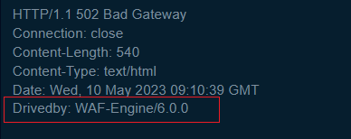
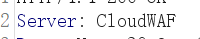

# 为什么

- 根据对应的指纹进行特定攻击

  ```
  前端：JS,WebPack
  后端：后端语言缺陷
  组件：框架，中间件漏洞
  端口服务：特定协议，应用攻击
  ```

- 识别安全设备


# 指纹识别原理

[TideFinger/Web指纹识别技术研究与优化实现.md at master · TideSec/TideFinger](https://github.com/TideSec/TideFinger/blob/master/Web指纹识别技术研究与优化实现.md)

- 主动识别：特定文件的MD5，特定路径


- 被动识别：关键字匹配


# 手工判断指纹

- 前端js代码，文件名，路径等放到github，gitee搜

- icon信息等放到空间搜索引擎

- 版权标识如url，logo等（可能注释或者删除了）

- 从URI中发现

  


# CDN

From[BYPASS-CDN/CDN 2023 完全攻击指南（一）.md at main · bin-maker/BYPASS-CDN · GitHub](https://github.com/bin-maker/BYPASS-CDN/blob/main/CDN 2023 完全攻击指南（一）.md)

#### 是什么

CDN（Content Delivery Network），中文全称为内容分发网络。

简单的说就是一组在不同运营商之间的对接点上的**高速缓存服务器**，把用户经常访问的**静态数据**资源直接**缓存**到节点服务器上，当用户再次请求时，会直接分发到离用户近的节点服务器上响应给用户，当用户**有实际数据交互时**才会**从远程Web服务器上响应**，这样可以大大提高网站的响应速度及用户体验。

这里CDN节点就充当了**反向代理**的作用


#### 为什么要绕过

- 寻找真实IP，这样才可以进行端口扫描
- 绕过云Waf


#### 判断CDN

- 观察请求响应的返回数据的头部，是否有 CDN 服务商标识

- 通过不同定位地点的 ping 测试，如果没有使用CDN，则只会显示一个IP地址

  - http://www.webkaka.com/Ping.aspx		（国内+国外）
  - https://www.host-tracker.com/v3/check/  （国外）

- 判断 IP 是否在常见 CDN 服务商的服务器 IP 段上

- 若 asp 或者 asp.net 网站返回头的 server 不是 IIS、而是 Nginx，则多半使用了nginx反向代理到 CDN

- 利用 Nslookup 查询域名

  - 服务器名称

    

  - 同一个域名解析对应多个 IP 地址

    


#### CDN绕过方法

##### CDN费用问题

CDN 加速需要支付一定的费用，所以**子站，国外**很可能没有部署CDN。


##### 历史 DNS 记录

[IP History - ViewDNS.info](https://viewdns.info/iphistory/?domain=www.baidu.com)

[微步在线X情报社区-威胁情报查询_威胁分析平台_开放社区](https://x.threatbook.com/v5/domain/www.baidu.com?source=top)


##### 邮箱法

> - 让目标邮件服务器发送邮件给我们的邮箱，通过查看收到的邮件源码在一定情况下可以找到真实IP（可以看到对方使用的邮件服务器IP）
> - 使用目标网站的邮件发送功能，将邮件发送给一个不存在的邮箱地址，因为找不到邮箱地址所以发送必然是失败的，这里邮件服务器可能会返回一个错误消息通知，在这个消息通知中就包含了该邮件服务器的真实IP

常见场景

- RSS 订阅
- 邮箱注册、激活处
- 邮箱找回密码处
- 产品更新的邮件推送
- 某业务执行后发送的邮件通知
- 员工邮箱、邮件管理平台等入口处的忘记密码


##### 空间测绘引擎

- favicon.ico 哈希特征

- 网页源码特征值

  > 在服务器源 IP 地址允许访问并且返回的也是类似的网站内容情况下，可以通过侦察页面源码中 JS 、CSS 、HTML 等一系列静态特征值，然后用 Shodan 、Zoomeye 、Censys 等搜索引擎进行匹配搜索，从而定位 IP 。


#### 真实 IP 使用

在获取到真实IP后，通过直接访问IP可能无法访问

- 修改 hosts 文件

- burpsuite 测试

  


# WAF判断

- 查看返回包有无WAF字样

  

  

- [WAFW00F ](https://github.com/EnableSecurity/wafw00f)

- 查看拦截页面信息

  > 通过一些明显的注入来触发waf

  [83个Waf拦截页面-腾讯云开发者社区-腾讯云](https://cloud.tencent.com/developer/beta/article/1872310)  （5年前）

  [30几款常见WAF的拦截页整理](https://mp.weixin.qq.com/s/8F060FU9g_78z57UKS-JsQ)   （2021年）

  

# 蜜罐相关

https://github.com/cnrstar/anti-honeypot

https://send-safe-honeypot-hunter.apponic.com/

