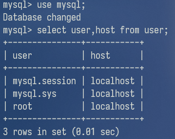
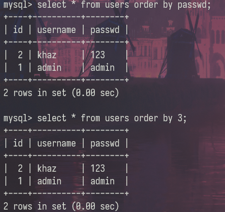
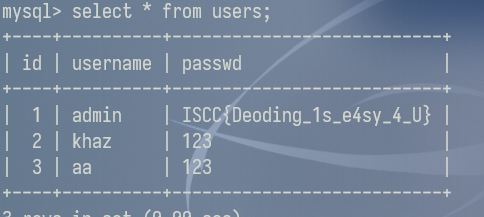
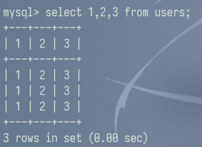
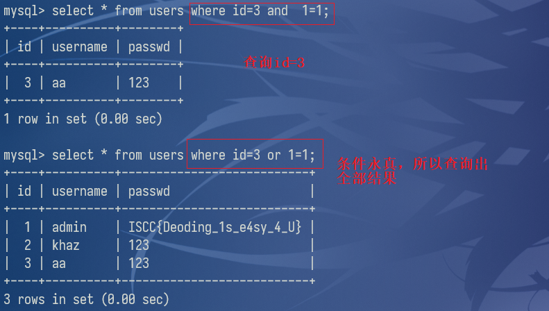

## Mysql登录

### 命令行参数

```mysql
-u username 指定数据库用户名  
-p password 指定数据库密码   
-e 指定要运行的sql语句
-D 指定数据库名
-P 端口
```

### 登录

```shell
mysql -uroot -proot [-P3306 -h127.0.0.1]
```

### 修改密码

```sql
set password for root@localhost = password('xxx');
```

### 开启远程连接

```mysql
# 修改配置文件
bind-address  = 0.0.0.0
```

```mysql
# 为需要远程登录的用户赋予权限
grant all privileges on *.* to 'root'@'%' identified by '123' with grant option;
flush privileges;

注：ip处填%的话则表示所有ip都可以访问
```

```mysql
# 查看用户与主机关系
use mysql;
select user,host from user;
```



mysql8

https://blog.csdn.net/llf_cloud/article/details/83141338


### 退出

```mysql
exit;
quit;
\q;
```


## 基础知识

### 条件查询

```mysql
where id xxx
```

xxx：

|        运算符         |      解释      |
| :-------------------: | :------------: |
|           =           |      等于      |
|        <> ，!=        |     不等于     |
|         <，<=         | 小于，小于等于 |
|         >，>=         | 大于,大于等于  |
|    in()，not in()     |  是否在数组中  |
|      and  ,  &&       |     逻辑与     |
|    or   ,     \|\|    |     逻辑或     |
|      like '%xx%'      |    模糊查询    |
| is null , is not null |    是否为空    |
|        regexp         |    正则匹配    |
|  is between x and y   |   在x和y之间   |


### 常用表

> 注意sys 库是在**MySQL5.6**及以上版本才有的

- 记录所有数据库及表

  ```mysql
  information_schema.tables
  sys.schema_table_statistics_with_buffer
  sys.x$schema_table_statistics_with_buffer
  
  字段：table_schema：数据库名称
  	 table_name：数据库下的所有表
  ```

  ```mysql
  mysql.innodb_table_stats
  mysql.innodb_index_stats
  
  字段：database_name：数据库名称
  	 table_name：数据库下的所有表
  ```

- 记录所有数据库

  ```mysql
  information_schema.schemata
  
  字段：SCHEMA_NAME：数据库名
  ```

- 记录含有自增id字段的数据库及表

  ```sql
  sys.schema_auto_increment_columns
  
  字段：table_schema：数据库名称
  	 table_name：数据库下的所有表
  ```

- 记录所有字段

  ```sql
  information_schema.columns 
  
  字段：table_name：表名
  	 column_name：表下的所有字段名
  ```

- 配置信息

  ```mysql
  @@character set_ database：字符集
  @@hostname：计算机名
  @@version_compile_os：系统版本
  @@basedir:mysql路径
  @@datadir:myslq data存放路径
  @@sql_mode：sql模式
  ```

  > @是用户变量，@@是系统变量


### 常用函数

```mysql
select user(); 查看当前MySQL登录的用户名

select database(); 查看当前使用的数据库名

select version(); 查看当前MySQL版本

# 查看当前用户权限
SELECT * FROM mysql.user WHERE user = CURRENT_USER();
SHOW GRANTS FOR CURRENT_USER();
```

```mysql
group_concat(字段名) 查看所有字段名，默认分隔符为,
length() 获得长度
concat(str1,str2) 连接str1和str
mid(str,a,length)    从a开始截取str字符length长度
substr(str,a,length) 从a开始截取str字符length长度
left/right(str,length) 返回最左边/最右边的length长度字符
```

```mysql
ord(string)  返回字符串第一个字符的ascii码值
ascii(str) 返回字符的ascii码
rand()随机数
```


### 常用操作语句

#### 创建表

```mysql
CREATE TABLE IF NOT EXISTS `users`(
   `id` INT UNSIGNED AUTO_INCREMENT,
   `username` VARCHAR(10) NOT NULL,
   `passwd` VARCHAR(40) NOT NULL,
   PRIMARY KEY ( `id` )
)ENGINE=InnoDB DEFAULT CHARSET=utf8;
```

> AUTO_INCREMENT：自增
>
> PRIMARY KEY：主键


#### 对数据库的增删改查

```mysql
增  create database 数据库名
删  drop database 数据库名
查  所有数据库 show databases
改  rename database 旧名 to 新名
```

####    对数据表的增删改查

```mysql
增    create table 数据表名(id int,name char(10))
参数形式：字段名 字段类型
删    drop table 数据表名
查    show tables 
改    alter table 旧名 to rename 新名
```

#### 对表数据的增删查改

```mysql
增  insert into 表名(列1，列2 ... ) values(值1，值2 ... )

删  delete from 表名 where 列名 = 值

查  所有内容   select * from 表名
	查看表的结构 DESC 表名 / show columns from 表名
	条件下所有列 select * from 表名 where 条件
	条件下部分列 select 列1,列2,...,列n from 表名 where 条件;
	
改  修改数据 update 表名 set 列名=新值 where 条件
		    REPLACE INTO table_name  VALUES(主键,value..) 
	修改列名 alter table 表名 change 旧列名 新列名 varchar(长度)
```

`replace into`，需要更改一整条数据，不能只更改其中某列。

- 如果待写入数据已经存在，则先删除该行数据，然后插入新的数据。
- 如果待写入数据不存在，则直接插入新数据。

```mysql
mysql> select * from users;
+----+----------+--------+
| id | username | passwd |
+----+----------+--------+
|  1 | khaz     | 123    |
|  2 | khaz2    | 1234   |
+----+----------+--------+
2 rows in set (0.00 sec)

mysql> replace into users values(1,'passwd');
ERROR 1364 (HY000): Field 'username' doesn't have a default value

mysql> replace into users values(1,'khaz3','passwd');
Query OK, 2 rows affected (0.00 sec)

mysql> select * from users;
+----+----------+--------+
| id | username | passwd |
+----+----------+--------+
|  1 | khaz3    | passwd |
|  2 | khaz2    | 1234   |
+----+----------+--------+
2 rows in set (0.00 sec)
```


### 对用户的增删查改

```mysql
增  insert into users(username,password)  values('khaz','wuhu')
	create user '用户名'@'来源地址' identified by '密码'
删  drop user 用户名
查  select user()
改  修改用户名 rename user 旧用户名 to 新用户名
	修改密码 SET PASSWORD FOR 用户名 = PASSWORD('abc123');
```


## sql注入相关解释

### order by

order  by语句用于根据指定的列对结果集进行排序，支持字段名和字段位置



可选参数(排列方式): 

- 升序(ASC) 默认
- 降序(DESC)

**在sql注入中的使用：**

> 判断字段数：当字段位置不存在时就会报错
>
> order by注入


### limit

用于分页

```sql
select* from article LIMIT 1,3
select * from article LIMIT 3 OFFSET 1
上面两种写法都表示取 2、3、4 三条条数据：

1.当 LIMIT 后面跟两个参数的时候，第一个数表示要跳过的数量，后一位表示要取的数量

2.当 LIMIT 和 OFFSET 组合使用的时候，LIMIT 后面只能有一个参数，表示要取的的数量，OFFSET表示要跳过的数量 。

select* from article LIMIT 3 
表示取前三条数据
当 LIMIT 后面跟一个参数的时候，该参数表示要取的数据的数量。
```

**在注入中的使用：**

> 使用group_concat()批量查询输出结果长度有限制，需要使用linmit一条一条获取或使用concat()拼接得到结果
> limit 0,1
> limit 1,1
> limit 2,1
> ....


### union select与select

union select语句用来合并两个或多个 SELECT 语句的结果集。所以union select可以用来查询其他表。

```
select 字段值1 from 表1 union select 字段值2 from 表2
```

#### union特性

```sql
1.union  select只能查询两个表中共同都有的字段，如果一个字段在另外一个表中没有，就会报错

如users表比users2表多了school字段，查询users表中的school和users2表中的address，因为users2表中没有school字段，所以报错
```

```sql
2.(union) select 查询的字段数要一致，否则会报错
所以需要先用order by来判断字段数
```

```
3.union 自带去重功能（distinct的功能）

如果不想要去重可以使用union all
```

#### select 1,2,3

 select时不写后面的表名，这时select实际上没有向任何一个数据库查询数据，即查询命令不指向任何数据库的表。返回值就是我们输入的这个数组。


通过这个和union select

##### 构造临时数据


users表中并没有要查询的数据,但是却返回了我们构造的数据!



而在下一次查询中，这个我们自定义的数据不存在，说明通过这样方式创建的数据的存活周期只在其查询语句执行时

所以通过上述操作就可以临时构造一个用户，达到登录的效果

 

##### 联合查询注入

**需要将前面的select语句设置为假**，才能使用后面的union select 1,2,3来判断哪一个字段值是回显的，是可以利用的。（原因是一般获取的是第一个结果，而我们构造的union select 1,2,3在之后）

```mysql
id=-1 union select 1,2,3
```


##### select+XX和表名

列数取决于我们输入的数字个数，行数取决于表原来的行数。




### 注释符


- 单行注释符

  - --+

    ```mysql
    实质上--是起到注释的作用，但是在sql中用--注释后面必须加一个空格--才生效
    ```

  - #

    ```
    在URL中#表示锚点，带上#不会请求后端路由，而是刷新前端路由，所以
    测试一般用URL编码后的%23
    ```

- 多行注释符

  - /*   */

    ```
    用于注释多行
    /*
    
    
       */
    ```


### and 与 or




### 反引号

反引号是 mysql 的转义符，只要你不在列名、表名中使用 mysql 的保留字或中文，就不需要转义。
其他数据库也同样有保留字，如果使用的话也同样需要转义，只是转义符不同而已。

```sql
#假如表A中有一列名为select，查询该列
select select from A;   #错误
select `select` from A;  #正确

#假如存在表flag，用desc(describe)查询该表信息
desc flag A;  #显示flag表信息，别名为A
desc `flag` `A` #与上述语句相同
```

MySQL 关键字和保留字汇总（MySQL 8.0）：

https://blog.csdn.net/m0_56921622/article/details/122975904


###  as

`AS`命令用于使用别名重命名列或表。

别名仅在查询期间存在。

```sql
重命名表名
select c.ID from users as c
重命名列名
select c.ID as ID2 from users as c

注：可以把as省略，即select c.ID from users c等价于select c.ID from users as c
```


在sql注入可以用于无列名注入


