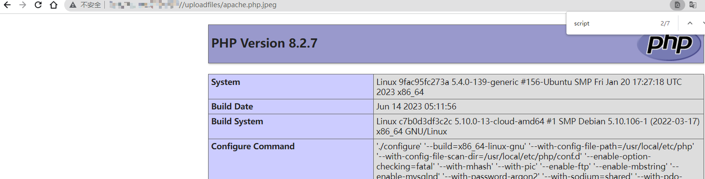
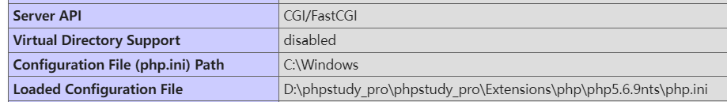
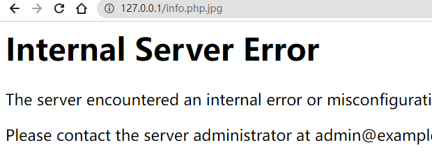

中间件配置不当，导致可以解析其他脚本后缀

```php
# php
.php3 .php4 .php5  .pht  .phtml  .phar  .shtml 
    
# .shtml    
<pre>
<!--#exec cmd="whoami" -->
</pre>
    
# jsp    
.jsp .jspa .jsps .jspx 
    
# .net
.asp  .asa .cdx  .cer  .aspx .asmx  .ashx
```

- 可以上传相关配置文件

  - .htaccess

    [CTF.htaccess的使用技巧总结_.htaccess ctf_Y4tacker的博客-CSDN博客](https://blog.csdn.net/solitudi/article/details/116666720)

    只能用于Apache

    ```ini
    # 当文件名中包含shell时，该文件会被Apache当作php解析
    <FilesMatch "shell">
    SetHandler application/x-httpd-php
    </FilesMatch>
    
    #.png文件也可以执行php程序
    AddType application/x-httpd-php .png 
    
    # 开启了cgi扩展：扩展名为.yyy的文件作为 CGI 脚本来处理
    Options +ExecCGI
    AddHandler cgi-script .yyy
    ```

    修复

    ```
    在配置文件中将AllowOverride ALL改为AllowOverride None
    ```

  - .user.ini

    使用条件

    ```
    Apache和Nginx都可以，只需满足：
    服务器脚本语言为PHP 服务器使用CGI
    FastCGI模式
    上传目录下要有可执行的php文件
    ```

    payload

    ```ini
    auto_prepend_file=file_name  #表示在加载第一个PHP代码之前先行预加载该配置所指示的PHP文件。
    
    auto_append_file=file_name  #表示在加载第一个PHP代码之后执行预加载该配置所指示的PHP文件。
    ```

- 过滤不当

  ```php
  点绕过、空格绕过、后缀双写绕过、后缀大小写绕过
  ```

- Apache解析漏洞

  - 从右往左解析漏洞

    产生原因：

    前提：**php作为apache的一个子模块来运行**

    

    apache支持一个文件拥有多个后缀，并为不同后缀执行不同的指令，如果运维人员给`.php` 后缀增加了处理器

    ```ini
    AddHandler application/x-httpd-php .php
    ```

    Apache会从右向左，依次识别后缀，直到遇到自己能解析的文件名为止。那么，在有多个后缀的情况下，只要一个文件含有`.php` 后缀的文件即将被识别成 PHP 文件。

    假设上传的文件名为

    ```php
    xxxx.php.xyz
    ```

    这时候最后一个可识别的扩展为.php，会将其作为php文件进行解析，轻松绕过**黑白名单**。

    

    vulhub复现

    

    本地cgi模式复现

  

  

  

  - HTTPD换行解析漏洞--CVE-2017-15715

    产生原因：

    配置中的正则缺陷

    ```php
    <FilesMatch "[^ .]+\.php$">
        SetHandler application/x-httpd-php 
    </FilesMatch>
    ```

    正则表达式中$不仅匹配字符串结尾位置，也可以匹配\n 或 \r，从而导致可以上传`.php\n`绕过**黑名单**校验，同时也可以被作为PHP文件解析。（不能是`.php\r\n`）

    payload

    ```
    上传：1.php\x0a
    访问：1.php%0a
    ```

    

  上述漏洞修复：因为Apache的解析漏洞是由于畸形扩展名和畸形文件名导致的，所以使用白名单，并对文件重命名，文件就不会存在畸形字符和多扩展名的情况。

  参考如下代码

  ```php
  <?php
  # $_FILES['file']['name']会自动把换行去掉
  $ext = pathinfo($_FILES['file']['name'], PATHINFO_EXTENSION);
  
  //...其他检查
  if(in_array($ext, ['gif', 'jpg', 'jpeg', 'png'], true)) {
          $new_name = './upload/' . uniqid() . '.' . $ext;
          move_uploaded_file($_FILES['file']['tmp_name'], $new_name);
  }
  ?>
  ```

  