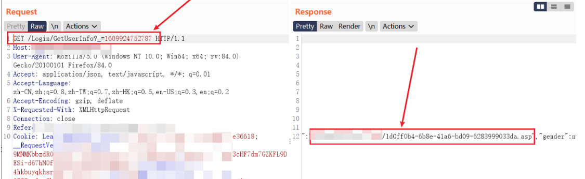

# 文件路径寻找

From https://www.cnblogs.com/yokan/p/15252077.html

- 因为传上去的文件，如图片这类的总归是显示出来的，所以可以先在web应用到处点点，多加载一些数据包，然后再到burp的http history搜索shell的名字

- **返回了一些参数但不包括路径的情况**，比如file_id 等等，那么文件路径可能存储在数据库中，可以**结合sql注入** sqlmap的--search -C参数找到字段和值

- **什么都没返回的情况，只返回了ok，true等等。重新加载，抓包看响应，或许某个接口的响应就包括对应的路径。**

  比如头像位置上传上去了，但是没有返回路径，那么想办法让他在加载一遍，比如退出重新登陆，一个包一个包的放。可能有些包的响应中就包含路径。

     另外可能存在其他服务器、或者其他站点的其他路径，也是抓包查看，看一下加载过程的路径在哪或者看一下html、js

  [

- **尝试访问日志文件，看能否发现一些敏感目录或上传目录**

- **只返回了文件名，没有路径**

  一种是fuzz，看其他同类型文件的路径，f12或者如果有文件下载的地方，下载抓包，看文件地址。

  另一种是 尝试上传的时候**目录穿越**，一次一次尝试，看能否**穿到站点根目录**或者**知道的目录下面**。修改表单的其他参数、或者filename参数的值 


# WebShell不解析

表现：访问时文件直接下载

尝试目录穿越，跳到可以执行脚本语言的目录

```http
///../../../
```

> 以///开头是因为可能会转码，导致写入失败


# 上传后存在安全设备被删

怎么判断呢？一般来讲，上传的时候，随便写点内容（不直接写webshell），后缀改为PHP/JSP/JSPX/ASPX/ASP等等，访问一下如果在，那么就可以认为是上传成功的；接下来再去上传webshell,如果访问不到，一般情况可以认为是杀毒给删除了。

- 免杀
- 通信加密


# Webshell连接失败

- 访问webshell是没问题的，但是500错误之流，webshell连接工具也是没法连上的（虽然像冰蝎哥斯拉都是适配了大部分场景，但是有些国产化中间件还是存在适配问题，比如金蝶天燕）

- 后台上传需要带Cookie访问webshell


- 需要带上指定的Referer字段


# Trick

From：代码审计知识星球

修改压缩包二进制字节，让压缩包解压过程出错，但是出错前已解压部分即为webshell。（出错后捕获异常，程序中止，如果开发人员没有对已解压部分进行校验，那么已解压出的webshell就可以留在服务端中）

https://www.leavesongs.com/PENETRATION/after-phpcms-upload-vul.html
