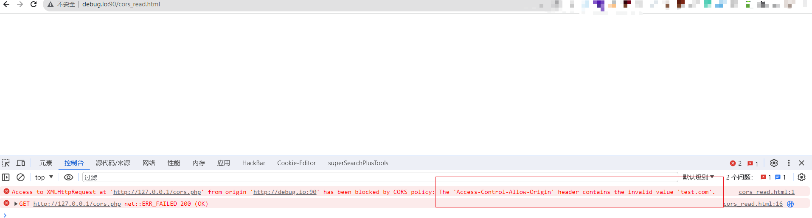

# 前置知识

> CORS（Cross-Origin Resource Sharing）是一种**跨域资源共享机制**，它允许Web应用程序从不同的域名访问资源，而不受同源策略的限制。CORS机制需要在服务端进行配置，并且需要在每个跨域请求中添加特定的HTTP头部信息，例如“Access-Control-Allow-Origin”和“Access-Control-Allow-Methods”等。CORS机制可以支持各种类型的HTTP请求，包括GET、POST、PUT、DELETE等，因此它在Web应用程序中的应用非常广泛。

**客户端--CORS简单请求**

符合以下条件的为简单请求

- 请求方法为get，post，head中的一种

- header头为以下字段的子集

  ```http
  Accept
  Accept-language
  Content-language
  Last-Event-ID
  Content-Type:application/x-www-form-urlencoded,multipart/form-data,text/plain
  ```

**客户端--CORS非简单请求（不符合简单请求的条件时）**

客户端非简单请求流程

- 第一次请求为预检请求（OPTIONS方法，Origin请求头）
- 根据服务器返回的response来判断是否能够发起CORS请求

**服务端配置**

**相关的头部字段含义**

```http
Access-Control-Allow-Origin:  必需项，告诉浏览器允许该源访问资源。
Access-Control-Allow-Headers: 必需项，指明了实际请求中允许携带的标头字段。
Access-Control-Allow-Methods: 可选项，指定了访问资源时允许使用的请求方法
Access-Control-Allow-Credentials:表示是否允许发送cookie，默认不允许。设置为true时，可以发送cookie
```

Nginx配置Demo

```nginx
location = /corstest.php {
            root   /var/www/html;
            add_header Access-Control-Allow-Origin *;
            add_header Access-Control-Allow-Methods 'GET, POST, OPTIONS';
            add_header Access-Control-Allow-Headers 'DNT,X-Mx-ReqToken,Keep-Alive,User-Agent,X-Requested-With,If-Modified-Since,Cache-Control,Content-Type,Authorization';
            if ($request_method = 'OPTIONS') {
                     return 204;
            }
……
}
```

代码配置Demo

```php
<?php
header("Access-Control-Allow-Origin: *");
header("Access-Control-Allow-Methods:GET, POST, OPTIONS");
header("Access-Control-Allow-Headers:DNT,X-Mx-ReqToken,Keep-Alive,User-Agent,X-Requested-With,If-Modified-Since,Cache-Control,Content-Type,Authorization");
?>
```

**服务端对于跨域请求的处理流程**


错误的`Access-Control-Allow-Origin`配置

http://debug.io:90/cors_read.html

```html
<script>
    var xhr = new XMLHttpRequest();
    xhr.open('GET', 'http://127.0.0.1/cors.php', true);

    // If specified, responseType must be empty string or "text"
    xhr.responseType = 'text';
    xhr.onload = function () {
        if (xhr.readyState === xhr.DONE) {
            if (xhr.status === 200) {
                document.write(xhr.responseText);
            }
        }
    };

    xhr.send(null);
</script>
```

http://127.0.0.1/cors.php

```php
<?php
// header("Access-Control-Allow-Origin: *");
?>

<table border="1">
  <tr>
    <th>name</th>
    <th>password</th>
  </tr>
  <tr>
    <td>Jack</td>
    <td>1ui23p=13!</td>
  </tr>
</table>
```

没有设置`Access-Control-Allow-Origin`


设置`Access-Control-Allow-Origin`为`*`时


设置`Access-Control-Allow-Origin`为`test.com`时




# 漏洞危害

cors如果配置不当，就可能导致攻击者通过恶意网站或代码执行跨域请求，从而获取或篡改用户的敏感数据（危害和CSRF类似，不过可以劫持返回的内容）。


# 漏洞原理

Java:https://mp.weixin.qq.com/s/PSU8T-IO3mAz4MEVvAeUug

PHP:https://mp.weixin.qq.com/s/ViSR-l41Z9qsazxI2MAhTA


# POC

请求包加入

```
origin:http://evil.com
```

观察响应头

```
Access-Control-Allow-Origin: */null/http://evil.com
Access-Control-Allow-Credentials: true
```


# 漏洞修复

1. 限制Access-Control-Allow-origin 的值为可信源，尽可能设置白名单，不能为*，也不能为 null
2. 避免 Access-Control-Allow-Credentials 的值为 True
3. 设置 Access-Control-Allow-Methods5（允许的 HTTP 方法）、Access-Control-Allow-Headers(允许的请求头)