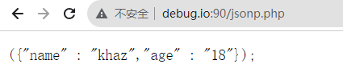
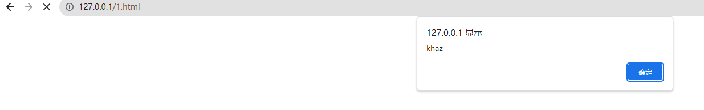

# 前置知识

## **同源策略**

- 目的

  > 同源策略的目的，是为了保证用户信息的安全，防止恶意的网站窃取数据。
  >
  > 设想这样一种情况：A网站是一家银行，用户登录以后，又去浏览其他网站。如果其他网站可以读取A网站的 Cookie，会发生什么？
  >
  > 很显然，如果 Cookie 包含隐私（比如存款总额），这些信息就会泄漏。更可怕的是，Cookie 往往用来保存用户的登录状态，如果用户没有退出登录，其他网站就可以冒充用户，为所欲为。因为浏览器同时还规定，提交表单不受同源政策的限制。
  >
  > 由此可见，"同源策略"是必需的，否则 Cookie 可以共享，互联网就毫无安全可言了。

- 定义

  两个web界面只有同协议，同域名，同端口才是同源的

  

## jsonp

JSONP（JSON with Padding）即填充式的JSON，通过填充额外的内容把JSON数据包装起来，变成一段有效的可以独立运行的JavaScript语句。它是基于JSON 格式的为解决跨域请求资源而产生的解决方案，基本原理是利用HTML里script元素标签，**远程调用JSON文件来实现数据传递**。

下面通过Demo代码演示

假设http://debug.io:90/ 服务器存放JSON数据

```php
//jsonp.php
<?php
header('Content-type: application/json');
$callback = $_GET['callback'];
print $callback.'({"name" : "khaz","age" : "18"});';
?>
```



那么http://localhost可以通过以下方式获取http://debug.io:90/上存放的JSON数据

- script标签的src属性

  ```html
  <!--1.html-->
  <script>
  function test(data)
  {
    alert(data.name);
  }
  </script>
  <script src="http://debug.io:90/jsonp.php?callback=test"></script>
  ```

  

- ajax请求

  ```html
  <script src="http://cdn.static.runoob.com/libs/jquery/1.8.3/jquery.js"></script>
  <script type="text/javascript">    
      $.getJSON("http://debug.io:90/jsonp.php?callback=?", function(data){
            alert(data.age);
      });
  </script>
  ```

  


# 漏洞原理

JSONP跨域漏洞是指网站JSONP接口callback参数值可自定义导致的XSS和JSONP劫持


# 漏洞利用

## XSS

当Content-Type为`text/html`且未对callback参数进行过滤时出现

```
// 攻击者构造
http://api.example.com/data?callback=<script>alert('xss')</script>
```


## JSONP劫持

当网站的JSONP接口没有做好防护，并且存在敏感数据时，攻击者就可以构造恶意的html页面诱导受害者点击，从而携带用户的cookie等信息向jsonp接口发起请求，并通过callback将获取到的敏感数据发给攻击者。

http://www.mi1k7ea.com/2019/08/20/JSONP%E8%B7%A8%E5%9F%9F%E6%BC%8F%E6%B4%9E%E6%80%BB%E7%BB%93/#Referer%E7%BB%95%E8%BF%87


### 利用手法

- 获取jsonp中的敏感信息

- 水坑攻击

  水坑攻击就是在受害者必经之路设置一个水坑，也就是陷阱。攻击者通过分析受害者的上网活动规律，经常访问哪些网站，然后利用网站漏洞在其中植入攻击代码。比如攻击者通过分析得知受害者经常访问网站A和B，并想要得到受害者在网站A上的敏感数据，而网站B安全性相对薄弱，于是攻击者在网站B中植入JSONP利用代码，当受害者访问网站B时，就会通过JSONP跨域访问网站A从而获取受害者在网站A上的敏感数据。

- 蜜罐溯源

  蜜罐能够对攻击者画像进行画像和溯源的原理就是蜜罐中集成了大量社交网站的JSONP接口。当攻击者发起攻击时，如果其使用的浏览器保存了社交网站的登录信息，就有可能因为触发了蜜罐的JSONP利用代码而留下个人社交信息。


# 漏洞修复

- 对请求的来源进行校验，如Referer，Origin等参数
- 尽量不使用JSONP接口来传输敏感数据
- 使用CORS来代替JSONP


# 二者区别

- JSONP是浏览器默认支持的跨域方式（跨域加载javascript），CORS是W3C提供的一个跨域标准
- JSONP只支持GET方法，CORS可以自定义支持的方法
- JSONP几乎支持所有的浏览器，CORS不支持IE10下的浏览器
- JSONP传递的数据要符合JavaScript代码规范，CORS可以是html，xml等多种格式


# 参考文章

《Web漏洞解析与攻防实战》

[JSONP挖掘与高级利用](http://drops.xmd5.com/static/drops/papers-6630.html)

