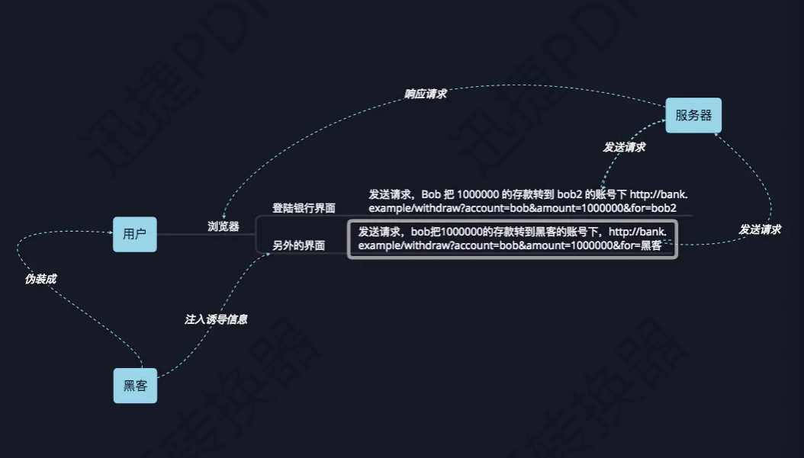
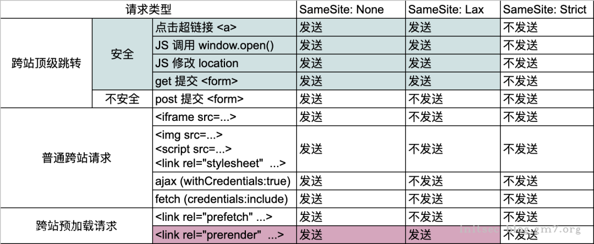
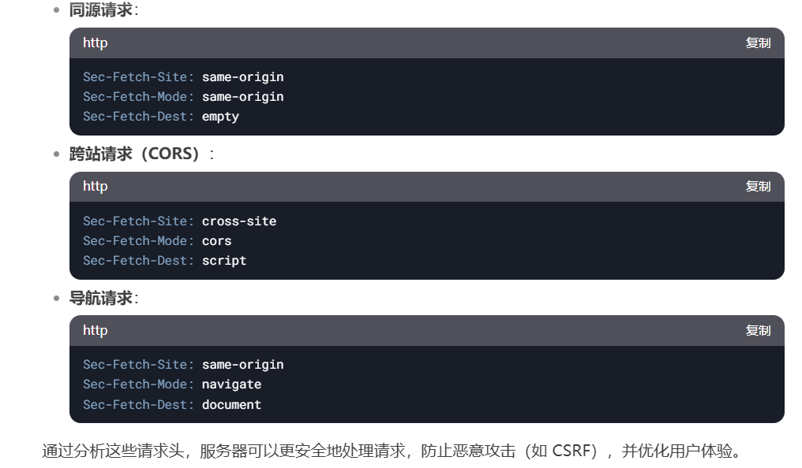

# 漏洞原理

CSRF（Cross-site request forgery）跨站请求伪造攻击：攻击者通过一些技术手段欺骗用户的浏览器去访问一个用户自己曾经认证过的网站并执行一些操作（如发邮件，发消息，甚至财产操作如转账和购买商品）。



> 简单来说就是你点击我构造的恶意链接，我就可以以你的名义（浏览器中存储的身份认证信息）去发起一个http请求
>
> 1. 攻击者可以预先伪造用户的请求
> 2. 伪造的请求可以使用存储的Cookie


# 漏洞危害

伪造用户请求，用户能做啥，这个漏洞就能做啥


# 常见场景

- 修改密码，修改个人信息，订单信息等
- 创建用户，发送邮件等

- 数据包无token和referer验证

  无token验证并且无referer验证时，就基本存在跨站请求伪造，但基于功能点不同，一些为无意义无危害的跨站请求伪造。

  提交数据包时抓包删除referer字段，如果不报错，则基本存在跨域请求伪造，GET型构造链接，POST型写一个提交表单，测试有跨域情况下提交的数据包是否生效。

- 数据包无token有referer验证

​        只有referer验证时，可尝试空referer或者尝试域名伪造。


# POC

GET

```html
<!-- 不论什么手段，只要能让受害者访问一个链接即可 -->

```

POST

burp右键生成


# 漏洞修复

- 当用户发送重要的请求时需要输入原始密码，手机验证码等

- 设置Token

- 检验 referer 来源

  疑问：referer不是可以进行伪造吗？

  答：攻击者确实可以在发送请求时进行伪造，但是csrf是用户发起请求，用户不会去伪造；

  不过当网站本身可以植入csrf的payload时，检验refer来源的防御手段就失效了。
  
- 设置SameSite

​	`SameSite` 是 HTTP Cookie 的一个属性，用于限制 Cookie 的发送范围，确保 Cookie 不会在跨站请求中被滥用




