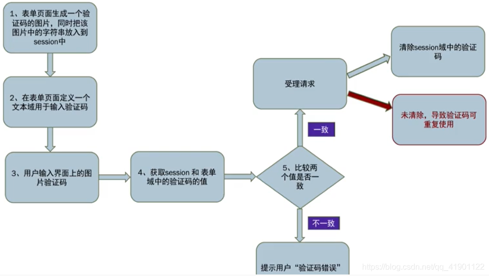

# 一般校验过程




# 短信验证码

## 短信轰炸

绕过方法

```php
# 手机号
添加区号如+86
手机号前后添加空格
多手机号参数：mobile=xx&mobile=xx
添加逗号：mobile=xxx,xxx
手机号长度
Fuzz（位置手机号前，后，前后）
    
# 不同接口   
type参数
    
# 突破验证码发送次数限制
修改请求包UA,IP
时间戳绕过：数据包返回time参数，后端通过校验时间戳来判断是否能再次发送短信

# 验证码短信内容可控
Trubo Intruder的%s回显
验证码由客户端发送
```

## 短信验证码校验绕过

```php
# 验证码可暴力破解
通常短信验证码有效期为1min，只能爆4位的，可以看看发送的验证码长度是否可控参数有两个比如mobile=xxx&code=6，这个code=6代表验证码长度
短信验证码存在默认值：所有手机号均存在默认短信验证码（没碰到过）或者只有测试手机号存在默认短信验证码（碰到过）
    
# 验证码可获得
服务端回显:响应包中回显短信验证码
短信接收方可篡改：可修改请求包中的手机号控制验证码的发送
修改手机号发给攻击者
发送给多个手机号并且收到的验证码是相同的比如phone=phone1,phone2

#  绑定关系失效
验证码未与手机号进行绑定
短信接收方可篡改：用phone2接受的验证码校验phone1
最终提交时存在两个手机号参数：一个用于验证短信验证码，一个用于注册/登录，后端没有对这两个参数做一致性校验，达到的效果就是用自己的手机号接受验证码来注册他人的手机号

# 验证码验证机制失效
万能验证码：将验证码置空，删除，置null时后端不对验证码进行校验
验证码可复用：验证码的有效期过长，并且在使用后仍可以再次使用或者在一定时间内发送的短信都是相同的 （修复建议：当服务器端处理完一次用户提交的请求之后,及时将 session域中的验证码清除,并生成新的验证码。）
```


# 图形验证码

[盘点图形验证码的漏洞挖掘方式，看完之后你还不会挖吗？](https://mp.weixin.qq.com/s/a03-z_dk21DhbG025aqAeg)

- 图形验证码识别

  [captcha-killer-modified/FAQ.md at main · f0ng/captcha-killer-modified](https://github.com/f0ng/captcha-killer-modified/blob/main/FAQ.md)

  [【Security】利用Burp Suite爆破带有验证码Web登录接口（保姆级教程） - 为极客而生 - 博客园](https://www.cnblogs.com/4geek/p/17145385.html#!comments)

  ```bash
  regex："token":"(.*?)"
  [*]  use @captcha@ replace captcha
  [*]  use @captcha-killer-modified@ replace captcha's token
  ```

  

- 图形验证码复用

  ```
  图形验证码有效时间过长（碰到过一个验证码信息存储在JWT的里的，通过修改EXP从而验证码复用）
  
  没有重置图形验证码
  
  后端实际不校验验证码
  ```


- 图形验证码Dos攻击

  通过控制图形验证码的大小


# 滑块验证码

https://www.freebuf.com/articles/web/238038.html

[看我如何绕过滑块验证码拿到高危漏洞 - 先知社区 (aliyun.com)](https://xz.aliyun.com/t/12557)