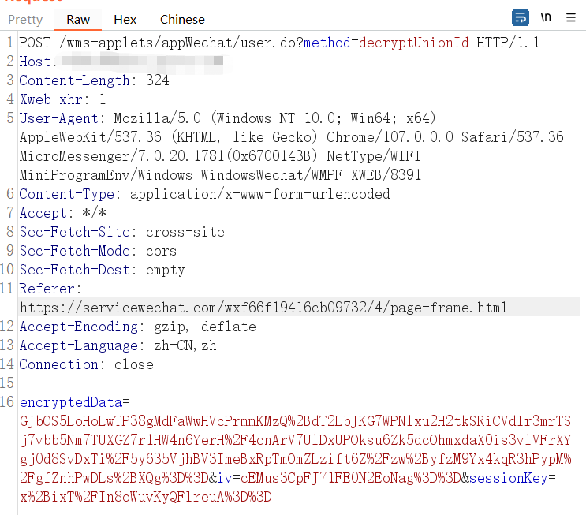

# 微信小程序和公众号

> 这两有的会校验数据包中的User-Agent，所以用一些扫描工具的时候要带上对应的User-Agent才行
>
> 或者要带上UA和cookie
>
> 
>
> ```
> # 公众号UA
> Mozilla/5.0 (Windows NT 10.0; Win64; x64) AppleWebKit/537.36 (KHTML, like Gecko) Chrome/107.0.0.0 Safari/537.36 NetType/WIFI MicroMessenger/7.0.20.1781(0x6700143B) WindowsWechat(0x63090621) XWEB/8287 Flue
> 
> # 小程序UA
> Mozilla/5.0 (Windows NT 10.0; Win64; x64) AppleWebKit/537.36 (KHTML, like Gecko) Chrome/107.0.0.0 Safari/537.36 MicroMessenger/7.0.20.1781(0x6700143B) NetType/WIFI MiniProgramEnv/Windows WindowsWechat/WMPF XWEB/8287
> ```

## 小程序接口→Web后台

> 开发者为了方便管理和调试，会在公网 Api 后端服务器上搭建一个后台管理界面从而方便管理数据

把小程序抓包时的url复制到浏览器中，寻找后台（蛮多的🤗）

后台名称

```
常规的
小程序名字缩写+web等
```

比如


就这个后台出了三个高危，弱口令，任意文件上传，存储型xss


## 小程序本身

[微信小程序安全浅析](https://mp.weixin.qq.com/s?__biz=MzIyMjUyNTkyNQ==&mid=2247484180&idx=1&sn=29680b46f17106c10bcd8b80e143634e)

### 抓包

PC：proxifier+burp

Android：同一个局域网下，wifi代理+burp

### 解包还原

一键解密+反编译工具

https://pan.baidu.com/s/1N3ZR3djSaS8g_RXc0Hsa5Q?login_type=qzone&pwd=f79y&_at_=1693833286263

**注意点：进入小程序后，先把各种功能点点，加载更多的程序之后再进行反编译**

小程序打开时


打开点点点之后，点了一部分后就多了3MB


- PC

  需要先解密，再反编译，小程序文件位置如下

  

- Android

  直接反编译即可

  ```
  /data/data/com.tencent.mm/MicroMsg/df69765be7b6e4a441a86a25d26e861f/appbrand/pkg/_-1486048203_3.wxapkg
  ```


#### 敏感信息泄露

```cmd
# 会在KillWxapkg.exe同目录下生成sensitive_data.json文件
KillWxapkg.exe -id=wxid -in=".wxapkg所在目录" -sensitive 
```

> 配置文件在KillWxapkg.exe同目录下的config目录


### 小程序hook开启F12

```cmd
KillWxapkg.exe -hook

# WeChatOpenDevTools
python main.py -all
```

小程序文件在nodomain下


### accesstoken泄露-小程序接管

泄漏了AppID和AppSecret，可以通过接口获取accesstoken来接管小程序

还有一种是消耗每天的accesstoken的获取次数


### sessionkey泄漏



解密

****

利用

> 利用这个漏洞的危害也很简单，就是我们可以在这个微信小程序的站点找到里面管理员的手机号，然后去替换手机号，然后再反向加密，然后再替换回开始登录的数据包中，然后再一键放包，就可以成功登录我们管理员的后台了


### 微信开发者工具调试

**报错修复**


wxml文件（样式文件）报错修复：直接删除

插件修复：遇到不需要使用的插件直接删除，要用到的插件去官方后台添加


## 公众号

跟web思路一样，注意UA头即可