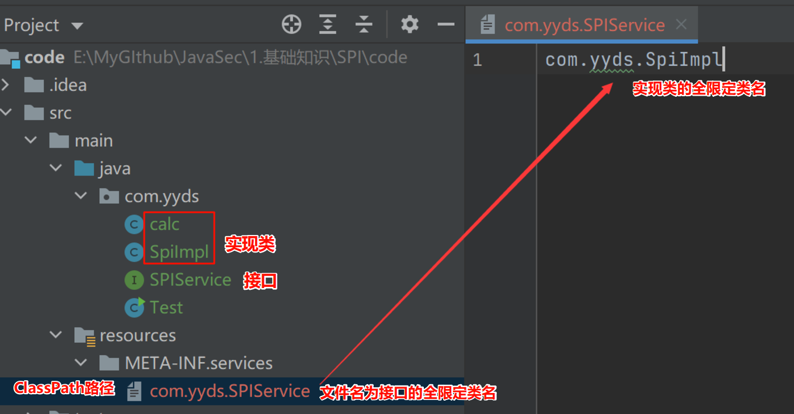

# SPI

SPI ，全称为 Service Provider Interface，是Java中用于定义接口，并**允许外部模块提供该接口实现**的一种机制。应用程序通过 SPI 发现和加载服务提供者（即接口的具体实现）。



```java
package com.yyds;

import sun.misc.Service;

import java.util.Iterator;
import java.util.ServiceLoader;

public class Test {
    public static void main(String[] args) {
        
        // sun.misc.Service.providers返回实现了 SPIService 接口的所有服务提供者的迭代器
        Iterator<SPIService> providers = Service.providers(SPIService.class);
        // 遍历实现类执行execute()方法
        while(providers.hasNext()) {
            SPIService ser = providers.next();
            ser.execute();
        }
        
        System.out.println("--------------------------------");
        
        // ServiceLoader.load()查找并加载实现了 SPIService 接口的所有实现类
        ServiceLoader<SPIService> load = ServiceLoader.load(SPIService.class);
        Iterator<SPIService> iterator = load.iterator();
        // 遍历实现类执行execute()方法
        while(iterator.hasNext()) {
            SPIService ser = iterator.next();
            ser.execute();
        }
    }
}
```

安全性问题

编写一个恶意的服务提供者（接口实现类）


并于服务中注册,从而让应用程序加载并执行恶意代码


