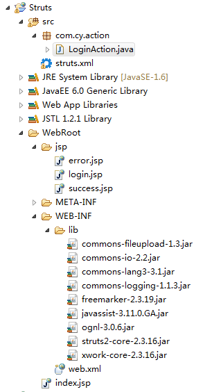

# SSH（Struts2 + Spring + Hibernate）

**Struts2**


解析：客户端发送请求（HttpServletRequest）到服务器，服务器接收到请求就先进入web.xml配置文件看看有没有配置过滤器，发现有有Struts2的过滤器，然后找到struts.xml配置文件，struts.xml配置文件里定义一个action，然后就去找到action类，此类继承ActionSupport接口，并且实现了execute()方法，返回一个字符串“success”给struts.xml配置文件，struts.xml配置文件的action会默认调用action类的execute()方法，result接收到返回的字符串，result就会调用你指定的jsp页面将结果呈现，最后响应给客户端。

**Spring** 


**Hibernate**

Hibernate是一个开放源代码的对象关系映射框架，它对JDBC进行了非常轻量级的对象封装，它将POJO与数据库表建立映射关系，是一个**全自动的orm框架**。




**WEB-INF/web.xml**

```xml
<?xml version="1.0" encoding="UTF-8"?>
<web-app xmlns:xsi="http://www.w3.org/2001/XMLSchema-instance"
         xmlns="http://java.sun.com/xml/ns/javaee" xmlns:web="http://java.sun.com/xml/ns/javaee/web-app_2_5.xsd"
         xsi:schemaLocation="http://java.sun.com/xml/ns/javaee http://java.sun.com/xml/ns/javaee/web-app_3_0.xsd"
         id="WebApp_ID" version="3.0">
    <!-- 配置Struts2核心过滤器 -->
    <filter>
        <filter-name>struts2</filter-name>
        <filter-class>
            org.apache.struts2.dispatcher.ng.filter.StrutsPrepareAndExecuteFilter
        </filter-class>
    </filter>
    <filter-mapping>
        <!-- 将Struts2过滤器映射到`/*`，而不是`/*.action`，这意味着所有的url都会被Struts2过滤器解析。-->
        <filter-name>struts2</filter-name>
        <url-pattern>/*</url-pattern>  
    </filter-mapping>
</web-app>
```

**WEB-INF/classes/struts.xml**

```xml
 <?xml version="1.0" encoding="UTF-8" ?>
<!DOCTYPE struts PUBLIC
"-//Apache Software Foundation//DTD Struts Configuration 2.3//EN"
      "http://struts.apache.org/dtds/struts-2.3.dtd">
 
<struts>
     <package name="default" extends="struts-default">
         <action name="login" class="com.cy.action.LoginAction">
             <result name="success">/jsp/success.jsp</result> 
              <result name="error">/jsp/error.jsp</result>      
         </action>
     </package>
 
 
</struts>
```

1. 在action标签中定义了name和class。name属性对应的是用户URL请求中的action名，class属性是处理请求的实现类（注意：要包含完整路径）。
2. result标签定义逻辑视图和物理视图之间的映射，在我们的Action中，如果返回的字符串是"success”则由对应的success.jsp页面进行处理；如果返回的字符串是"error”则由error.jsp页面进行处理。


**src/com.cy.action**

```java
package com.cy.action;
 
import com.opensymphony.xwork2.ActionSupport;
 
public class LoginAction extends ActionSupport {

     private static final long serialVersionUID = 1L;
 
     private String userName;
     private String password;
 
     public String execute() {
         if (userName.equals("hellokitty") && password.equals("123")) {
             return SUCCESS;
         } else {
             return ERROR;
         }
     }
 
     public String getUserName() {
         return userName;
     }
 
     public void setUserName(String userName) {
         this.userName = userName;
     }
 
     public String getPassword() {
         return password;
     }
 
     public void setPassword(String password) {
         this.password = password;
     }
 
 }
```

1. Struts2直接使用Action来封装HTTP请求参数，因此Action类应该包含与请求相对应的属性，并为该属性提供对应的setter和getter方法。
2. 为Action类里增加一个execute方法，因为Struts2框架默认会执行这个方法。这个方法本身并不做业务逻辑处理，而是调用其他业务逻辑组件完成这部分工作。
3. Action类返回一个标准的字符串，该字符串是一个逻辑视图名，该视图名对应实际的物理视图。

**WebRoot/jsp/login.jsp**

```jsp
<%@ page language="java" import="java.util.*" pageEncoding="utf-8"%>
<%
String path = request.getContextPath();
String basePath = request.getScheme()+"://"+request.getServerName()+":"+request.getServerPort()+path+"/";
%>

<!DOCTYPE HTML PUBLIC "-//W3C//DTD HTML 4.01 Transitional//EN">
<html>
  <head>
    <base href="<%=basePath%>">
    
    <title>My JSP 'Login.jsp' starting page</title>
    
    <meta http-equiv="pragma" content="no-cache">
    <meta http-equiv="cache-control" content="no-cache">
    <meta http-equiv="expires" content="0">    
    <meta http-equiv="keywords" content="keyword1,keyword2,keyword3">
    <meta http-equiv="description" content="This is my page">
    <!--
    <link rel="stylesheet" type="text/css" href="styles.css">
    -->

  </head>
  
  <body>
    <form action="login" method="post">
              用户名：<input type="text" name="userName"><br/>
              密&nbsp;&nbsp;&nbsp;&nbsp;码:<input type="password" name="password"/><br/>
            <input type="submit" value="提交"/> 
            <input type="reset" value="重置"/>                  
    </form>
  </body>
</html>
```


1）首先客户端浏览器发送一个请求（HttpServletRequest）。

2）接着程序会调用 StrutsPrepareAndExecuteFilter，然后询问 ActionMapper 这个请求是否需要调用某个 Action。

3）如果 ActionMapper 决定需要调用某个 Action，StrutsPrepareAndExecuteFilter 会把请求的处理交给 ActionProxy。

4）ActionProxy 通过配置管理器（Configuration Manager）从配置文件（struts.xml）中读取框架的配置信息，从而找到需要调用的 Action 类。

5）ActionProxy 会创建一个 ActionInvocation 的实例。

6）ActionInvocation 使用命名模式调用 Action，在调用 Action 前，会依次调用所有配置的拦截器（Intercepter1、Intercepter2……）。

7）一旦 Action 执行完，则返回结果字符串，ActionInvocation 就会负责查找结果字符串对应的 Result，然后执行这个 Result。通常情况下 Result 会调用一些模板（JSP 等）呈现页面。

8）产生的 Result 信息返回给 ActionInvocation，在此过程中拦截器会被再次执行（顺序与 Action 执行之前相反）。

9）最后产生一个 HttpServletResponse 的响应行为，通过 StrutsPrepareAndExecuteFilter 反馈给客户端。
