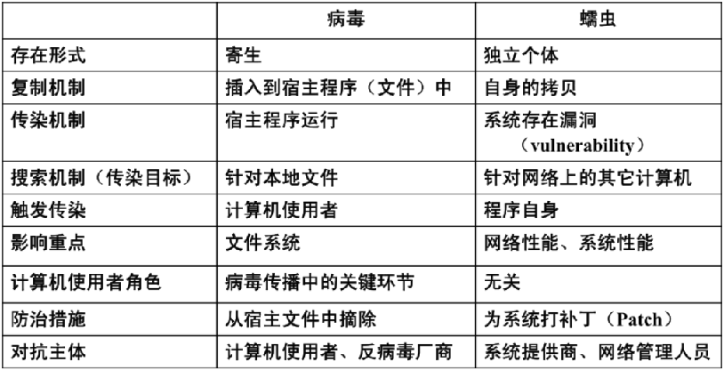
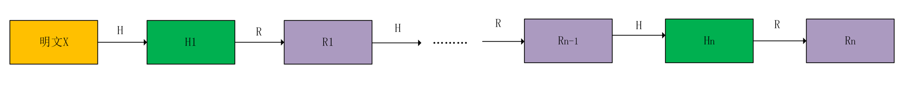
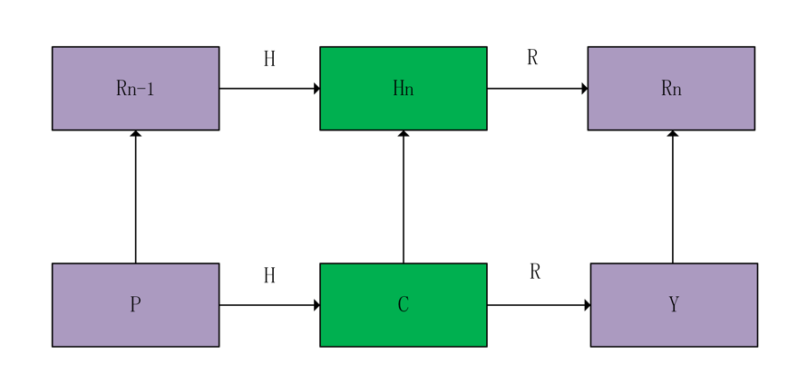
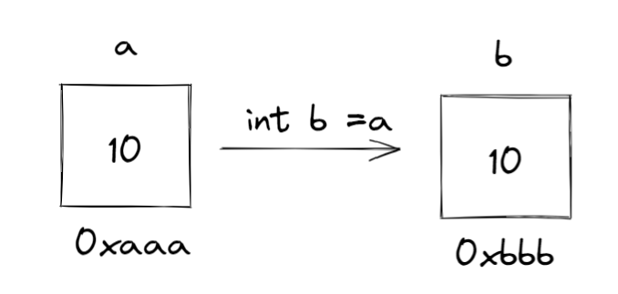
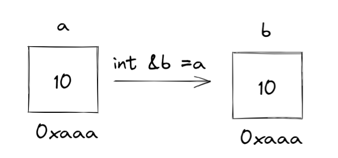
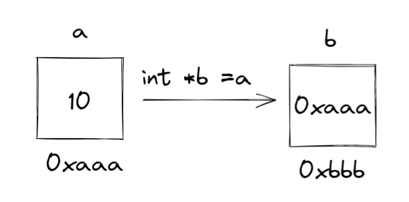
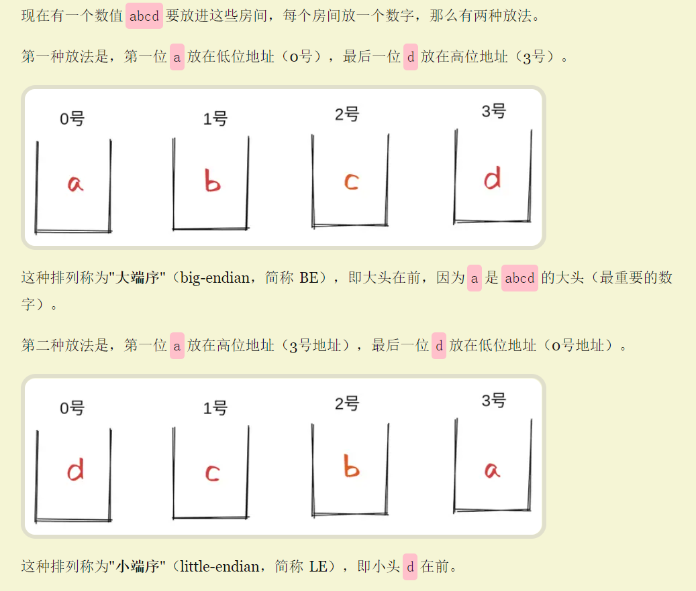
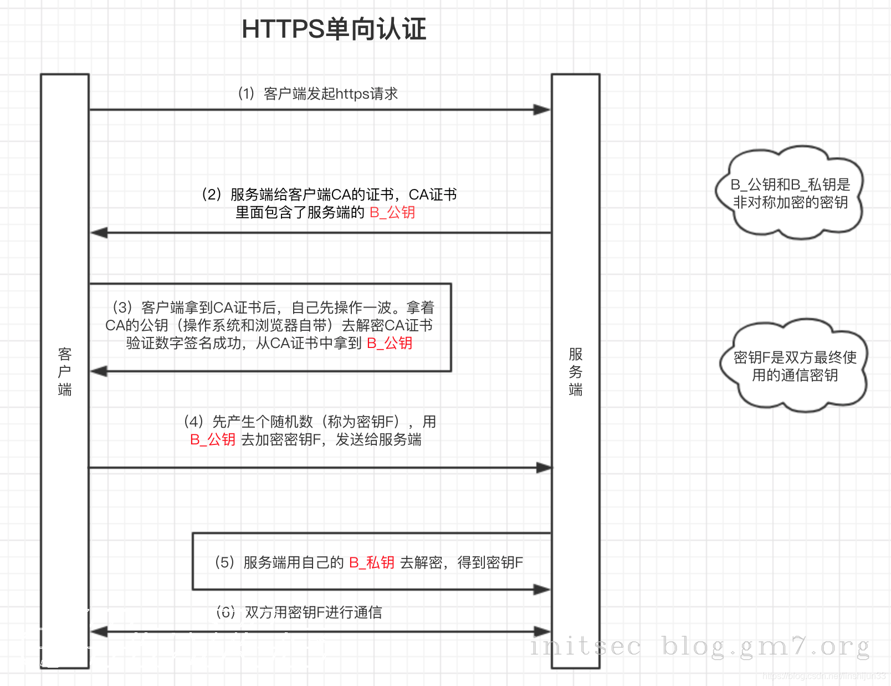
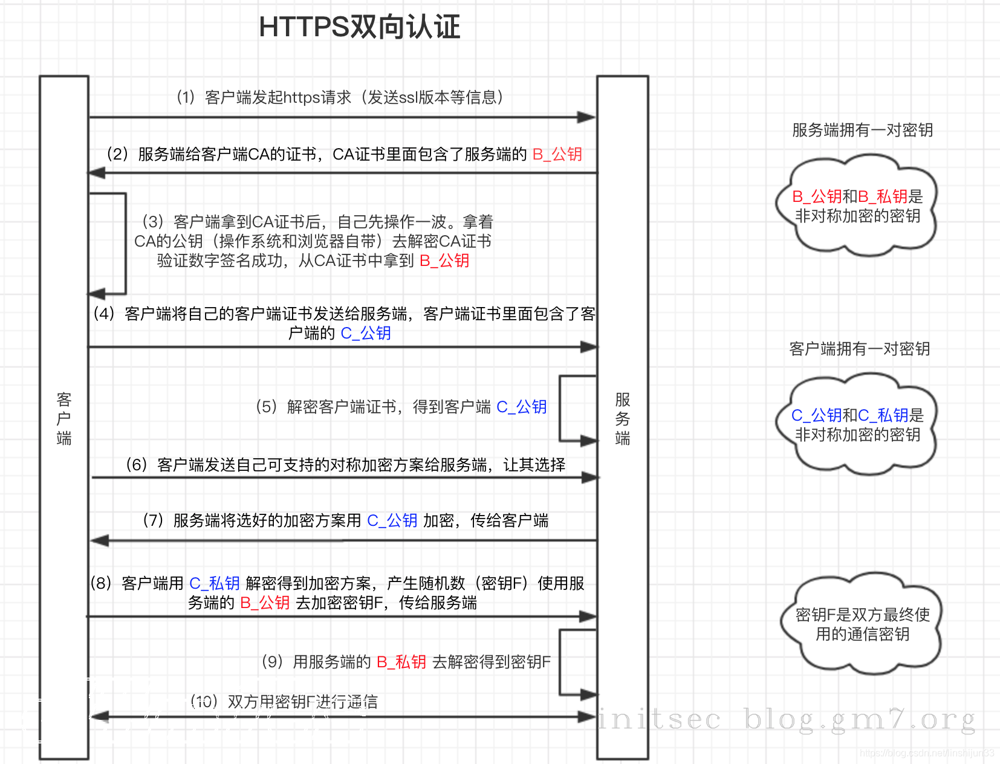

|      常见名词       |                             解释                             |
| :-----------------: | :----------------------------------------------------------: |
|   0day(Zero-day)    |                      没有补丁的安全漏洞                      |
|        Nday         |   官方发布了补丁，但该漏洞仍然大量未修复，存在一定可利用性   |
|         POC         |               一段无害的用来证明漏洞存在的代码               |
|   EXP（exploit）    |    一段对漏洞如何利用的详细说明或者一个演示的漏洞攻击代码    |
| payload（有效载荷） |     指成功 exploit 之后，真正在目标系统执行的代码或指令      |
|         CVE         | Common Vulnerabilities & Exposures 公共漏洞和暴露      CVE编号--漏洞标签 |
|      ShellCode      | 一段16进制机器码，可在暂存器eip溢出后，塞入一段可让CPU执行的shellcode机器码，从而执行任意指令，EIP`寄存器，它里面存放的值是`CPU`下次要执行的指令地址，因此可以通过修改`EIP`寄存器的值来执行`shellcode |
|        FUZZ         |                  模糊测试：随机输入，观察输                  |
|         CMS         | 内容管理系统：指的是一种内容编辑程序。就像在博客写文章一样，不需要懂得编程的人，也可以通过CMS发布，更改，管理内容。 |
|        CNVD         | China National Vulnerability Database                                   国家信息安全漏洞共享平台 |
|       Rootkit       |         载入到操作系统内核中的恶意软件，具有root权限         |
|         WAF         |        Web应用防火墙，具有针对 HTTP/HTTPS 的安全策略         |
|       堡垒机        | 监控和记录运维人员对网络内的服务器、网络设备、安全设备、数据库等设备的操作行为，以便集中报警、及时处理及审计定责。 |
|       彩虹表        |              空间换时间，通过哈希碰撞破解哈希值              |
|     供应链攻击      |            攻击软件供应商，如向更新程序中注入木马            |
|        沙箱         | 虚拟系统程序：     在隔离环境中，用以测试不受信任的文件或应用程序等行为的工具 |
|     域名泛解析      |                     `*.a.com`指向同一IP                      |
|        OSINT        | **公开来源情报**（OSINT, Open Source INTelligence）是从公开来源收集到的情报 |
|         IDS         |     Intrusion Detection System（入侵检测系统），旁路部署     |
|         IPS         |    Intrusion Prevention System（入侵防御设备），串联部署     |
|         SA          | Situation Awareness（态势感知），态势感知是一种基于环境的、动态、整体地洞悉全网安全风险的能力。它以安全大数据（采集全网流量数据和安全防护设备日志信息）为基础，从全局视角对全网安全威胁进行发现识别、理解分析展示和响应处置，并预测发展趋势，为后续网络安全的相关决策与行动提供数据依据。 |
|         AV          | anti-virus killer（反病毒杀手），防病毒软件如WinowsDefinder，360 |
|     上/下游代理     | 请求：客户端→下游代理→上游代理→服务端                                                                                                        响应：服务端→上游代理→下游代理→客户端 |
|        RASP         | 运行时应用程序自我保护（`Runtime application self-protection`，简称`RASP`）RASP采用`基于攻击行为分析`的`主动防御`机制，严防`文件读写`、`数据访问`、`命令执行`等Web应用系统命脉（在Web应用程序执行关键的Java API之前插入防御逻辑（API HOOK），从而控制原类方法执行的业务逻辑） |
|       路由器        | 路由器（Router）是一种网络设备，用于将数据包从一个网络转发到另一个网络。主要功能**根据网络协议决定最佳的路径**来转发数据，**网络地址转换（NAT）** |
|       交换机        | 交换机是一种网络设备，用于在局域网中传输数据包。它有多个端口，可以连接多台计算机或其他网络设备，如打印机、服务器等。交换机能够根据每个数据包的目标地址，将其转发到对应的目标设备，实现设备之间的通信和数据传输。交换机还可以提供一些额外的功能，如虚拟局域网（VLAN）划分、安全策略配置等。 |
|                     |                                                              |
|                     |                                                              |
|                     |                                                              |


# MVC设计思想


# ORM--对象关系映射


# 蠕虫、病毒之间的区别




# 正向/反向代理

https://www.cloudflare.com/zh-cn/learning/cdn/glossary/reverse-proxy/

- 正向代理

  > 转发代理，通常称为代理、代理服务器或 Web 代理，是位于一组客户端计算机之前的服务器,确保没有源站直接与该特定客户端通信

  

​        在标准的互联网通信中，计算机 A 将直接与计算机 C 保持联系，客户端将请求发送到[源服务器](https://www.cloudflare.com/learning/cdn/glossary/origin-server/)，并且源服务器将响应客户端。当存在正向/转发代理时，A 将请求发送到 B，B 随后将请求转发给 C。C 将向 B 发送响应，而 B 则将响应转发给 A。


- 反向代理

  > 反向代理是位于一个或多个 Web 服务器前面的服务器，拦截来自客户端的请求，确保没有客户端直接与该源站通信。

  

​       通常，来自 D 的所有请求都将直接发送到 F，而 F 会直接将响应发送到 D。使用反向代理，来自 D 的所有请求都将直接发送给 E，而 E 会将其请求发送到 F 并从 F 接收响应，然后将适当响应传递给 D。


|               | 对象   | 优点                     |
| :------------ | ------ | ------------------------ |
| 正向/转发代理 | 客户端 | 匿名，绕过访问限制       |
| 反向代理      | 服务端 | 更加安全，提高服务器性能 |


# 静态web和动态web

https://help.dedecms.com/shiyongshouce/moshi/mingci.html

伪静态即是网站本身是动态网页如.php、.asp、.aspx等格式动态网页有时这类动态网页还跟"?"加参数来读取数据库内不同资料，伪静态就是做url重写操作(即rewrite)。

demo

```php
跳转需求：
访问http://www.kevin.com/p/123456.html  跳转成  http://a.aa.com/p/123456

配置如下:
rewrite ^/p/(\d+).html    http://www.kevin.com/p/$1 last;

解释说明：
\d是数字的意思 +是最少一个{1,} 1到无穷大{1,3} 这样是1-3位数。
```


# DDOS攻击和CC攻击

DDoS攻击打的是网站的服务器，而CC攻击是针对网站的页面攻击的。

用术语来说就是，一个是WEB网络层拒绝服务攻击（DDoS），一个是WEB应用层拒绝服务攻击（CC）。

网络层就是利用肉鸡的流量去攻击目标网站的服务器，针对比较本源的东西去攻击（通信信道），服务器瘫痪了，那么运行在服务器上的网站肯定也不能正常访问了。

而应用层就是我们用户看得到的东西，就比如说网页，CC攻击就是针对网页来攻击的，CC攻击本身是正常请求，网站动态页面的正常请求也会和数据库进行交互的，当这种"正常请求"达到一种程度的时候，服务器就会响应不过来，从而崩溃。


# 彩虹表

https://zhuanlan.zhihu.com/p/105578739

**彩虹表**(`rainbow table`)是一个用于[加密散列函数](https://link.zhihu.com/?target=https%3A//zh.wikipedia.org/wiki/%E5%8A%A0%E5%AF%86%E6%95%A3%E5%88%97%E5%87%BD%E6%95%B0)逆运算的预先计算好的[表](https://link.zhihu.com/?target=https%3A//zh.wikipedia.org/wiki/%E6%9F%A5%E6%89%BE%E8%A1%A8)，常用于破解加密过的密码散列。如MD5，SHA1.

 查找表常常用于包含有限字符固定长度[纯文本](https://link.zhihu.com/?target=https%3A//zh.wikipedia.org/wiki/%E7%BA%AF%E6%96%87%E6%9C%AC)[密码](https://link.zhihu.com/?target=https%3A//zh.wikipedia.org/wiki/%E5%AF%86%E7%A0%81)的加密。


事先准备大量哈希链表：

X：随机生成的明文

H：哈希函数

R：自定义函数



只保存开头和末尾位置即X和Rn。


对于经过H得到的密文C进行破解：首先使用R得到Y=R（C），再将Y与Rn进行比较。

①如果相等，则说明密文C对应的明文P在哈希链表中的Rn-1处。原理见下图。




②如果不相等，则说明密文C对应的明文P不在哈希链表中的Rn-1处。所以需要向前查找是否在Rn-2~R1处。

具体流程：对Y再用H和R函数，得到Y‘，与Rn比较，如果相等，则说明明文为Rn-2，如果不是，就重复步骤，直到所有哈希链表都查找过，说明破解失败。


防御手段：加密时使用盐值


# 堆和栈

[堆和栈的区别](https://cloud.tencent.com/developer/article/1688327)

> 栈区保存声明的变量例如`int a=1`,由系统自动分配
>
> 堆区保存用户申请的变量例如`malloc`，`b=&a`
>
> 程序在编译变量和对函数分配内存都在栈上进行，且函数调用时参数的传递也是在栈上进行。


# 按值传递，按引用传递和按指针传递

https://www.junmajinlong.com/coding/pass_by_value_or_ref/

- 按值传递

  > 开辟新空间，将数据对象拷贝一份副本到新空间中

  ```python
  int a=10;
  int b=a;
  ```

  

  > 这时候修改a或b的值，都不会影响另一个变量的值

- 按引用传递

  ```c
  int a=10;
  int &b=a;
  ```

  > 不开辟新空间，只是给数据对象所在空间名起了一个别名

  

  > 这时候修改a或b的值，应该会影响另一个变量的值，因为二者的地址是一样的。

- 按指针传递

  在c或c++可以操作指针的语言中

  ```c
  int a=10;
  int* b=&a;
  ```

  > 在堆内存中开辟空间用来保存指针b，b指向a所在的地址（保存a的地址）。

  

# 阻塞和非阻塞，同步和异步，回调函数

**例子**

我要看足球比赛，但是妈妈叫我烧水，电视机在客厅，烧水要在厨房。家里有2个水壶，一个是普通的水壶，另一个是水开了会叫的那种水壶。我可以：

1. 用普通的水壶烧，人在边上看着，水开了再去看球。**（同步，阻塞）**这个是常规做法，但是我看球不爽了。
2. 用普通水壶烧，人去看球，隔几分钟去厨房看看。**（同步，非阻塞）**这个又大问题，万一在我离开的几分钟水开了，我就麻烦了。
3. 用会叫的水壶，人在边上看着。**（异步，阻塞）**这个没有问题，但是我太傻了。
4. 用会叫的水壶，人去看球，听见水壶叫了再去看。**（异步，非阻塞）**这个应该是最好的。

等着看球的我：阻塞

看着电视的我：非阻塞

普通水壶：同步

会叫的水壶：异步

所以，异步往往配合非阻塞，才能发挥出威力。


**回调函数**

在上面的例子中，用会叫的水壶，人去看球，听见水壶叫了再去看。**（异步，非阻塞）**这一方法的实现就是使用了回调函数。


# MVC架构


# 小端序和大端序




# HTTPS单向认证




# HTTPS双向认证




# CGI与fastCGI

[关于CGI和FastCGI的理解 - 天生帅才 - 博客园](https://www.cnblogs.com/tssc/p/10255590.html#_label4_4)


# X64、X86和X86_64

- X64、X86和X86_64都是x86指令集架构

- X86是x86指令集架构的32位版本。

  > "x86"这个术语源自Intel 8086处理器，它是x86家族的第一款处理器。

- X64和X86_64都是x86指令集架构的64位扩展（X86_64将x86架构的兼容性与x64架构的增强功能结合起来）


# DAST、SAST、IAST 

[一文洞悉DAST、SAST、IAST ——Web应用安全测试技术对比浅谈 - 安全牛 (aqniu.com)](https://www.aqniu.com/learn/46910.html)


# 什么是开发环境、测试环境、UAT环境、仿真环境、生产环境？

- dev环境：开发环境，外部用户无法访问，开发人员使用，一般来讲，开发环境中的服务器配置比较随意主要是用来测试的，无用户交互，并且要打开错误报告，方便程序员调试。
- test环境：测试环境，外部用户无法访问，专门给测试人员使用的，版本相对稳定。
- pre环境：性能评估测试（压测）环境，外部用户可以访问，但是服务器配置相对低，其它和生产一样。
- uat环境：验收测试环境，主要作为客户体验的环境。
- pro环境：生产环境，面向外部用户的环境，连接上互联网即可访问的正式环境。


