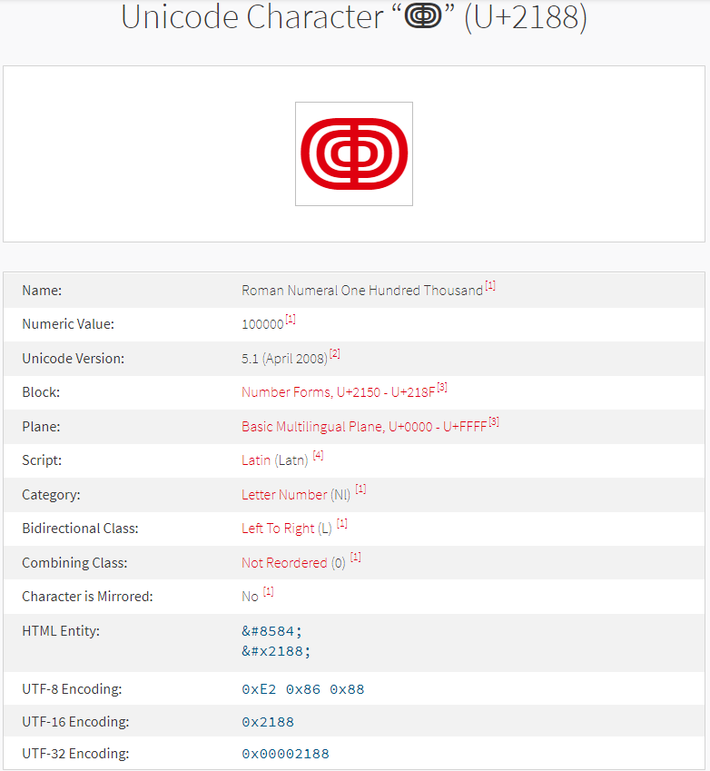

## 编码的由来

计算机存储的任何数据，包括各种文本、图片、音视频文件等等，实际上都是一串[二进制](https://so.csdn.net/so/search?q=二进制&spm=1001.2101.3001.7020)数字01字节序列组成的。

字节一般用来存储与网络传输，这样可以节省存储空间与网络传输带宽。而字符主要是用于显示，方便大家阅读。

编码主要是为了存储传输，而解码是为了方便阅读


## 编码方式的确立

可以通过http消息头的accept-encoding指定

html中的charset=”UTF-8″

应用本身的编码方式


## base64编码

编码表

> 大小写字母，[0,9]，+，/

加密

> 每6个字符为一组

解密

> 每8个字符为一组

加密时不足的会补上`=`


## rot13

明/密文空间：字母表

操作：右移13位

可逆运算


## url编码

[URL原理、URL编码、URL特殊字符](https://blog.csdn.net/freeking101/article/details/68922983)

#### 特殊字符

[URL中的保留和不安全字符 - atzuge - 博客园](https://www.cnblogs.com/zuge/p/6141359.html)


#### 在哪里发生

当我们向服务器发送数据时，浏览器就会自动将需要编码的字符进行URL编码（可以在数据包中看到）,然后服务器接收到数据包后，也会自动解码URL编码后的字符。


## Ascii

长度：固定1字节

0~126个字符，其中前32个字符为不可打印字符


## Unicode字符集--万国码

形式：U+数字  或者 16进制形式\u8fd9\u662f\u4e00

长度：固定**2字节**


https://www.compart.com/en/unicode




### UTF

UTF是Unicode Transformation Format(统一码转换格式)，变长Unicode编码。

常见的有UTF-8,UTF-16,UTF-32


## jsfuck

http://www.jsfuck.com/

https://blog.csdn.net/qq_36539075/article/details/79946099


## HTML实体编码

&#36825


## 编码安全

### base64编码绕过

[奇安信攻防社区-从RFC看如何使用Base64编码绕过WAF](https://forum.butian.net/share/639)


### 编码前后不一致

- SQL宽字节注入

- 文件编码不同，导致报错

  [NSSRound#6 Team]check(Revenge)

  ```python
  @app.route('/download', methods=['POST'])
  def download_file():
      filename = request.form.get('filename')
      if filename is None or filename == '':
          return '?'
      
      filepath = os.path.join(app.config['UPLOAD_FOLDER'], filename)
      
      if '..' in filename or '/' in filename:
          return '?'
      
      if not os.path.exists(filepath) or not os.path.isfile(filepath):
          return '?'
      
      if os.path.islink(filepath):
          return '?'
      
      if oct(os.stat(filepath).st_mode)[-3:] != '444':
          return '?'
      
      with open(filepath, 'r') as f:
          return f.read()
  ```

  `with open(filepath, 'r') as f`，这里mode为r，默认为utf-8编码。

  所以当我们将gbk编码的文件上传后，读取时就会报错，从而出现debug界面

  

  这时候就可以尝试进行Flask的PIN码破解

  

### Unicode欺骗

> 原理简单来说就是对字符串的标准化操作导致unicode字符转换成了与他同形的ascii字符。

[Web 基于ASIS 2019：Unicorn shop学习Unicode安全隐患 – 大彪的小站](https://1idb.com/?p=642)


查询：

https://unicode-table.com/cn/blocks/

https://unicode-table.com/cn/sets/symbols-for-nickname/#arabic-and-roman-numerals


### JSON

[json编码](https://www.w3cschool.cn/json/28yd1mw2.html)

> 字符串支持unicode编码


#### 过滤位置出错

后端接收JSON数据，没有先对其进行解码等处理，而直接对其进行操作如判断，过滤

- 过滤

  ```php
  function waf($str)
  {
      xxxx;
  }
  $body = file_get_contents('php://input');
  waf($body);
  $data = json_decode($body, true);
  ```

  > 对于这种情况，只需要对提交的JSON数据进行UNICODE编码即可绕过waf。
  >

  

- 判断比较

  ```php
  $numbers=file_get_contents('php://input'); #获取ajax请求的数据
  for($i=0; $i<7; $i++){
  		if(!($numbers[$i] == $win_numbers[$i]){
  			exit();
  		}
  }
  echo $flag;           
  ```

  > 将$numbers的每一位与待比较数字逐字比较
  >
  > 因为json支持数组和布尔类型的数据，所以可以构造json数据为{numbers:[true,true,true,true,true,true,true]}
  >
  > 只要待比较数字$win_numbers的每一位都大于0，即可输出flag

  


## 参考文章

[HTML字符集 (w3school.com.cn)](https://www.w3school.com.cn/charsets/index.asp)

[30余种加密编码类型的密文特征分析（建议收藏） - 云+社区 - 腾讯云 (tencent.com)](https://cloud.tencent.com/developer/article/1748394)

[python中的编码](https://segmentfault.com/a/1190000019437999)


