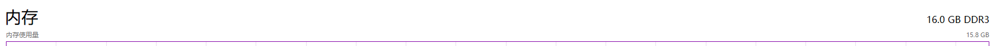

> 好多年前的电脑了，内存有点不够，内网靶场开不起来😭

## 如何选择适合电脑的内存条

**工具**

- [CPU-Z | Softwares | CPUID](https://www.cpuid.com/softwares/cpu-z.htm)

- [AIDA64 v6.92.6600 便携版 - 果核剥壳 (ghxi.com)](https://www.ghxi.com/aida64e.html)

**关注信息**

- 支持的内存条类型和最大内存大小

- 几个插槽（支持几条内存条）

- 内存条频率

  这里看到的是800MHZ，实际上是1600MHZ，在任务管理器中可以看到

  

  [内存频率只有一半？别急 系统只是告诉了你事实 - 知乎 (zhihu.com)](https://zhuanlan.zhihu.com/p/462005732)

- 制造商：组双通道最好一致

- 电压

  低电压：1.35V

  标准电压：1.5V

综上我最好去京东上购买DDR3规格，海力士品牌，内存条频率为1600MHZ，低电压，内存大小<=24GB（32-8）的内存条

## 装内存条

红框处即为内存条

红框处向外拉，取出内存条，然后新内存条30°插入箭头所指后，用点力向下压，听到哒的一声就OK了

内存成功变为16GB

